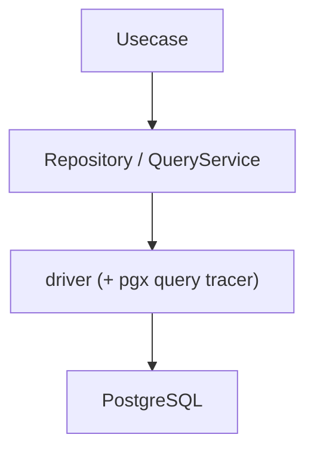
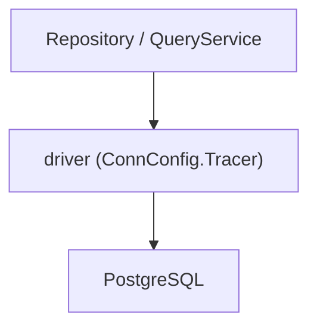
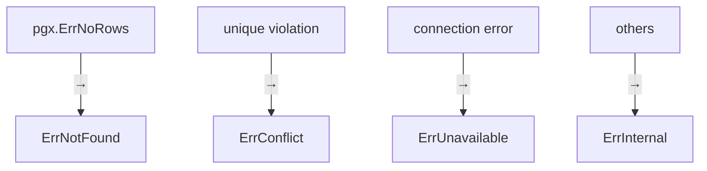

# RDB Infrastructure Guide (`internal/infrastructure/rdb`)

English | [日本語](README.ja.md)

## Role

`internal/infrastructure/rdb` is an **Infrastructure subsystem for using RDB (PostgreSQL)**.

This directory has the following responsibilities.

- Connection management to PostgreSQL
- SQL execution (sqlc)
- Repository / QueryService implementation
- SQL execution logging and tracing (Observability)
- PostgreSQL error normalization
- Conversion between DB nullable types and Go types

Domain / Usecase can use **data persistence and querying without being aware of RDB implementation details**.

## RDB Architecture

This directory is composed of the following layered structure.



The responsibilities of each layer are as follows.

|Layer|Role|
|---|---|
|Repository|Aggregate persistence (implementation of Domain Repository Interface)|
|QueryService|Provides search-specific queries (implementation of Usecase Interface)|
|driver|DB connection / transaction management, and SQL logging / tracing via a pgx query tracer|
|PostgreSQL|Actual DB|

The following exist as supporting components.

|Component|Role|
|---|---|
|sqlc|Type-safe query execution code generated from SQL|
|pgerror|PostgreSQL error → application error conversion|
|metrics|Connection pool statistics as Prometheus metrics|
|system_query|System operational queries (health check, etc.)|
|testkit|RDB test utilities (real DB + rollback)|

## Directory Structure

```txt
internal/infrastructure/rdb
 ├ repository/        Repository implementation
 ├ query_service/     QueryService implementation
 ├ system_query/      System operational queries (health check, etc.)
 ├ driver/            DB connection / transaction + pgx query tracer (logging / tracing)
 ├ sqlc/              sqlc generated code + SQL helper
 ├ pgerror/           PostgreSQL error normalization
 ├ metrics/           Connection pool Prometheus metrics
 └ testkit/           RDB test utilities
```

## Repository

Repository is the layer that **implements the Domain Repository Interface**.

Main responsibilities

- sqlc query execution
- Row → Domain entity conversion
- DB error normalization

Important: **Repository does not contain business logic**

See details below.

[repository directory README](repository/README.md)

## QueryService

QueryService is the layer that **provides read-only queries such as search and listing**.

While Repository handles Aggregate persistence,  
QueryService is specialized for search use cases.

Main responsibilities

- Execute search queries
- Convert Row → Domain / DTO
- Normalize DB errors

Important: **Search must be implemented in QueryService, not Repository**

See details below.

[query_service directory README](query_service/README.md)

## sqlc

`sqlc` is a tool that generates Go code from SQL.

In this directory:

- sqlc generated code
- LIKE search helper

are provided.

Generated code is placed at:

`internal/infrastructure/rdb/sqlc/gen`

See details below.

[sqlc directory README](sqlc/README.md)

## driver

`driver` is the **lowest layer that provides DB connection and transaction management**.

Main functions

- DatabaseDriver abstraction
- DB connection pool management
- Transaction management (tx.Manager)
- DBTX interface for sqlc
- SQL logging / tracing via a pgx query tracer (see below)

Important: **Transaction boundaries are managed by the Usecase layer**

See details below.

[driver directory README](driver/README.md)

## SQL Logging / Tracing (pgx query tracer)

SQL logging and tracing are wired at the **pgx connection level** (`ConnConfig.Tracer`) by
`driver.NewQueryTracer`, not in a separate wrapper layer. Repository / QueryService talk to the
driver directly via `driver.New(ctx, db)`; instrumentation is transparent and also covers
transaction-bound queries.



The query tracer embeds `otelpgx` for OpenTelemetry spans (with semconv DB attributes) and adds
query logs: **success at Info (with latency), slow queries at Warn, and failures at Error**.

Main functions

- OpenTelemetry span per query (via `otelpgx`, including batch / copy)
- Info log on successful completion (with latency)
- Error log on query failure (`span.RecordError` + log)
- Slow query warning log (threshold: `DB_SLOW_QUERY_WARN_THRESHOLD`)
- Query argument masking (`OBS_MASKED_DB_QUERY_ARGS`)

## PostgreSQL Error Normalization

`pgerror` is a **layer that converts PostgreSQL-specific errors into application errors**.

Repository / QueryService use:

```go
pgerror.NormalizeError(err)
```

to normalize DB errors.

Main conversions



See details below.

[pgerror directory README](pgerror/README.md)

## metrics

`metrics` is a package that **exposes pgxpool connection pool statistics as Prometheus metrics**.

Provides Gauge (connection counts) and Counter (acquire counts, destroy counts, etc.).

See details below.

[metrics directory README](metrics/README.md)

## system_query

`system_query` is a layer that provides **system-operational DB queries** (health check, etc.).

Unlike Repository / QueryService, it handles operational and monitoring queries that do not belong to the business domain.

See details below.

[system_query directory README](system_query/README.md)

## testkit

`testkit` is a **utility for testing using RDB**.

Main functions

- Test DB initialization
- Shared test DB driver provision
- Transaction-based testing (automatic rollback)

Test characteristics

- real DB
- transaction rollback
- parallel execution (Tx is serialized)

See details below.

[testkit directory README](testkit/README.md)

## Design Principles

This RDB subsystem is based on the following design principles.

### 1. Hiding DB Implementation

Domain / Usecase do not depend on:

- sql
- pgx
- sql.DB

### 2. Separation of Responsibility (Repository / QueryService)

- Write / persistence → Repository
- Search / read       → QueryService

### 3. Centralized Transaction Boundary Management

Usecase manages Tx, and Infrastructure does not start Tx.

### 4. DB Error Normalization

PostgreSQL-specific errors are converted into application-wide errors by `pgerror`.

### 5. SQL Type Safety

All SQL execution is performed through `sqlc`.

### 6. Observability

SQL execution tracing is provided by a pgx query tracer wired at the driver connection level
(`otelpgx` spans), with logs on successful completion (Info, with latency), slow queries (Warn),
and failures (Error).

### 7. Test Strategy (Integration-based)

Repository / QueryService tests are executed with:

real DB + rollback

This is safely implemented using `testkit`.
