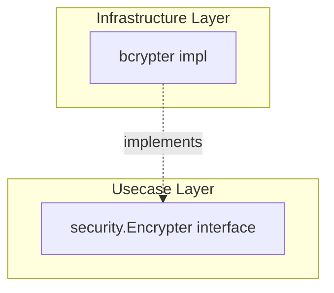

# security

English | [日本語](README.ja.md)

`internal/infrastructure/security` provides **security-related infrastructure implementations** such as password hashing.

## Architectural Position



Implements the `security.Encrypter` interface (`internal/usecase/boundary/security`) in the Infrastructure layer. Usecase / Domain do not depend on bcrypt implementation details.

## Public API

|Function / Method|Description|
|---|---|
|`NewBcryptHasher(secCfg)`|Create `security.Encrypter` using `BcryptCost` from `config.SecurityConfig`|
|`Hash(password)`|Hash a password with bcrypt|
|`Compare(hash, password)`|Compare hash with plaintext password (mismatch returns `false, nil`)|

## Design Policy

- bcrypt cost is externalized via `config.SecurityConfig.BcryptCost()`
- Password mismatch absorbs `bcrypt.ErrMismatchedHashAndPassword` and returns `false, nil` (not treated as an error)
- Other errors (invalid cost, etc.) are returned as-is

## DI Registration

Register in the `security` module of `internal/di/module/infrastructure.go`.

```go
fx.Provide(security.NewBcryptHasher)
```
