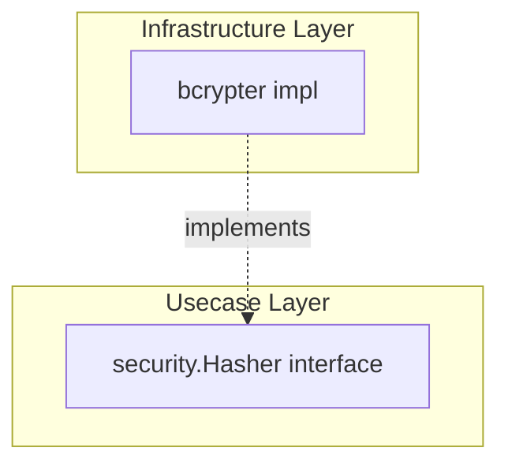

# security

English | [日本語](README.ja.md)

`internal/infrastructure/security` provides **security-related infrastructure implementations** such as password hashing.

## Architectural Position



Implements the `security.Hasher` interface (`internal/usecase/boundary/security`) in the Infrastructure layer. Usecase / Domain do not depend on bcrypt implementation details.

## Design Policy

- bcrypt cost is externalized via `config.SecurityConfig.BcryptCost()`
- Password mismatch absorbs `bcrypt.ErrMismatchedHashAndPassword` and returns `false, nil` (not treated as an error)
- Other errors (invalid cost, etc.) are wrapped as `apperror.ErrInternal` (per the Infrastructure layer rule that external errors must be converted into application-wide errors)

## DI Registration

Registered via `securityModule()` in `internal/di/module/security.go` (aggregated by `InfrastructureModule()`).

```go
fx.Provide(security.NewBcryptHasher)
```
