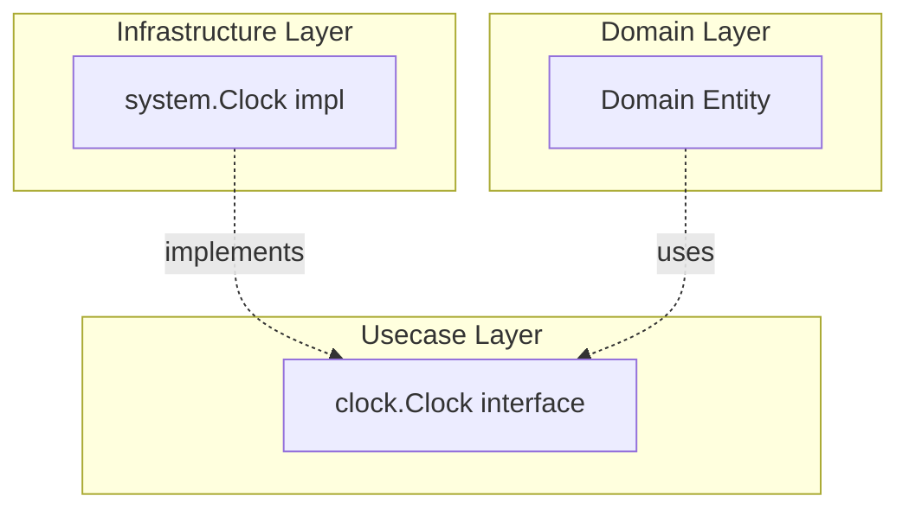

# system

English | [日本語](README.ja.md)

`internal/infrastructure/system` provides **Infrastructure implementations for system-dependent operations** such as time retrieval.

## Architectural Position



If Domain / Usecase call `time.Now()` directly, time cannot be controlled in tests. By going through the `clock.Clock` interface (`internal/usecase/boundary/clock`), mock substitution becomes possible during testing.

## Public API

|Function / Method|Description|
|---|---|
|`NewClock()`|Create an implementation of `clock.Clock` (internally calls `time.Now()`)|
|`Now()`|Return the current time|

## Why Abstract?

- Preserve **determinism** in Domain / Usecase — time can be fixed in tests
- Follow Onion Architecture principles by **pushing system dependencies outward**
- Direct dependency on `time.Now()` is prohibited in the Domain layer

## DI Registration

Register in the `system` module of `internal/di/module/infrastructure.go`.

```go
fx.Provide(system.NewClock)
```

## Extending

To add system-dependent operations beyond time (random number generation, hostname retrieval, etc.):

1. Define the interface in `internal/usecase/boundary/`
2. Place the implementation in this package
3. Add DI registration in `internal/di/module/infrastructure.go`
