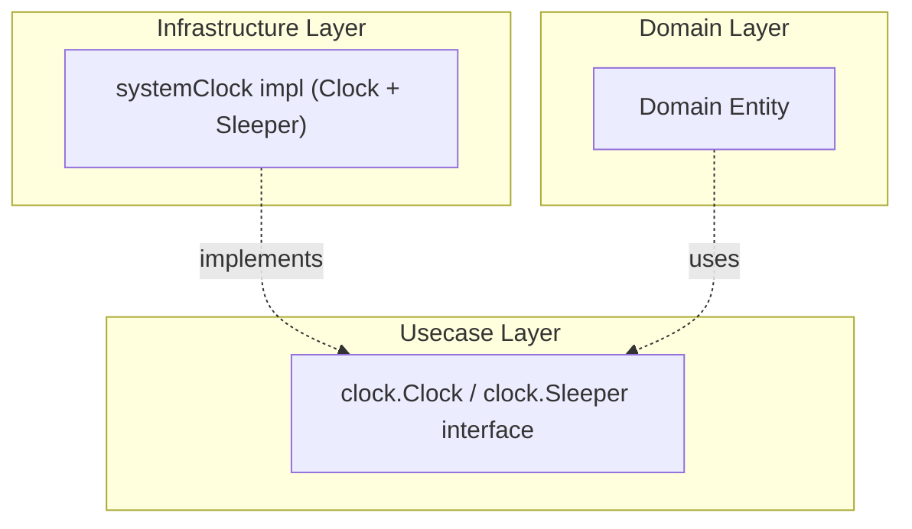

# system

English | [日本語](README.ja.md)

`internal/infrastructure/system` provides **Infrastructure implementations for system-dependent operations** such as time retrieval and context-aware waiting.

It implements two interfaces from `internal/usecase/boundary/clock`:

- `clock.Clock` (`NewClock`) — `Now()` returns the current time
- `clock.Sleeper` (`NewSleeper`) — `Sleep(ctx, d)` waits until `d` elapses, returning `ctx.Err()` if the context is canceled first (a non-positive `d` returns immediately with `ctx.Err()`)

Both are backed by the same unexported `systemClock` type.

## Architectural Position



If Domain / Usecase call `time.Now()` directly, time cannot be controlled in tests. By going through the `clock.Clock` interface (`internal/usecase/boundary/clock`), mock substitution becomes possible during testing.

## Why Abstract?

- Preserve **determinism** in Domain / Usecase — time can be fixed in tests
- Follow Onion Architecture principles by **pushing system dependencies outward**
- Direct dependency on `time.Now()` is prohibited in the Domain layer

## DI Registration

Registered via `clockModule()` in `internal/di/module/clock.go` (aggregated by `InfrastructureModule()`). Both the `Clock` and `Sleeper` implementations are provided here.

```go
fx.Provide(
    system.NewClock,
    system.NewSleeper,
)
```

## Test Strategy

There is no database here, so the infrastructure layer's real-DB strategy does not apply. This package is
also the one place in the repository that legitimately reads wall time: it *is* the implementation the
rest of the codebase injects instead of calling `time.Now()`, so there is nothing left to inject in its
place. The rule "never let a test depend on real time" holds everywhere it can be satisfied — here it
cannot be, so the strategy is to keep the exposure small and bounded rather than to pretend it is absent.

- **Real time is used, in the smallest amount that still proves the contract.** A wait is measured in
  tens of milliseconds and asserted with a lower bound (`elapsed >= d`), never an upper bound — an upper
  bound turns scheduler jitter and a loaded CI machine into a red build. `Now()` is compared against
  `time.Now()` within a generous window for the same reason.
- **Cancellation is tested without waiting.** The context is cancelled *before* the call, so the case
  that pins "cancellation wins over the deadline" completes immediately rather than after the duration
  it was handed.
- **The non-positive duration is a branch, not an edge case.** `d <= 0` returns immediately, and it must
  still report a cancelled context — otherwise a zero backoff would silently ignore cancellation. Both
  the cancelled and the live context are pinned for that path.

Consumers of these interfaces do the opposite: they inject the `clock` testkit doubles and assert on a
controlled timeline. That asymmetry is the point of the abstraction, and it is why the real-time
exposure stops at this package.

## Extending

To add system-dependent operations beyond time (random number generation, hostname retrieval, etc.):

1. Define the interface in `internal/usecase/boundary/`
2. Place the implementation in this package
3. Add DI registration in `internal/di/module/infrastructure.go`
