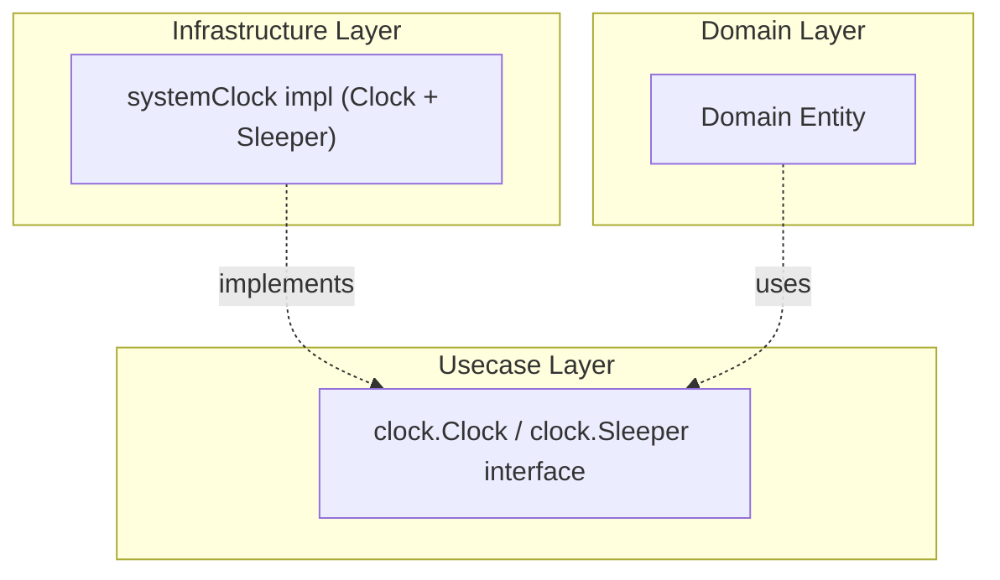

# system

English | [日本語](README.ja.md)

`internal/infrastructure/system` provides **Infrastructure implementations for system-dependent operations** such as time retrieval and context-aware waiting.

It implements two interfaces from `internal/usecase/boundary/clock`:

- `clock.Clock` (`NewClock`) — `Now()` returns the current time
- `clock.Sleeper` (`NewSleeper`) — `Sleep(ctx, d)` waits until `d` elapses, returning `ctx.Err()` if the context is canceled first (a non-positive `d` returns immediately with `ctx.Err()`)

Both are backed by the same unexported `systemClock` type.

## Architectural Position



If Domain / Usecase call `time.Now()` directly, time cannot be controlled in tests. By going through the `clock.Clock` interface (`internal/usecase/boundary/clock`), mock substitution becomes possible during testing.

## Why Abstract?

- Preserve **determinism** in Domain / Usecase — time can be fixed in tests
- Follow Onion Architecture principles by **pushing system dependencies outward**
- Direct dependency on `time.Now()` is prohibited in the Domain layer

## DI Registration

Registered via `clockModule()` in `internal/di/module/clock.go` (aggregated by `InfrastructureModule()`). Both the `Clock` and `Sleeper` implementations are provided here.

```go
fx.Provide(
    system.NewClock,
    system.NewSleeper,
)
```

## Extending

To add system-dependent operations beyond time (random number generation, hostname retrieval, etc.):

1. Define the interface in `internal/usecase/boundary/`
2. Place the implementation in this package
3. Add DI registration in `internal/di/module/infrastructure.go`
