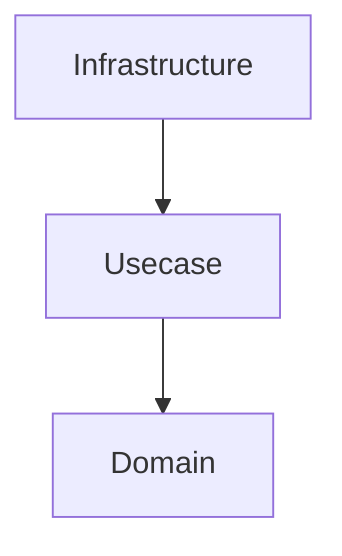
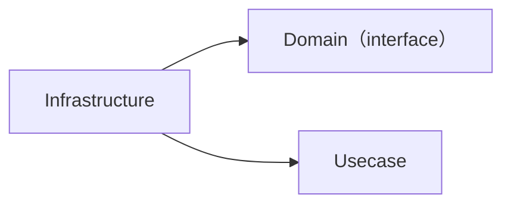
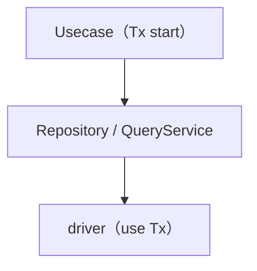
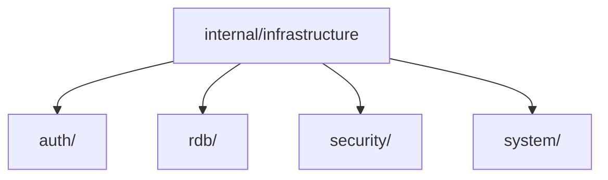
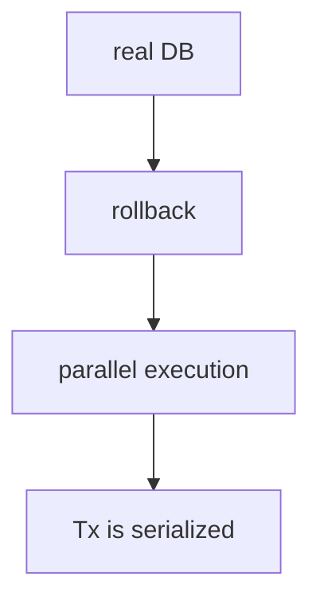

# Infrastructure Layer (`internal/infrastructure`) Guide

English | [日本語](README.ja.md)

## Role

The Infrastructure layer is responsible for **implementing access to external technologies (DB, external APIs, authentication, security, etc.)**.

This layer has the following responsibilities.

- Implementation of external I/O (RDB / API / authentication / system)
- Implementation of interfaces defined by the Domain
- Encapsulation of technical details (connection, retry, drivers, logging, etc.)
- Error normalization
- Provision of Observability (logging / tracing)

Upper layers (Domain / Usecase) **must not be aware of Infrastructure implementation details at all.**

## Position in Onion Architecture



- Domain / Usecase define abstractions only
- Infrastructure provides concrete implementations

## Dependencies



- Infrastructure depends on Domain
- Domain / Usecase must not depend on Infrastructure

## Relationship with Usecase

- Transaction boundaries are managed by the Usecase layer
- Infrastructure must not start transactions
- Transactions are propagated via `context.Context`



## Error Handling

The Infrastructure layer must not return external technology errors as-is,  
but must **convert them into application-wide errors**.

Examples:

- PostgreSQL errors → pgerror.NormalizeError
- External API errors → converted to apperror

## Observability

The Infrastructure layer provides the following observability.

- SQL / external I/O log output
- Tracing using OpenTelemetry
- Execution time measurement (slow query)

Mainly implemented by a pgx query tracer wired at the driver connection level (`otelpgx` spans, with log output limited to query failures and slow queries).

## Prohibited Practices

The following must not be done in the Infrastructure layer.

- Implementation of business logic
- Branching based on Domain rules
- Decision making of Usecase
- Introducing HTTP / framework-dependent code
- Starting transactions

## Implementation Rules

- Use sqlc for SQL execution
- Do not write search logic in Repository (use QueryService)
- Acquire the DBTX via `driver.New(ctx, db)` (logging / tracing is applied at the driver connection level)
- Always propagate context
- Always normalize external errors

## Directory Structure



## Subdirectories

|Directory|Description|Interface Placement|Details|
|---|---|---|---|
|`auth/`|Authentication infrastructure (environment-specific Authenticator impl)|Usecase boundary|[README](auth/README.md)|
|`rdb/`|RDB subsystem (Repository / QueryService / driver / sqlc, etc.)|Domain / Usecase|[README](rdb/README.md)|
|`security/`|Password hashing (bcrypt)|Usecase boundary|[README](security/README.md)|
|`system/`|System-dependent operations (time retrieval, etc.)|Usecase boundary|[README](system/README.md)|

## Test Strategy

- Integration Test using real DB
- State isolation using transaction rollback
- Use testkit



## Design Principles Summary

### 1. Encapsulation of Technical Details

DB / API / authentication / security  
→ encapsulated in Infrastructure

### 2. Dependency Inversion

Domain defines interfaces  
Infrastructure implements them

### 3. Separation of Responsibilities

```txt
Persistence → Repository  
Query       → QueryService
```

### 4. Transaction Management

Usecase manages transactions  
Infrastructure does not participate

### 5. Unified Error Handling

External errors → application errors

### 6. Observability

logging / tracing / metrics
