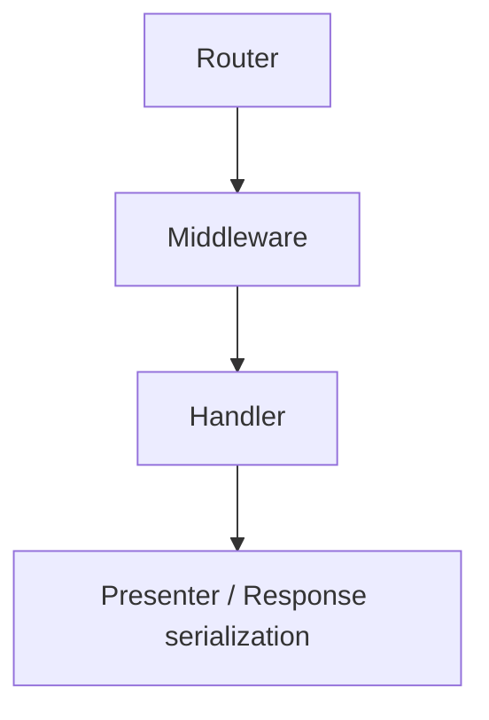
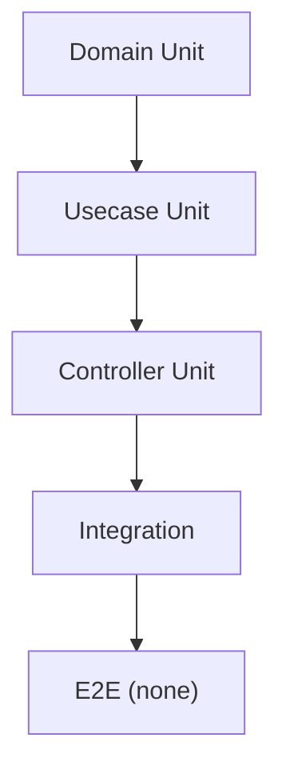
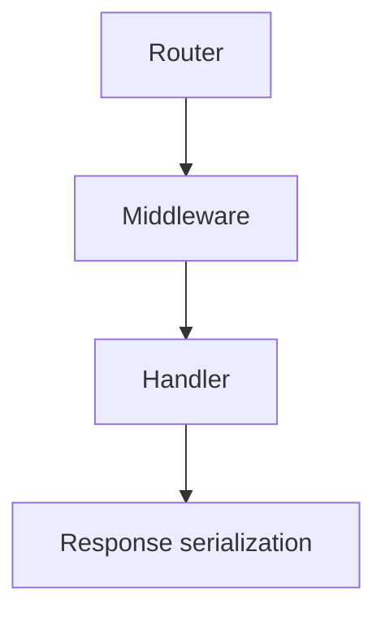
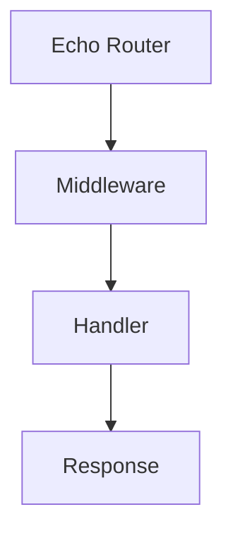
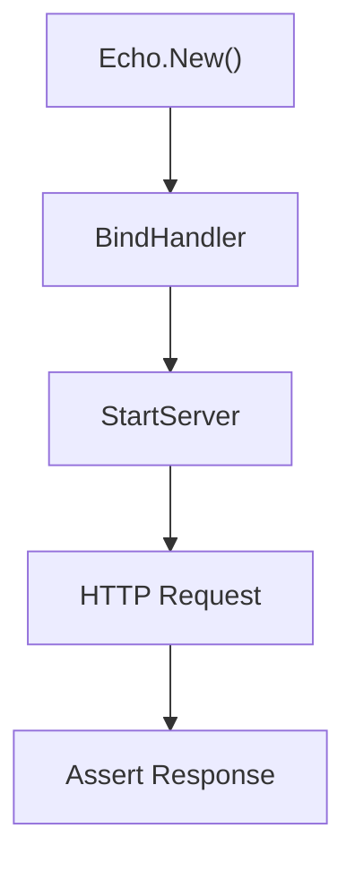
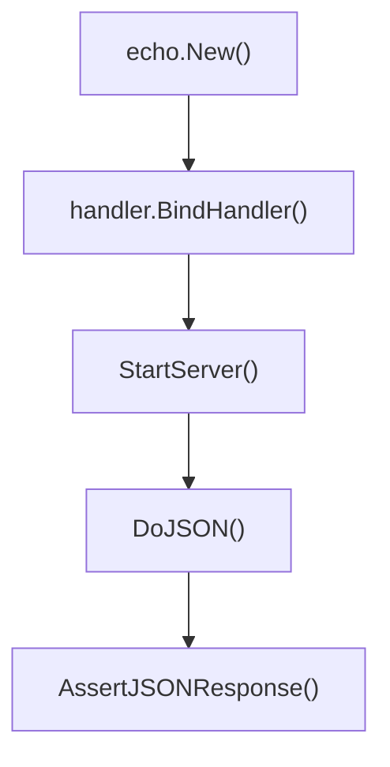

## integration Directory

English | [日本語](README.ja.md)

This directory is a place to organize **integration tests**.

It starts an Echo server and verifies through the **actual HTTP communication path**, which cannot be fully covered by unit tests.

These tests are **not integration tests that include DB or Infrastructure, but integration tests aimed at verifying the HTTP boundary**.

## Test Strategy

This project adopts the following test strategy.

- `Domain` → Unit Test
- `Usecase` → Unit Test
- `Controller` → Unit Test
- `Integration` → HTTP boundary test

Integration tests perform only **verification of the entire HTTP path behavior**.

In other words, the following scope is verified.



The following are **not handled in integration tests**.

- Domain logic
- Internal Usecase logic
- Repository implementation
- DB connection
- SQL execution

## Definition of Test Levels (Test Pyramid)

This project adopts a test strategy based on the **Test Pyramid**.



Policy:

- Write tests centered on **Domain / Usecase Unit Test**
- Integration Test performs **only HTTP boundary verification**
- E2E tests are not handled in this project

This policy provides the following benefits.

- Faster test execution
- Improved test maintainability
- Easier root cause identification when failures occur

## Why Usecase is mocked

In integration tests, **Usecase is mocked**.

The reason is **to preserve layer boundaries**.

The purpose of integration tests is **verification of the HTTP Layer**,  
and only the following scope is targeted.



The logic of Usecase / Domain / Repository  
belongs to **Unit Test responsibility**.

If Usecase is used as-is in implementation:

- DB
- Repository
- Domain

the test scope expands to include these,  
and **the purpose of HTTP boundary test is broken**.

## Integration Test Placement Policy

Integration tests are placed as **verification of public API behavior**.

Example target endpoints:

- `/health`
- `/healthz`
- `/ready`
- `/version`
- `/v1/...`

In other words, only **public HTTP APIs** are the target of integration tests.

Detailed logic of internal functions and handlers  
is verified by **Controller Unit Test**.

## Reason for having the integration directory

### Separation of layers

Unit tests target individual functions and handlers,  
while integration tests verify the **entire flow from router → middleware → handler → response serialization**.

By separating this directory, **the purpose and granularity of tests are clarified**.

- `internal/controller/handler/...` → Handler Unit Test
- `internal/integration` → HTTP Integration Test

### Verification close to actual operation

Integration tests verify by **sending actual HTTP requests**.

This allows confirmation of the following.

- Router binding
- Middleware application
- Request → DTO conversion
- Response serialization
- HTTP status codes

It can also be used for CI/CD and smoke testing.

## Scope of Integration Test

The scope handled by integration tests is as follows.



Usecase uses **mock**.

Reason:

The purpose of integration tests is **verification of HTTP boundary**,  
and not validation of application logic.

Example

- `mock_user.NewMockUsecase`
- `mock_healthcheck.NewMockUsecase`

## Test Flow

Integration tests are executed with the following steps.



Concrete example



## Functions defined in integration_test.go

### `StartServer(t *testing.T, e *echo.Echo) *Server`

Starts Echo using `httptest.NewServer` and returns a simple server for integration testing.

Features:

- Server automatically stops with `t.Cleanup`
- Holds an internal HTTP client
- Provides test helper functions `Do` / `DoJSON`

Usage example:

```go
e := echo.New()
handler.BindHandler(e)

srv := StartServer(t, e)
```

### `StopServer()`

Stops the server explicitly.

Normally, the server is automatically stopped by `t.Cleanup` in `StartServer`,  
so it is not used except in special cases.

### `Do(method, path string, reqBody io.Reader, contentType string, headers http.Header)`

Sends an arbitrary HTTP request.

Functions:

- Specify HTTP method
- Specify request body
- Specify headers
- Specify content-type

Internally uses `http.NewRequestWithContext`.

### `DoJSON(method, path string, reqBody any, headers http.Header)`

Shortcut function for JSON.

Features:

- Encodes `reqBody` as JSON
- Automatically sets `Content-Type: application/json`
- Internally calls `Do`

Example:

```go
actual := srv.DoJSON(http.MethodGet, "/health", nil, nil)
```

### `AssertJSONResponse[T any]`

Utility to verify the contents of JSON response.

Verification contents:

- HTTP Status Code = 200
- Content-Type = application/json
- JSON can be unmarshaled into type `T`

Usage example:

```go
AssertJSONResponse(t, gen.ResponseHealth{}, actual)
```

## Auth Test Helper

### `MakeAvailableUserID`

A helper that **simulates an authenticated user** in integration tests.

Internally adds Echo Middleware and  
sets authentication information using `ctxhelper.SetAuthnToEcho`.

Usage example:

```go
headers := MakeAvailableUserID(t, e, userID)
srv.DoJSON(http.MethodPost, "/v1/users", body, headers)
```

## Test Design Policy

Integration tests follow the following principles.

### 1 Do not use Infrastructure

In integration tests:

- DB
- SQL
- Repository

are not used.

### 2 Mock Usecase

In integration tests, **Usecase is mocked**.

Reason: because `integration = HTTP boundary test`.

### 3 Actually hit HTTP

Do not call handler directly, but use `httptest.Server`.

### 4 Verify with response types

Responses are verified using **OpenAPI types**.

- `gen.ResponseV1Users`
- `gen.ResponseHealth`
- `gen.ResponseVersion`
