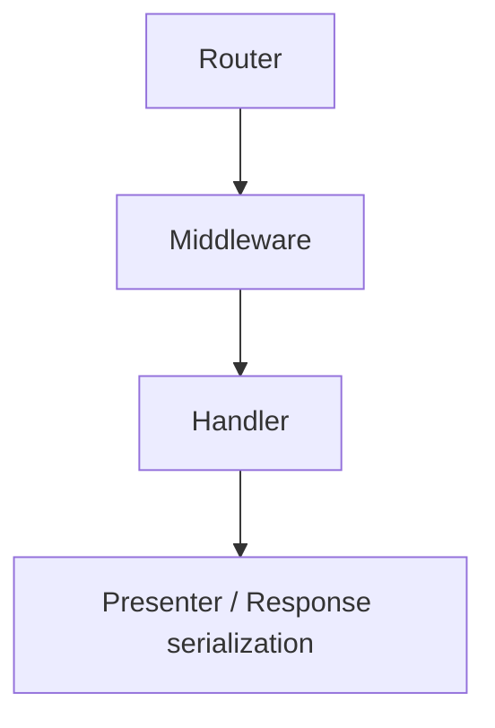
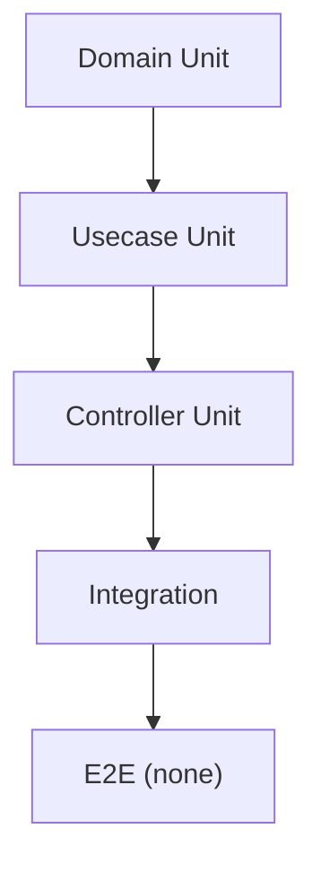
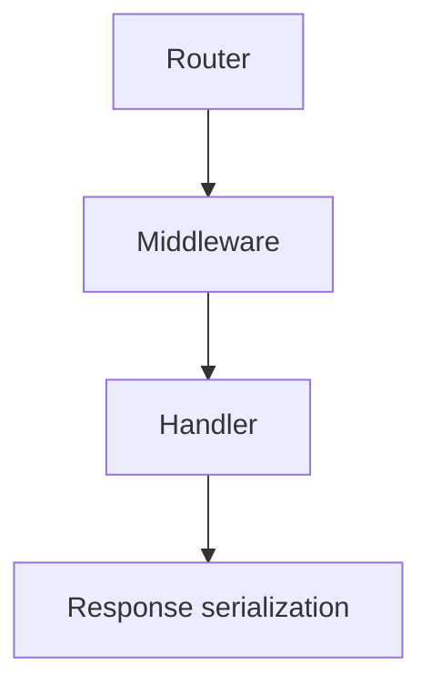
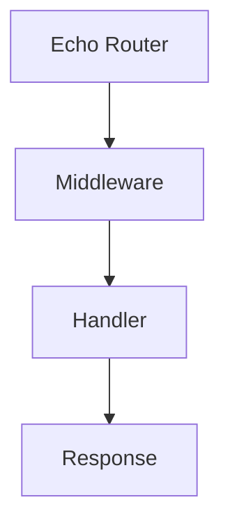
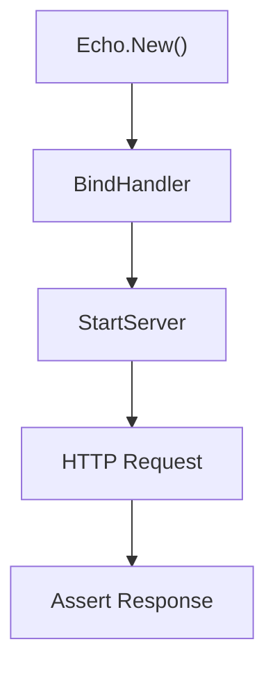
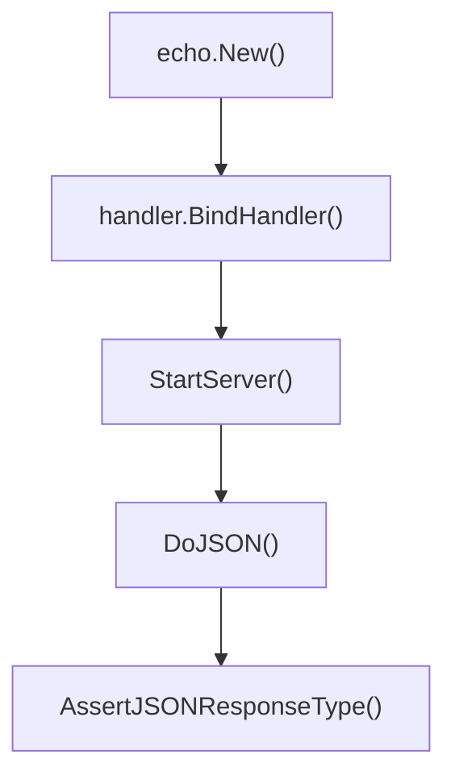

## integration Directory

English | [日本語](README.ja.md)

This directory is a place to organize **integration tests**.

It starts an Echo server and verifies through the **actual HTTP communication path**, which cannot be fully covered by unit tests.

These tests are **not integration tests that include DB or Infrastructure, but integration tests aimed at verifying the HTTP boundary**.

## Test Strategy

This project adopts the following test strategy.

- `Domain` → Unit Test
- `Usecase` → Unit Test
- `Controller` → Unit Test
- `Integration` → HTTP boundary test

Integration tests perform only **verification of the entire HTTP path behavior**.

In other words, the following scope is verified.



The following are **not handled in integration tests**.

- Domain logic
- Internal Usecase logic
- Repository implementation
- DB connection
- SQL execution

## Definition of Test Levels (Test Pyramid)

This project adopts a test strategy based on the **Test Pyramid**.



Policy:

- Write tests centered on **Domain / Usecase Unit Test**
- Integration Test performs **only HTTP boundary verification**
- E2E tests are not handled in this project

This policy provides the following benefits.

- Faster test execution
- Improved test maintainability
- Easier root cause identification when failures occur

## Why Usecase is mocked

In integration tests, **Usecase is mocked**.

The reason is **to preserve layer boundaries**.

The purpose of integration tests is **verification of the HTTP Layer**,  
and only the following scope is targeted.



The logic of Usecase / Domain / Repository  
belongs to **Unit Test responsibility**.

If Usecase is used as-is in implementation:

- DB
- Repository
- Domain

the test scope expands to include these,  
and **the purpose of HTTP boundary test is broken**.

## Integration Test Placement Policy

Integration tests are placed as **verification of public API behavior**.

Example target endpoints:

- `/health`
- `/healthz`
- `/ready`
- `/version`
- `/v1/...`

In other words, only **public HTTP APIs** are the target of integration tests.

Detailed logic of internal functions and handlers  
is verified by **Controller Unit Test**.

## Reason for having the integration directory

### Separation of layers

Unit tests target individual functions and handlers,  
while integration tests verify the **entire flow from router → middleware → handler → response serialization**.

By separating this directory, **the purpose and granularity of tests are clarified**.

- `internal/controller/handler/...` → Handler Unit Test
- `internal/integration` → HTTP Integration Test

### Verification close to actual operation

Integration tests verify by **sending actual HTTP requests**.

This allows confirmation of the following.

- Router binding
- Middleware application
- Request → DTO conversion
- Response serialization
- HTTP status codes

It can also be used for CI/CD and smoke testing.

## Scope of Integration Test

The scope handled by integration tests is as follows.



Usecase uses **mock**.

Reason:

The purpose of integration tests is **verification of HTTP boundary**,  
and not validation of application logic.

Example

- `mock_<feature>.NewMockUsecase`
- `mock_healthcheck.NewMockUsecase`

## Test Flow

Integration tests are executed with the following steps.



Concrete example



## Functions defined in helper_test.go

Every handler's `BindHandler` takes a tracer factory; in these tests it is a
no-op one obtained from `observability.NewNoopTracerFactory(t)`. Feature
handlers additionally take a **mocked usecase** (see "Why Usecase is mocked").

### `StartServer(t *testing.T, e *echo.Echo) *Server`

Starts Echo using `httptest.NewServer` and returns a simple server for integration testing.

Features:

- Server automatically stops with `t.Cleanup`
- Holds an internal HTTP client
- Provides test helper functions `Do` / `DoJSON`

Usage example:

```go
e := echo.New()
tf := observability.NewNoopTracerFactory(t)
<feature>.BindHandler(e, tf, mockUsecase)

srv := StartServer(t, e)
```

### `StopServer()`

Stops the server explicitly.

Normally, the server is automatically stopped by `t.Cleanup` in `StartServer`,  
so it is not used except in special cases.

### `Do(method, path string, reqBody io.Reader, contentType string, headers http.Header)`

Sends an arbitrary HTTP request.

Functions:

- Specify HTTP method
- Specify request body
- Specify headers
- Specify content-type

Internally uses `http.NewRequestWithContext`.

### `DoJSON(method, path string, reqBody any, headers http.Header)`

Shortcut function for JSON.

Features:

- Encodes `reqBody` as JSON
- Automatically sets `Content-Type: application/json`
- Internally calls `Do`

Example:

```go
actual := srv.DoJSON(http.MethodGet, "/health", nil, nil)
```

### `AssertJSONResponseType[T any]`

A reachability assertion for the HTTP boundary. It confirms that the response
travels the full HTTP path and is serialized into the expected shape — **not**
that individual field values are correct.

Verification contents:

- HTTP Status Code = 200
- Content-Type = application/json
- The response body can be unmarshaled into type `T`
- Every field declared as a Go slice in `T` (recursively, including nested
  structs and slice elements) is serialized as a JSON array — never `null`.
  Only a key that is present with a `null` value is a violation; an absent key
  (e.g. `omitempty`) is not.

This helper intentionally does **not** compare field values. Per the test
pyramid above, response value correctness (the presenter's field mapping) is the
responsibility of the **Controller Unit Test**, which verifies it against an
independent oracle. Duplicating value assertions here would couple the
integration test to presenter details and make it brittle; for responses that
carry dynamic values (e.g. build info, `RegisteredAt`) only the type is
checkable anyway.

The array-not-`null` check is not a value assertion but a check on the
**serialization shape**: whether an empty collection reaches the client as `[]`
or `null` is decided at the HTTP boundary, so the integration layer owns this
guarantee.

Usage example:

```go
AssertJSONResponseType[gen.HealthResponse](t, actual)
```

### `UseAppErrorHandler(t, e, extra ...extension.UseMiddleware)`

Installs the production `HTTPErrorHandler` on the Echo instance. The bare
`echo.New()` only carries Echo's default error handler, so error-path tests
that need to observe the real `apperror` → HTTP status mapping must wire the
production handler first.

It also wires the production `requestid` middleware, because the handler alone
cannot produce a conformant error response: it fills the body's `requestId` by
**reading back** the `X-Request-Id` that the middleware wrote onto the response.
Wire only the handler and every error body carries an empty `requestId`. The two
are one contract, so they are wired together here instead of being left for each
test to remember.

Pass `extra` to add further production middleware to that stack — take each one
from its own DI provider and let `extension.ApplyUseMiddlewares` sort them (see
"Wire a middleware-order contract from the DI providers, not by hand" below).
Call sites never write the order themselves.

### `AssertErrorResponse(t, actual, wantStatus)`

Asserts that an error response carries `wantStatus` and that its body
deserializes into the JSON error shape (`ErrorResponse`). As with
`AssertJSONResponseType`, only the boundary concern is checked — the
`apperror` → status mapping and the error body's shape — while the correctness
of the `code` / `message` values stays the responsibility of the unit tests.

It additionally asserts that the body's `requestId` is non-empty **and equals
the `X-Request-Id` header on the wire**. This is a boundary concern rather than
a value assertion: the header and the body are produced by two different
components (a middleware and the error handler) that only meet at the HTTP
boundary, so nothing below this layer can catch them disagreeing. Because every
error-path test funnels through this helper, the guarantee holds across the
whole suite rather than in one dedicated test.

Usage example:

```go
e := echo.New()
UseAppErrorHandler(t, e)
// ... mock the usecase to return apperror.ErrNotFound, bind the handler ...
actual := StartServer(t, e).DoJSON(http.MethodGet, path, nil, headers)
AssertErrorResponse(t, actual, http.StatusNotFound)
```

## Auth Test Helper

### `MakeAvailableUserID`

A helper that **simulates an authenticated user** in integration tests.

Internally it adds an Echo Middleware that builds an authenticated principal
with `auth.New` and injects it into the request context via `ctxhelper.WithAuthn`
/ `ctxhelper.SetAuthn`, then returns an `Authorization: Bearer debug:<id>` header
to attach to the request.

Usage example:

```go
headers := MakeAvailableUserID(t, e, userID)
srv.DoJSON(http.MethodPost, "/v1/<resource>", body, headers)
```

## Test Design Policy

Integration tests follow the following principles.

### 1 Do not use Infrastructure

In integration tests:

- DB
- SQL
- Repository

are not used.

### 2 Mock Usecase

In integration tests, **Usecase is mocked**.

Reason: because `integration = HTTP boundary test`.

### 3 Actually hit HTTP

Do not call handler directly, but use `httptest.Server`.

### 4 Verify with response types

Responses are verified using **OpenAPI types**.

- `gen.HealthResponse`
- `gen.VersionResponse`
- a feature handler's response type from its `gen` package — `gen.<Xxx>Response` (aliased, e.g. `detailgen.<Xxx>Response`, when one test file imports several handler `gen` packages)

### 5 Wire a middleware-order contract from the DI providers, not by hand

Most tests here register only the middleware the endpoint needs, in the order the
test writes them. That is fine while the assertion is about one middleware, but a
contract that only holds because middleware A runs outside middleware B is not
verified by a hand-written order — the test would keep passing after the real
priorities changed underneath it.

For those tests, take the middleware from its own DI provider
(`instrumentation.RequestIDMiddleware()`, `security.CookieMiddleware(...)`, …) and
apply it with `extension.ApplyUseMiddlewares`, which performs the same `Priority`
sort production does. The ordering then comes from the same source of truth as the
running server, so reordering the stack breaks the test that depends on it.

This is the one case where an integration test reaches into `internal/di`; it does
not license using the DI container to assemble usecases or infrastructure, which
stays mocked per the policies above.
