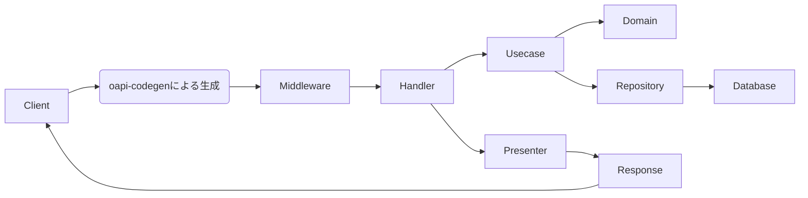
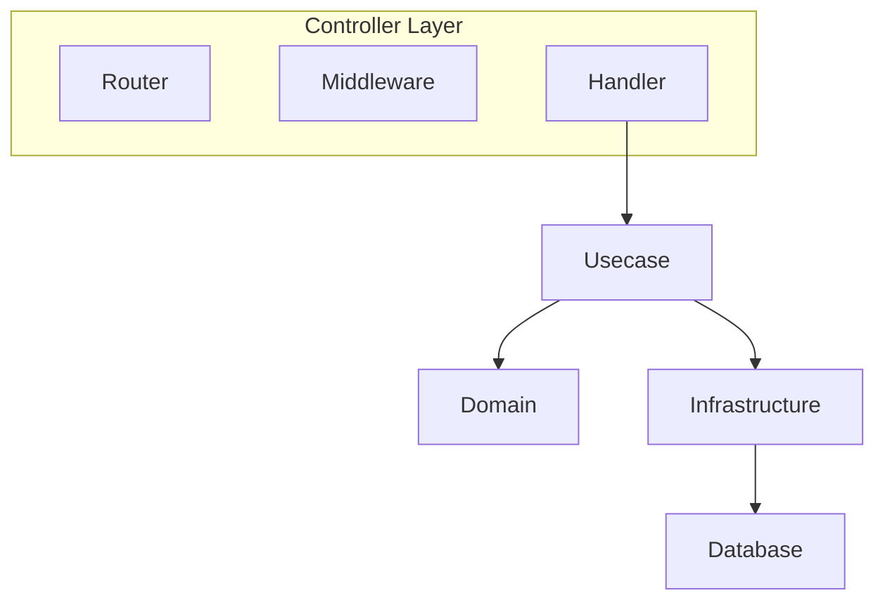
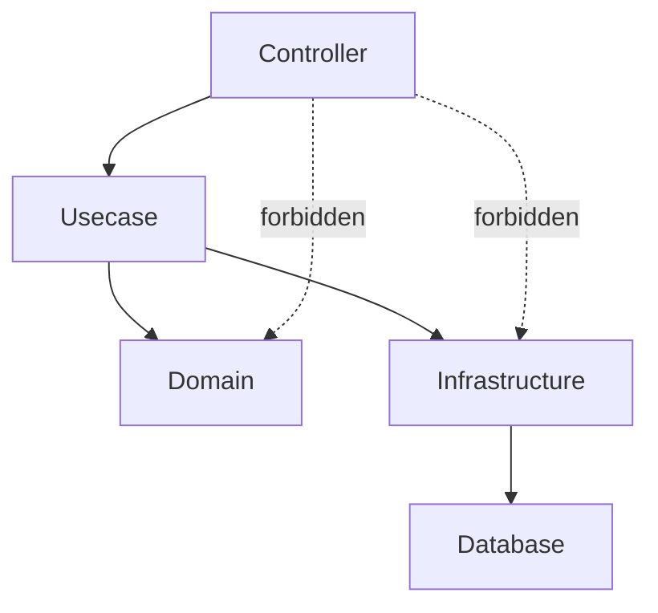
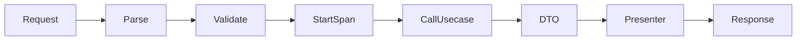
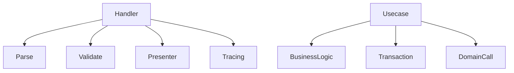
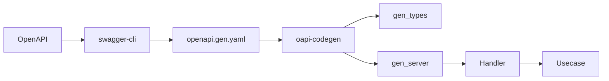
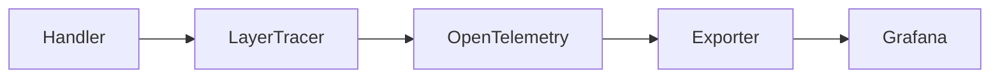

# コントローラー層のハンドラー（`internal/controller/handler`）ガイド

[English](README.md) | 日本語

## Controller Layerとは

このboilerplateでは以下を **Controller Layer** と定義します。

- handler - HTTPリクエストを受け取り、Usecase層へ処理を委譲する責務を持ちます。
- router - ルーティングの登録とHTTPサーバーの起動を担います。
- middleware - ロギング/リクエストID/トレーシングなど、HTTPリクエストの前後で共通処理を行います。

HTTPリクエストを受け取り、Usecase層へ処理を委譲する責務を持ちます。

Controllerは **アプリケーションの入出力境界** です。

## このリポジトリでの役割

internal/controller/handler は、CLI（Cobra）から起動される **サーバーのエントリポイント（Controller層）**です。

- 入力のパース/軽い検証（型・必須チェック）
- Observability（LayerTracer）で span を開始・終了する
- ユースケース（Usecase層）を呼び出す
  - 送信用の **DTO/VO** に詰め替えて渡す
  - Usecaseから返却されたDTO→OpenAPI型への詰め替え
- エラーは[apperrorで定義されているマップピング](../../apperror/README.ja.md)で apperrorのエラーを統一マッピングして返却される。
- ページングは`paging.NewPageFrom1Based()` に渡して正規化。
- リクエストID/ロギングなどはミドルウェア（Echo + Zap）で実施。

「ビジネスロジック」「DBアクセス」「ドメインモデルの操作」は Usecase / Domain / Infra に寄せ、Controller は薄く保ちます。

## Presenter とは

Presenterとは`Usecase DTO → OpenAPIレスポンス型`への変換処理です。

## アーキテクチャ

### HTTPリクエストの処理フロー



リクエストは次の順序で処理されます。

1. Router（Echo）がルーティングを解決
2. Middlewareが共通処理（ログ / トレース / RequestIDなど）を実行
3. Handler（Controller）が入力をパース
4. UsecaseにDTOとして処理を委譲
5. Domain / Repository を経由してデータを取得
6. DTO → OpenAPIレスポンス型へ変換（Presenter）
7. HTTPレスポンスとして返却

Handlerの役割は次の変換です。

```txt
HTTP Request
→ Parse / Validate
→ DTO
→ Usecase
→ DTO
→ Presenter
→ HTTP Response
```

### Controllerレイヤー設計



Controllerは **HTTPの入出力境界** を担当します。

役割

- Router  
  HTTPルーティングの登録

- Middleware  
  共通処理（Logging / RequestID / Trace）

- Handler  
  HTTPリクエスト → Usecase 呼び出し

### 依存関係ルール



許可される依存

- Controller → Usecase
- Controller → Presenter
- Controller → apperror

禁止される依存

- Controller → Domain
- Controller → Infrastructure
- Controller → Database

Controllerは **Usecaseを通してのみ下位層にアクセス**します。

## ハンドル設計

### ハンドラーの責務

それぞれの処理の間に必要な処理を挟みながら、HTTPリクエストをUsecase呼び出し、最終的にレスポンスを返却します。



Handlerの責務

1. リクエストのパース
2. 軽い検証
3. Trace span開始
4. Usecase呼び出し
5. DTO → Response変換
6. レスポンス返却

Handlerは **ビジネスロジックを持ちません**。

### Thin Controller 原則



Controllerが行うこと

- Request parsing
- Validation
- Presenter
- Tracing

Controllerが行わないこと

- ビジネスロジック
- DBアクセス
- トランザクション管理
- ドメインモデル操作

## OpenAPI との統合

### OpenAPI Code 生成フロー



開発フロー

1. OpenAPI定義を書く
2. swagger-cliで結合
3. oapi-codegenでコード生成
4. Handler実装

生成コードは `gen/` 配下に出力されます。

### oapi-codegenからハンドラの生成

- 生成する際には、[openapi/openapi.yaml](../../../openapi/openapi.yaml)に定義したルーティングに沿う形で、
  `internal/controller/handler/`の先のディレクトリをURIとして再現してハンドラファイルを生成してください。
  1. [openapi/openapi.yaml](../../../openapi/openapi.yaml)などにAPI定義を作成
     - [生成を前提としたOpenAPIガイドライン](../../../openapi/README.ja.md)を参照
  2. `internal/controller/handler/`の先のディレクトリをURIとして再現
     - 例1: `/v1/users` → `internal/controller/handler/v1/users/`
     - 例2: `/v1/users/{id}` → `internal/controller/handler/v1/users/detail/`
  3. 作成したファイルの先頭に生成用のコメントを追加

     ```go
     //go:generate oapi-codegen --include-tags=v1/users --package=gen --generate=types -o ./gen/type.gen.go /app/openapi/openapi.gen.yaml
     //go:generate oapi-codegen --include-tags=v1/users --package=gen --generate=echo-server,strict-server -o ./gen/server.gen.go /app/openapi/openapi.gen.yaml
     ```

  4. `swagger-cli`でOpenAPIを結合・検証し、`oapi-codegen`で生成
     - `make gen` で一括生成可能
  5. `internal/controller/handler/<version>/<resource>/gen`に生成物が出力される。
  6. 生成物をもとにコントローラーを実装する。
  7. 実装したコントローラーの`BindHandler`を[コントローラー層のDIモジュール](../../di/module/controller.go)に登録する。
- 入出力の型（パラメータ・ボディ・レスポンス）は生成物を使用し、**Usecase の DTO と明確に分離**。  
- スキーマ変更は **OpenAPI → 再生成 → 実装調整**の一方向。生成物は**編集禁止**。

### 生成コードポリシー

`gen/` 配下は `oapi-codegen` による **自動生成コード** です。

次の行為は禁止です。

- gen配下のコードを直接編集する
- 型定義を変更する
- interface を手で修正する

変更が必要な場合は必ず

OpenAPI → `make gen` → 再生成

の順序で修正してください。

## Observability

### Observability フロー

トレーシングの流れです。



Controllerは **OpenTelemetry SDKを直接扱いません**。

Controllerが行うこと

```go
ctx, endSpan := tracer.Start(ctx)
defer endSpan()
```

トレーサー生成や設定は **observability層に隠蔽**されています。

### Observability（Tracing）の使い方

このboilerplateでは、Controller層で直接OpenTelemetrySDKを扱わず、
observability.LayerTracerを経由してspanの開始・終了を行います。

#### 1. Controller層でのspanの開始と終了

各ハンドラーの先頭で必ず次の2行を記述してください。

```go
ctx, endSpan := s.tracer.Start(ctx)
defer endSpan()
```

- Start(ctx)でspanが開始され、trace_id/span_idがcontextに紐づきます。
- endSpan()は、spanの終了（span.End）を行います。
- defer endSpan()により例外や早期returnがあっても必ず終了されます。

ポイント：Controllerはspanの開始・終了だけを知り、
OpenTelemetry SDK の詳細には一切触れません。

#### 2. TracerのDI（observability.LayerTracer）

Controllerは以下のようにobservability.LayerTracerを依存として受け取ります。

```go
type server struct {
    tracer observability.LayerTracer
    uc      user.Usecase // それぞれのユースケース
}
```

BindHandler側では、`observability.NewControllerTracer`でController専用のトレーサーを生成します。

```go
func BindHandler(
  e *echo.Echo, tf observability.TracerFactory, uc user.Usecase
) {
    gen.RegisterHandlers(e, gen.NewStrictHandler(&server{
        tracer: tf.Controller(),
        uc:     uc,
    }, nil))
}
```

ここではSDKの生インスタンスを直接使わず、
observability層がtracerの生成ルール（レイヤー名やパッケージ名・関数名の抽出）を内部で隠蔽します。

## Implementation Rules

### 実装上の注意点（HTTPの要素をUsecaseに漏らさない）

#### 命名/構造

- ルーティングの登録関数は `BindHandler` とし、[di/module/controller.go](../../di/module/controller.go)で登録する。
- URIとした時のリソース構造を再現し、パスパラメータに関しては`detail`で分離して命名する。
  - 例1: package v1users
  - 例2: package v1usersdetail

#### UsecaseにHTTPの語彙を入れない

- `http.Request`/`http.Header`/`http.Status*`などの`http.`を**絶対**渡さない。  
- Usecaseの引数はDTO / VO（例：`Page`）/ Contextのみ。

#### ページング

- Controller: `page & per_page`を受け取り、`usecase.NewPagingFrom1Based()`でhttpを意味（Paging）へ変換。
- Usecase: `Paging`を受け、方針（上限・既定）を一元管理。

#### エラーマッピング

- Controller層で直接定義し、呼び出される基底のエラー（`apperror`）は下記のもの。
  - `ErrInvalidArgument` → 400
  - `ErrUnauthenticated` → 401
  - `ErrUnimplemented` → 501
  - `ErrUnavailable` → 503
- 0件リストは**正常**（200 + 空配列）。**NotFound は単体取得のみ**。  

#### トランザクション

- Controller は Tx を知らない。Tx 境界は Usecase（`TxManager`）が握る。

### 依存関係ポリシー

Controller層は次の依存のみ許可されます。

これらのルールは **Controller → Usecase → Domain/Infra** の一方向で、Controller層が下位層を直接呼び出すことはできません。
`make lint` で依存関係のルール違反を検出できます。

Allowed:

Controller → Usecase
Controller → Presenter
Controller → apperror

- **Controller → Usecase のみ**（＋生成物`gen`、DTO/Presenter、`apperror`/`errorresponse`）。  
- DI（`fx`）で `handler` は `usecase.Service` を受け取る。

Forbidden:

Controller → Domain
Controller → Infrastructure
Controller → Database

- **Infra / Domain を直接呼ばない**。

### やっていいこと / いけないこと(まとめ)

#### Do

- `Get...Params` → **VO/DTO（Page, Filters など）**へ変換
- DTO → `gen` レスポンスへ **Presenter** として詰め替え
- `httptest` + `testify` で **エンドツーエンド風** にハンドラを検証

#### Don’t

- Usecase に `http.Status`, `echo.Context`, `*http.Request` などの HTTP 要素を渡す
- Usecase で `limit/offset` を直に決めるために **HTTP のパラメータ生値**を渡す  
- `sqlc` 生成型やDB列名をControllerにそのまま持ち込む
- 一覧0件で `ErrNotFound` を返して404にする  
- 自動判定しているステータスコードを変更するために、エラーを握りつぶして独自に返す
- ログは **Zap ミドルウェア**（リクエストID, ルート, ステータス, 所要時間）

## テスト戦略

Controller層のテストは **HTTP境界の振る舞い** を検証します。

Controller テストでは **Usecase の実装は使用せず mock を利用**します。  
Controller は Thin Controller を前提とし、**HTTP Request / Response の変換と Usecase 呼び出し**に責務を限定します。

### テストの依存関係

|依存|テスト方法|
|---|---|
|Usecase|mock|
|Domain|使用しない|
|Infrastructure|使用しない|
|Echo Router|実体|
|Presenter|実装|
|Observability LayerTracer|mock / noop|

### テスト対象

Controller テストでは次の内容を検証します。

- Router が正しく登録される
- HTTP Request が正しく DTO に変換される
- Usecase が正しく呼び出される
- Usecase の戻り値が正しく OpenAPI Response に変換される
- エラーが正しく伝播される
- HTTP境界としての責務のみを果たしている

### テスト構成

Controller のテストは次の構成で実装します。

```text
TestBindHandler
Test_server_<Operation>
```

例：

```text
TestBindHandler
Test_server_GetUsers
Test_server_PostUsers
TestGetHealth
TestGetReady
TestGetVersion
```

### Router テスト

Router テストでは **ルーティングの登録結果**を検証します。

確認対象：

- path
- method

例：

```go
testassert.AssertEchoRouterPath(t, targetPath, e.Routes())
testassert.AssertEchoRouterMethods(t, expectedMethods, e.Routes())
```

このテストでは、ハンドラが **正しい URI / HTTP Method** で公開されていることを確認します。

### Handler テスト

Handler テストでは **Usecase を mock 化**し、Controller の責務のみを検証します。

例：

```go
mockApp := mock_user.NewMockUsecase(ctrl)
mockApp.EXPECT().
    ListUsersByKeyword(gomock.Any(), expectedParams, mockPaging).
    Return(mockDTO, nil)
```

検証対象：

- パラメータの正規化
- DTO の組み立て
- Usecase の呼び出し
- OpenAPI レスポンスへの詰め替え

### Response 検証

Response は **OpenAPI 生成型** を通して検証します。

例：

```go
actual, ok := resp.(gen.GetUsers200JSONResponse)
require.True(t, ok)

require.Equal(t, expectedResponse, gen.ResponseV1Users(actual))
```

Controller テストでは **HTTPレスポンス境界の型変換**が正しいことを確認します。

### エラー系テスト

Controller は **Usecase や前段処理のエラーをそのまま返す**ことを基本とします。

例：

```go
require.Nil(t, resp)
require.ErrorIs(t, err, apperror.ErrInvalidArgument)
```

確認対象：

- ページング変換エラー
- 認証情報不足エラー
- Usecase エラー
- BuildInfo / Config / Usecase の返却エラー

Controller 層では **ビジネスロジックとしてエラーを解釈し直さない**ことを確認します。

### Thin Controller 原則のテスト

Controller テストでは **ビジネスロジックを検証しません。**

検証対象は次のみです。

```text
HTTP boundary
DTO変換
Usecase呼び出し
Response変換
Error伝播
```

ビジネスルールの妥当性は **Usecase / Domain のテストで検証**します。

### Observability のテスト

Controller テストでは Observability の詳細実装ではなく、  
**LayerTracer を差し替えて安全に実行できること**を確認します。

例：

```go
lt := observability.NewMockControllerLayerTracer(t)
s := &server{
    tracer: lt,
    uc:     mockApp,
}
```

またはルーティング登録のみを確認する場合は noop tracer を使います。

```go
tf := observability.NewNoopTracerFactory(t)
```

### テスト設計ポリシー

#### 1. Usecase は mock にする

Controller の責務は Usecase 呼び出しまでであるため、  
**Usecase 実装そのものは Controller テストの対象外**とします。

#### 2. Infrastructure は使用しない

Controller テストでは DB / SQL / 外部API などは使用しません。

#### 3. OpenAPI 型で検証する

レスポンスは OpenAPI 生成型に変換された結果を検証します。

#### 4. Fail Fast

アサーションは `require` を基本とします。

例：

```go
require.NoError(t, err)
require.True(t, ok)
require.Equal(t, expected, actual)
```

前提条件が崩れた時点で即座にテストを失敗させ、  
テストの意図を明確に保ちます。

### テストで扱わないもの

Controller テストでは次を扱いません。

- Domain ロジックの妥当性
- Repository の実装
- SQL 実行
- DB 接続
- トランザクション制御
- Usecase 内部のアプリケーションロジック

これらは **Usecase / Domain / Infrastructure テストの責務**です。

## Example

## 参考スニペット

```go
//go:generate oapi-codegen --include-tags=v1/users --package=gen --generate=types -o ./gen/type.gen.go /app/openapi/openapi.gen.yaml
//go:generate oapi-codegen --include-tags=v1/users --package=gen --generate=echo-server,strict-server -o ./gen/server.gen.go /app/openapi/openapi.gen.yaml

package users

import (
    "context"

    "boilerplate-go/internal/observability"
    // それぞれ実装で使うパッケージをimport

    "github.com/labstack/echo/v4"
)

type server struct {
    tracer observability.LayerTracer
    uc      user.Service
}

// この関数をdi/handler.goで、[<package>.BindHandler,]として登録する。
func BindHandler(
  e *echo.Echo, tf observability.TracerFactory, uc user.Service,
) {
    gen.RegisterHandlers(e, gen.NewStrictHandler(&server{
        tracer: tf.Controller(),
        uc: uc,
    }, nil))
}

// handler
func (s *server) GetUsers(ctx context.Context, request gen.GetUsersRequestObject) (gen.GetUsersResponseObject, error) {
    // Spanの開始・終了呼び出して設定
    ctx, endSpan := s.tracer.Start(ctx)
    defer endSpan()

    page, err := paging.NewPagingFrom1Based(request.Params.Page, request.Params.PerPage)
    if err != nil {
        return nil, err
    }

    params := &user.GetParamsDTO{
        Keyword: request.Params.Keyword,
        Active:  request.Params.Active,
    }

    // Usecase 呼び出し（DTO返却）
    // user.ConditionByName はUsecaseの持ち物
    dtos, err := s.uc.ListUsersByKeyword(ctx, params, page)
    if err != nil {
        // エラーの基底値に従って、対応するHTTPステータスを返すのでハンドリングは不要
        return nil, err
    }

    // プレゼンター処理(DTO → OpenAPIの型)
    users := make([]gen.UserResponse, len(dtos))
    for i, dto := range dtos {
      users[i] = gen.UserResponse{
        Name:  dto.Name,
        Email: types.Email(dto.Email),
        Phone: ptr.To(dto.Phone),
      }
    }

    res := gen.ResponseV1Users{
      Users:  users,
      Limit:  page.Limit(),
      Offset: page.Offset(),
    }

    // OpenAPIのレスポンス型へ詰め替えて返却(ここは、gen/に定義される型を使うので、実装箇所によってメソッド名が変わります。)
    return gen.GetUsers200JSONResponse(res), nil
}
```
