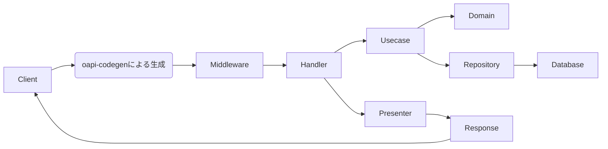
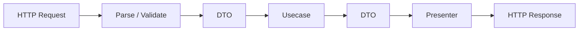
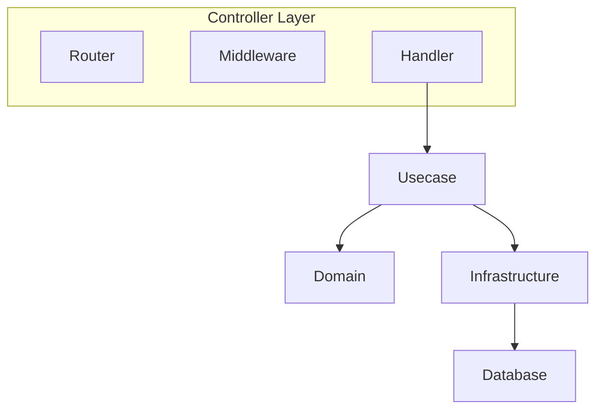
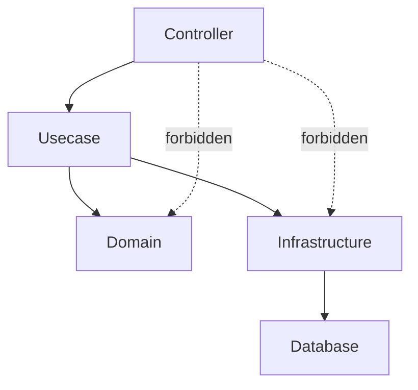
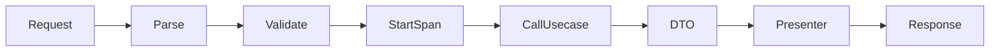
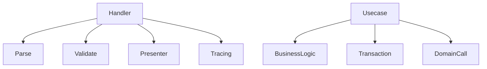
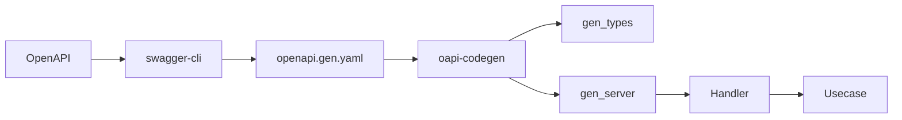
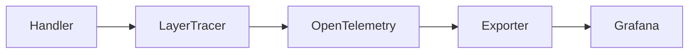
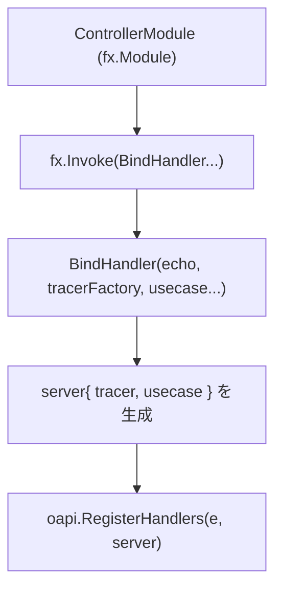
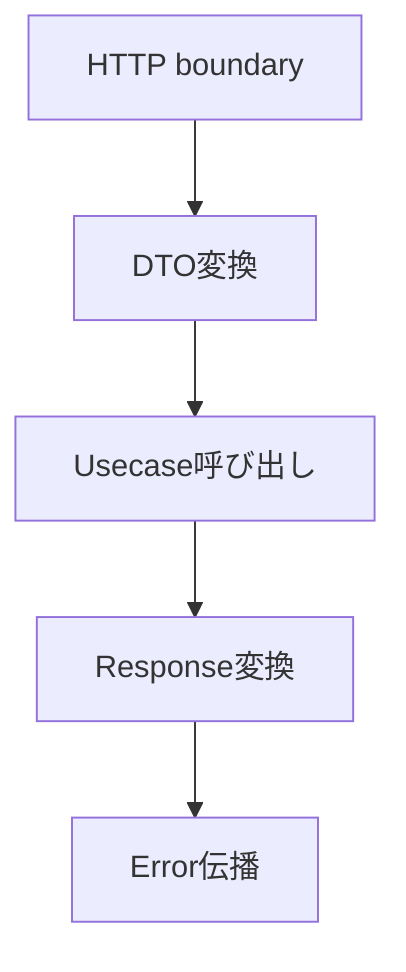

# コントローラー層のハンドラー（`internal/controller/handler`）ガイド

[English](README.md) | 日本語

## Controller Layerとは

このプロジェクトでは以下を **Controller Layer** と定義します。

- handler - HTTPリクエストを受け取り、Usecase層へ処理を委譲する責務を持ちます。
- router - ルーティングの登録とHTTPサーバーの起動を担います。
- middleware - ロギング/リクエストID/トレーシングなど、HTTPリクエストの前後で共通処理を行います。

Controllerは **アプリケーションの入出力境界** です。

## このプロジェクトでの役割

internal/controller/handler は、CLI（Cobra）から起動される **サーバーのエントリポイント（Controller層）**です。

- 入力のパース/軽い検証（型・必須チェック）
- Observability（LayerTracer）で span を開始・終了する
- ユースケース（Usecase層）を呼び出す
  - 送信用の **DTO/VO** に詰め替えて渡す
  - Usecaseから返却されたDTO→OpenAPI型への詰め替え
- エラーは[apperrorで定義されているマップピング](../../apperror/README.ja.md)で apperrorのエラーを統一マッピングして返却される。
- ページングは`paging.NewPageFrom1Based()` に渡して正規化。
- リクエストID/ロギングなどはミドルウェア（Echo + Zap）で実施。

「ビジネスロジック」「DBアクセス」「ドメインモデルの操作」は Usecase / Domain / Infra に寄せ、Controller は薄く保ちます。

handler は 1 アクションにつき **単一の Usecase 操作へ委譲**し、その結果を整形するだけにします。複数の Usecase 呼び出しを合成する（例: 一覧と総件数を別々に取得して handler で束ねる）のはアプリケーションのオーケストレーションであり Usecase 層の責務です。Usecase は合成済みの結果（例: `{ Items, Total }`）を返す単一メソッドを公開します。

## Presenter とは

Presenterとは`Usecase DTO → OpenAPIレスポンス型`への変換処理です。

同一の変換を複数のハンドラーメソッドで再利用する場合は、ハンドラーパッケージ内に private な `toXxxResponse(dto …) gen.XxxResponse` ヘルパー（例: `toItemResponse`）として定義します。単発の変換はハンドラー本体にインラインで書いてかまいません。

Presenter は**ハンドラーパッケージをまたいで共有しません**。2 つのパッケージが同じ Usecase DTO を同一のコードで変換する場合でも共有しません。レスポンス型はハンドラーパッケージごとに生成される（OpenAPI タグ 1 つにつき `gen` パッケージ 1 つ）ため、2 つのパッケージにある同名のレスポンス型は互いに無関係な 2 つの Go 型です。共有ヘルパーにすると、それらに対してジェネリックにするか、あるパッケージの型を別のパッケージへ返すことになります。**この重複は意図的です。** コピーは独立に保ち、Usecase DTO が変わったときにまとめて更新します。

## アーキテクチャ

### HTTPリクエストの処理フロー



リクエストは次の順序で処理されます。

1. Router（Echo）がルーティングを解決
2. Middlewareが共通処理（ログ / トレース / RequestIDなど）を実行
3. Handler（Controller）が入力をパース
4. UsecaseにDTOとして処理を委譲
5. Domain / Repository を経由してデータを取得
6. DTO → OpenAPIレスポンス型へ変換（Presenter）
7. HTTPレスポンスとして返却

Handlerの役割は次の変換です。



### Controllerレイヤー設計



Controllerは **HTTPの入出力境界** を担当します。

役割

- Router  
  HTTPルーティングの登録

- Middleware  
  共通処理（Logging / RequestID / Trace）

- Handler  
  HTTPリクエスト → Usecase 呼び出し

### 依存関係ルール



許可される依存

- Controller → Usecase
- Controller → Presenter
- Controller → apperror

禁止される依存

- Controller → Domain
- Controller → Infrastructure
- Controller → Database

Controllerは **Usecaseを通してのみ下位層にアクセス**します。

## ハンドル設計

### ハンドラーの責務

それぞれの処理の間に必要な処理を挟みながら、HTTPリクエストをUsecase呼び出し、最終的にレスポンスを返却します。



Handlerの責務

1. リクエストのパース
2. 軽い検証
3. Trace span開始
4. Usecase呼び出し
5. DTO → Response変換
6. レスポンス返却

Handlerは **ビジネスロジックを持ちません**。

### Thin Controller 原則



Controllerが行うこと

- Request parsing
- Validation
- Presenter
- Tracing

Controllerが行わないこと

- ビジネスロジック
- DBアクセス
- トランザクション管理
- ドメインモデル操作

## OpenAPI との統合

### OpenAPI Code 生成フロー



開発フロー

1. OpenAPI定義を書く
2. swagger-cliで結合
3. oapi-codegenでコード生成
4. Handler実装

生成コードは `gen/` 配下に出力されます。

### oapi-codegenからハンドラの生成

- 生成する際には、[openapi/openapi.yaml](../../../openapi/openapi.yaml)に定義したルーティングに沿う形で、
  `internal/controller/handler/`の先のディレクトリをURIとして再現してハンドラファイルを生成してください。

1. [openapi/openapi.yaml](../../../openapi/openapi.yaml)などにAPI定義を作成
   - [生成を前提としたOpenAPIガイドライン](../../../openapi/README.ja.md)を参照
2. `internal/controller/handler/`の先のディレクトリをURIとして再現
   - 例1: `/v1/<resource>` → `internal/controller/handler/v1/<resource>/`
   - 例2: `/v1/<resource>/{id}` → `internal/controller/handler/v1/<resource>/detail/`
3. 作成したファイルの先頭に生成用のコメントを追加

```go
//go:generate oapi-codegen --include-tags=v1/<resource> --package=gen --generate=types -o ./gen/type.gen.go /app/openapi/openapi.gen.yaml
//go:generate oapi-codegen --include-tags=v1/<resource> --package=gen --generate=echo5-server,strict-server -o ./gen/server.gen.go /app/openapi/openapi.gen.yaml
```

1. `swagger-cli`でOpenAPIを結合・検証し、`oapi-codegen`で生成
   - `make gen` で一括生成可能
2. `internal/controller/handler/<version>/<resource>/gen`に生成物が出力される。
3. 生成物をもとにコントローラーを実装する。
4. 実装したコントローラーの`BindHandler`を[コントローラー層のDIモジュール](../../di/module/controller.go)に登録する。

- 入出力の型（パラメータ・ボディ・レスポンス）は生成物を使用し、**Usecase の DTO と明確に分離**。  
- スキーマ変更は **OpenAPI → 再生成 → 実装調整**の一方向。生成物は**編集禁止**。

### パスパラメータの型変換（UUID）

`uuid` 型のパス/クエリパラメータは oapi-codegen の `openapi_types.UUID`（例: 生成された `<Resource>IdParam`）として渡される。usecase に渡す前に、**controller 専用の境界ヘルパー `internal/controller/conv` 経由**でドメイン側の `pkg/uuid.UUID` へ変換する。**生成 UUID 型を usecase / domain に持ち込まない**こと:

```go
id := conv.UUID(request.ItemId)
dto, err := s.uc.GetItem(ctx, id)
```

なぜ `pkg/uuid` のコンバータではなく `conv` か:

- UUID パスパラメータの形式は echo のバインド層で検証済み（不正な UUID はハンドラ到達**前**に 400 で弾かれる）。よってこの時点の値は必ず有効で変換は失敗しない → `conv.UUID` はエラーを返さない。
- `conv` は既存の検証済み `uuid.Parse` を再利用する。`pkg/uuid` に byte レベルのコンストラクタは**あえて追加しない** — public な検証バイパス入口は方針が形骸化し、各層で乱用されるため。
- OpenAPI 生成型を import するのは controller 層のみなので、変換を `internal/controller/conv` に集約すれば用途が境界に限定される（usecase / domain からは到達不能）。
- `conv` 内部では到達不能な parse 失敗を `panic` で不変条件アサートする。万一発火したら、それは握り潰すべき通常エラーではなく前提が壊れた致命的バグ。panic は string 入力の内部ヘルパー経由で単体テストするためカバレッジも完全。

### 生成コードポリシー

`gen/` 配下は `oapi-codegen` による **自動生成コード** です。

次の行為は禁止です。

- gen配下のコードを直接編集する
- 型定義を変更する
- interface を手で修正する

変更が必要な場合は必ず

OpenAPI → `make gen` → 再生成

の順序で修正してください。

### すべてのルートは OpenAPI に存在しなければならない

Echo に登録するルートは、必ず OpenAPI spec の operation（メソッド + パス）と対応していなければなりません。例外のための許可リストは持ちません。許可リスト自体がドリフト源になるためです。規約そのものの正本は [OpenAPI-first ルール](../../../docs/rules.ja.md#openapi-first-ルール)にあり、この節はハンドラを書くうえで何を意味するかを扱います。

この規約があるのは、HTTP スタックの複数の機能が「登録されたルート = spec の operation」を明示しないまま前提にしているからです。

- **405 の `Allow` ヘッダー** — このヘッダーはそのパスが実際に受け付けるメソッドを広告する必要があり、その一覧は登録ルートと spec の operation が一致している間だけ解決できる。
- **リクエストバリデーション** — spec に無いパスはバリデーションを受けない。
- **`details` の opt-in ゲート** — `DetailPolicy` は spec から operation を解決する fail-closed な仕組みのため、未解決のパスでは `details` が静かに落ちる。
- **404 / 405 の判定** — OpenAPI バリデーションミドルウェアは自前のルータで判定するため、spec に無いパスは 404 になる。

いずれもテストが緑のまま実行時の挙動だけが変わるため、この対応関係は `internal/architest` の `TestRouteSpecParity` で機械検証しています。除外されるのは `/_internal/` 配下の operation だけで、これは spec 自身が「実装・公開されないコード生成用のアンカー」と宣言しているためです。

したがって手書きのルート登録は、spec が既に宣言している operation に対してのみ許されます（[Handler 構造体のルール](#handler-構造体のルール)の `/metrics` の例外を参照）。メソッドとパスをソースから確定できない登録形（`Any` / `Match` / `Static` / `Group` / `AddRoute`、実行時にメソッドを決めるか `Route` リテラルを渡す `Add`、パスが文字列リテラルでない登録）は spec と突き合わせられないため、同じテストが拒否します。

## Observability

### Observability フロー

トレーシングの流れです。



Controllerは **OpenTelemetry SDKを直接扱いません**。

Controllerが行うこと

```go
ctx, endSpan := tracer.Start(ctx)
defer endSpan()
```

トレーサー生成や設定は **observability層に隠蔽**されています。

### Observability（Tracing）の使い方

このプロジェクトでは、Controller層で直接OpenTelemetrySDKを扱わず、
observability.LayerTracerを経由してspanの開始・終了を行います。

#### 1. Controller層でのspanの開始と終了

各ハンドラーの先頭で必ず次の2行を記述してください。

```go
ctx, endSpan := s.tracer.Start(ctx)
defer endSpan()
```

- Start(ctx)でspanが開始され、trace_id/span_idがcontextに紐づきます。
- endSpan()は、spanの終了（span.End）を行います。
- defer endSpan()により例外や早期returnがあっても必ず終了されます。

ポイント：Controllerはspanの開始・終了だけを知り、
OpenTelemetry SDK の詳細には一切触れません。

例外：下流の usecase を呼ばないハンドラー（liveness/health/version 等のプローブ）は再束縛した `ctx` を使わないため、未使用変数エラーを避けつつ span を記録する目的で `_, endSpan := s.tracer.Start(ctx)` と書いてよい。

#### 2. TracerのDI（observability.LayerTracer）

Controllerは以下のようにobservability.LayerTracerを依存として受け取ります。

```go
type server struct {
    tracer observability.LayerTracer
    uc      item.Usecase // それぞれのユースケース
}
```

BindHandler では、`tf.Controller()` で Controller 専用のトレーサーを生成します。

```go
func BindHandler(
  e *echo.Echo, tf observability.TracerFactory, uc item.Usecase
) {
    gen.RegisterHandlers(e, gen.NewStrictHandler(&server{
        tracer: tf.Controller(),
        uc:     uc,
    }, nil))
}
```

ここではSDKの生インスタンスを直接使わず、
observability層がtracerの生成ルール（レイヤー名やパッケージ名・関数名の抽出）を内部で隠蔽します。

## DI（Dependency Injection）の仕組み（Controller Layer）

このプロジェクトでは、Controller（Handler）は **Uber Fx による DI** で組み立てられます。
Handler は **自分で依存を生成せず、すべてコンストラクタ引数として受け取る**のが原則です。

### 全体構成

各ハンドラは `BindHandler` として定義され、`fx.Invoke` によって起動時に登録されます。



### internal/di/module/controller.go の役割

```go
func ControllerModule() fx.Option {
    return fx.Module("controller",
        fx.Invoke(
            health.BindHandler,
            items.BindHandler,
            // 他のハンドラ
        ),
    )
}
```

- `fx.Invoke`
  - Handler の登録関数（BindHandler）を起動時に実行
- 各 BindHandler は **DIされた依存（Echo / TracerFactory / Usecase）を受け取る**

### BindHandler の設計

```go
func BindHandler(
    e *echo.Echo,
    tf observability.TracerFactory,
    uc item.Usecase,
) {
    gen.RegisterHandlers(e, gen.NewStrictHandler(&server{
        tracer: tf.Controller(),
        uc:     uc,
    }, nil))
}
```

ポイント：

- `echo.Echo` は fx により自動注入される
- `TracerFactory` からレイヤー専用 tracer を取得
- `Usecase` は interface 経由で注入される（具象には依存しない）

### Handler 構造体のルール

```go
type server struct {
    tracer observability.LayerTracer
    uc     item.Usecase
}
```

- フィールドは **DIで受け取る依存のみ**
- new を使って内部で依存生成しない
- interface（Usecase）に依存する

例外：レスポンスを外部ライブラリのハンドラーが生成する運用エンドポイント（例: Prometheus の `/metrics` ハンドラー）は、そのパッケージで oapi-codegen を走らせないため生成された `ServerInterface` を持たず、`server` struct + `gen.NewStrictHandler` パターンに従いません。`BindHandler` 内で独自の `echo.HandlerFunc`（例: `echo.WrapHandler(promhttp.Handler())`）を直接登録します。この例外はコード生成についてのものであって **OpenAPI 定義についてではありません** — [すべてのルートは OpenAPI に存在しなければならない](#すべてのルートは-openapi-に存在しなければならない)が要求するとおり、operation は spec に宣言されています。

### なぜ fx.Invoke を使うのか

- ルーティング登録をアプリ起動時に自動化できる
- Handler 追加時に main.go を変更しなくてよい
- DIコンテナによる依存解決とライフサイクル管理が可能

### AI / 開発者向けルール

- 新しい Handler を追加する場合は `internal/di/module/controller.go` の `fx.Invoke(...)` に追加すること — 生成されたルート登録は配線の有無に関わらず存在するため、追加を忘れると実行時に 404 になる。この漏れは `internal/architest` の `TestBindHandlerDIParity` が検出する
- Handler 内で new して依存を生成しないこと
- 必ず constructor（BindHandler）経由で依存を受け取ること
- Usecase は interface を受け取り、具象型に依存しないこと

## Implementation Rules

### 実装上の注意点（HTTPの要素をUsecaseに漏らさない）

#### 命名/構造

- ルーティングの登録関数は `BindHandler` とし、[di/module/controller.go](../../di/module/controller.go)で登録する。
- URIとした時のリソース構造を再現し、パスパラメータに関しては`detail`で分離して命名する。
  - 例1: package v1users
  - 例2: package v1usersdetail

#### UsecaseにHTTPの語彙を入れない

- `http.Request`/`http.Header`/`http.Status*`などの`http.`を**絶対**渡さない。  
- Usecaseの引数はDTO / VO（例：`Page`）/ Contextのみ。

#### ページング

- Controller: `page & per_page`を受け取り、`paging.NewPageFrom1Based()`でhttpを意味（Page）へ変換。
- Usecase: `Page`を受け、方針（上限・既定）を一元管理。

#### エラーマッピング

- Controller層で直接定義し、呼び出される基底のエラー（`apperror`）は下記のもの。
  - `ErrInvalidArgument` → 400
  - `ErrUnauthenticated` → 401
  - `ErrUnimplemented` → 501
  - `ErrUnavailable` → 503
- 0件リストは**正常**（200 + 空配列）。  
- **NotFound は単体取得のみ**。

#### トランザクション

- Controller は Tx を知らない。  
- Tx 境界は Usecase（`TxManager`）が握る。

### 依存関係ポリシー

許可される依存・禁止される依存の一覧は上記の[依存関係ルール](#依存関係ルール)を参照してください。

## Do / Don’t

### Do

- `Get...Params` → **VO/DTO（Page, Filters など）**へ変換
- DTO → `gen` レスポンスへ **Presenter** として詰め替え
- `httptest` + `testify` で **エンドツーエンド風** にハンドラを検証

### Don’t

- Usecase に `http.Status`, `*echo.Context`, `*http.Request` などの HTTP 要素を渡す
- Usecase で `limit/offset` を直に決めるために **HTTP のパラメータ生値**を渡す  
- `sqlc` 生成型やDB列名をControllerにそのまま持ち込む
- 一覧0件で `ErrNotFound` を返して404にする  
- 自動判定しているステータスコードを変更するために、エラーを握りつぶして独自に返す
- ログは **Zap ミドルウェア**（リクエストID, ルート, ステータス, 所要時間）

## テスト戦略

Controller層のテストは **HTTP境界の振る舞い** を検証します。

Controller テストでは **Usecase の実装は使用せず mock を利用**します。  
Controller は Thin Controller を前提とし、**HTTP Request / Response の変換と Usecase 呼び出し**に責務を限定します。

### テストの依存関係

|依存|テスト方法|
|---|---|
|Usecase|mock|
|Domain|使用しない|
|Infrastructure|使用しない|
|Echo Router|実体|
|Presenter|実装|
|Observability LayerTracer|mock / noop|

### テスト対象

Controller テストでは次の内容を検証します。

- Router が正しく登録される
- HTTP Request が正しく DTO に変換される
- Usecase が正しく呼び出される
- Usecase の戻り値が正しく OpenAPI Response に変換される
- エラーが正しく伝播される
- HTTP境界としての責務のみを果たしている

### テスト構成

Controller のテストは次の構成で実装します。

```go
func TestBindHandler(t *testing.T) {
}

func Test_server_<Operation>(t *testing.T) {
}
```

### Router テスト

```go
testassert.AssertEchoRouterPath(t, targetPath, e.Routes())
testassert.AssertEchoRouterMethods(t, expectedMethods, e.Routes())
```

### Handler テスト

```go
mockApp := mock_item.NewMockUsecase(ctrl)
mockApp.EXPECT().
    ListItems(gomock.Any(), expectedParams, mockPage).
    Return(mockDTO, nil)
```

### Response 検証

```go
actual, ok := resp.(gen.ListItems200JSONResponse)
require.True(t, ok)

require.Equal(t, expectedResponse, gen.ItemsResponse(actual))
```

### エラー系テスト

```go
require.Nil(t, resp)
require.ErrorIs(t, err, apperror.ErrInvalidArgument)
```

### Thin Controller 原則のテスト

Controller テストでは **ビジネスロジックを検証しません。**

検証対象は次のみです。



ビジネスルールの妥当性は **Usecase / Domain のテストで検証**します。

### Observability のテスト

Controller テストでは Observability の詳細実装ではなく、  
**LayerTracer を差し替えて安全に実行できること**を確認します。

例：

```go
lt := observability.NewMockControllerLayerTracer(t)
s := &server{
    tracer: lt,
    uc:     mockApp,
}
```

またはルーティング登録のみを確認する場合は noop tracer を使います。

```go
tf := observability.NewNoopTracerFactory(t)
```

### テスト設計ポリシー

- Usecase は mock にする
- Infrastructure は使用しない
- OpenAPI 型で検証する
- `require` で Fail Fast させる

### テストで扱わないもの

Controller テストでは次を扱いません。

- Domain ロジックの妥当性
- Repository の実装
- SQL 実行
- DB 接続
- トランザクション制御
- Usecase 内部のアプリケーションロジック

これらは **Usecase / Domain / Infrastructure テストの責務**です。

## テストキット（testkit）

`testkit/` 配下には、Controller テストで共通利用するヘルパーパッケージが格納されています。

|パッケージ|説明|
|---|---|
|`testassert`|JSON レスポンスの検証、Echo ルーターのパス・メソッド検証|
|`testauth`|テスト用の認証情報をコンテキストに設定|
|`testecho`|Echo テスト用のビルダークライアント（リクエスト構築・送信）|
|`testspan`|Echo コンテキストにテスト用 span を埋め込み|
|`testuuid`|テスト用のパス/クエリパラメータ用 UUID 値を生成|

### testassert

|関数|説明|
|---|---|
|`AssertJSONEqual[T]`|HTTPレスポンスのステータスコードとJSONボディを検証|
|`AssertEchoRouterMethods`|登録されたルートのHTTPメソッドを検証|
|`AssertEchoRouterPath`|登録されたルートのパスを検証|

### testauth

|関数|説明|
|---|---|
|`MakeAvailableAuthn`|テスト用コンテキストに認証情報（subject）を設定|

### testecho

テスト用のHTTPリクエストをビルダーパターンで構築します。

```go
rec := testecho.NewEchoTestClient(t, e).
    Method(http.MethodGet).
    RequestURL("/v1/items?page=1&per_page=10").
    AuthBearer("test-token").
    Serve()
```

|メソッド|説明|
|---|---|
|`NewEchoTestClient`|テスト用クライアントを生成|
|`WithAppErrorHandler`|本番相当のエラーハンドラを Echo に設定（`HTTPErrorHandler` を上書き）|
|`Method`|HTTPメソッドを設定|
|`RoutePattern`|ルートパターンを設定（例: `/users/:id`）|
|`RequestURL`|実際のリクエストURLを設定|
|`JSONBody`|JSON形式のリクエストボディを設定|
|`RawBody`|生のリクエストボディを設定|
|`Header`|リクエストヘッダーを設定|
|`AuthBearer`|Bearer トークンを設定|
|`PathParams`|パスパラメータを設定|
|`QueryParams`|クエリパラメータを設定|
|`Build`|Request / ResponseRecorder / *echo.Context を返す|
|`Serve`|Echo にリクエストを送信し ResponseRecorder を返す|

### testspan

|関数|説明|
|---|---|
|`StartTestSpanForEcho`|*echo.Context にテスト用 span を埋め込み、終了関数を返す|

### testuuid

|関数|説明|
|---|---|
|`RequestUUID`|テストのパス/クエリパラメータに使う有効な `openapi_types.UUID` を生成|

## Example

## 参考スニペット

```go
//go:generate oapi-codegen --include-tags=v1/items --package=gen --generate=types -o ./gen/type.gen.go /app/openapi/openapi.gen.yaml
//go:generate oapi-codegen --include-tags=v1/items --package=gen --generate=echo5-server,strict-server -o ./gen/server.gen.go /app/openapi/openapi.gen.yaml

package items

import (
    "context"

    "go-boilerplate/internal/observability"
    // それぞれ実装で使うパッケージをimport

    "github.com/labstack/echo/v5"
)

type server struct {
    tracer observability.LayerTracer
    uc      item.Usecase
}

// この関数を di/module/controller.go で、[<package>.BindHandler,] として登録する。
func BindHandler(
  e *echo.Echo, tf observability.TracerFactory, uc item.Usecase,
) {
    gen.RegisterHandlers(e, gen.NewStrictHandler(&server{
        tracer: tf.Controller(),
        uc: uc,
    }, nil))
}

// handler
func (s *server) ListItems(ctx context.Context, request gen.ListItemsRequestObject) (gen.ListItemsResponseObject, error) {
    // Spanの開始・終了呼び出して設定
    ctx, endSpan := s.tracer.Start(ctx)
    defer endSpan()

    page, err := paging.NewPageFrom1Based(request.Params.Page, request.Params.PerPage)
    if err != nil {
        return nil, err
    }

    params := &item.ListParamsDTO{
        Keyword: request.Params.Keyword,
        Active:  request.Params.Active,
    }

    // Usecase 呼び出し（DTO返却）。フィルタ条件などの方針は Usecase の持ち物。
    dtos, err := s.uc.ListItems(ctx, params, page)
    if err != nil {
        // エラーの基底値に従って、対応するHTTPステータスを返すのでハンドリングは不要
        return nil, err
    }

    // プレゼンター処理(DTO → OpenAPIの型)
    items := make([]gen.ItemResponse, len(dtos))
    for i, dto := range dtos {
      items[i] = gen.ItemResponse{
        Name:  dto.Name,
        Email: types.Email(dto.Email),
        Phone: ptr.To(dto.Phone),
      }
    }

    res := gen.ItemsResponse{
      Items:  items,
      Limit:  page.Limit(),
      Offset: page.Offset(),
    }

    // OpenAPIのレスポンス型へ詰め替えて返却(ここは、gen/に定義される型を使うので、実装箇所によってメソッド名が変わります。)
    return gen.ListItems200JSONResponse(res), nil
}
```
