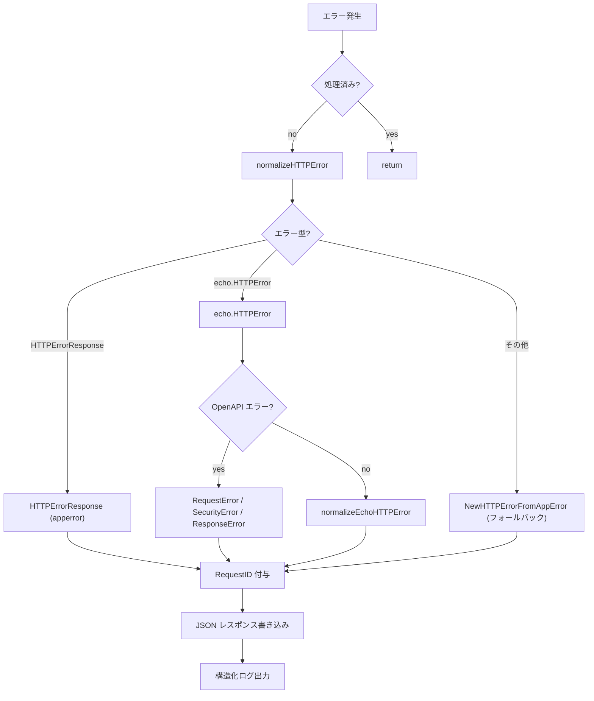

# errorhandler

[English](README.md) | 日本語

Echo / OpenAPI バリデーション / アプリケーションレベルのエラーを統一的な JSON レスポンスに正規化し、構造化ログとともに処理する統一 HTTP エラーハンドラです。

## アーキテクチャ



## 公開 API

|関数|説明|
|---|---|
|`New(e, log, lf, obsCfg)`|Echo インスタンスに統一エラーハンドラを設定（`e.HTTPErrorHandler`）|
|`NewHTTPErrorHandler(logger, lf, obsCfg)`|すべてのエラー型を正規化する `echo.HTTPErrorHandler` を返す|

## エラー正規化

ハンドラは以下の優先順位でエラーを処理します。

### 1. `response.HTTPErrorResponse`（アプリケーションエラー）

ハンドラ内で `response.NewHTTPErrorFromAppError()` によりラップ済みのエラー。

- HTTP ステータスが有効（400-599）: そのまま使用し、RequestID を付与
- HTTP ステータスが無効: `NewHTTPErrorFromAppError(internal)` で再正規化

### 2. `echo.HTTPError`（Echo / OpenAPI エラー）

まず Echo エラー内の OpenAPI 固有エラーを確認：

|OpenAPI エラー型|HTTP ステータス|
|---|---|
|`openapi3filter.RequestError`|400 Bad Request|
|`openapi3filter.SecurityRequirementsError`|401 Unauthorized|
|`openapi3filter.ResponseError`|500 Internal Server Error|

OpenAPI エラーでない場合は、ステータスコードを使って標準 Echo HTTP エラーとして正規化。

### 3. フォールバック

認識できないエラーは `response.NewHTTPErrorFromAppError()` に渡され、`apperror` の型に基づいて HTTP ステータスコードにマッピングされます。

## レスポンス形式

すべてのエラーは `response.HTTPErrorResponse` を使って JSON で返されます：

```json
{
  "code": "BAD_REQUEST",
  "message": "...",
  "details": ["..."],
  "requestId": "..."
}
```

- `requestId` は常に付与（`requestid.GetRequestIDFromResponse` で取得）
- `Details` と `Internal` エラーは利用可能な場合に含まれる
- `Internal` エラーとスタックトレースはログに出力されるが、**クライアントには返されない**

## ログ出力

エラーログは `ObservabilityConfig.TargetStatusCodeSet()` で制御されます：

- 設定されたステータスコードのみログ対象
- **5xx**: `Error` レベル（`errorhandler.server_error`）
- **4xx**: `Warn` レベル（`errorhandler.client_error`）

ログフィールド：

- HTTP ステータス、エラーコード、エラーメッセージ、RequestID
- リクエスト詳細（メソッド、パス、URI、リモート IP、ホスト、ユーザーエージェント等）
- クエリパラメータ、パスパラメータ
- Trace ID / Span ID（Observability 有効時）
- 内部エラーメッセージとスタックトレース（デバッグ用）

## 再入ガード

初回呼び出し時にハンドラは `ctxhelper.SetErrorHandledToEcho(c, true)` を呼び、以降の呼び出しは `ctxhelper.GetErrorHandledFromEcho(c)` の判定で早期 return します。これによりエラーレスポンス書き込み中に再度エラーが起きても無限再帰しません。フラグは Echo の内部ストアではなく `scripts/genctxkey` が生成する typed sentinel として request の context 側に保持されます。

## リカバリミドルウェアとの連携

上流の `recovery` ミドルウェアが既にパニックをログ済みの場合、同じコンテキストには `ctxhelper.SetRecoveredToEcho(c, true)` で `Recovered` sentinel が立っています。本ハンドラは `logHTTPError` を呼ぶ前に `ctxhelper.GetRecoveredFromEcho(c)` をチェックし、ログ二重出力を抑止します（500 レスポンス自体は返します）。

## ファイル構成

|ファイル|責務|
|---|---|
|`http_error_handler.go`|メインハンドラ、正規化ディスパッチ、ログ出力|
|`echo_http_error_handler.go`|`echo.HTTPError` → `HTTPErrorResponse` の正規化|
|`open_api_error_handler.go`|OpenAPI バリデーションエラー → `HTTPErrorResponse` の正規化|

## 注意点

- エラーレスポンスの書き込みに失敗した場合、フォールバックとして `500` ステータスを返し、書き込みエラーをログに出力
- エラーレスポンスは `controller/error/response/` の `response.HTTPErrorResponse` を使用 — エラーコードとメッセージのマッピングはそちらを参照
- このハンドラは Echo のデフォルトエラーハンドラを完全に置き換える
