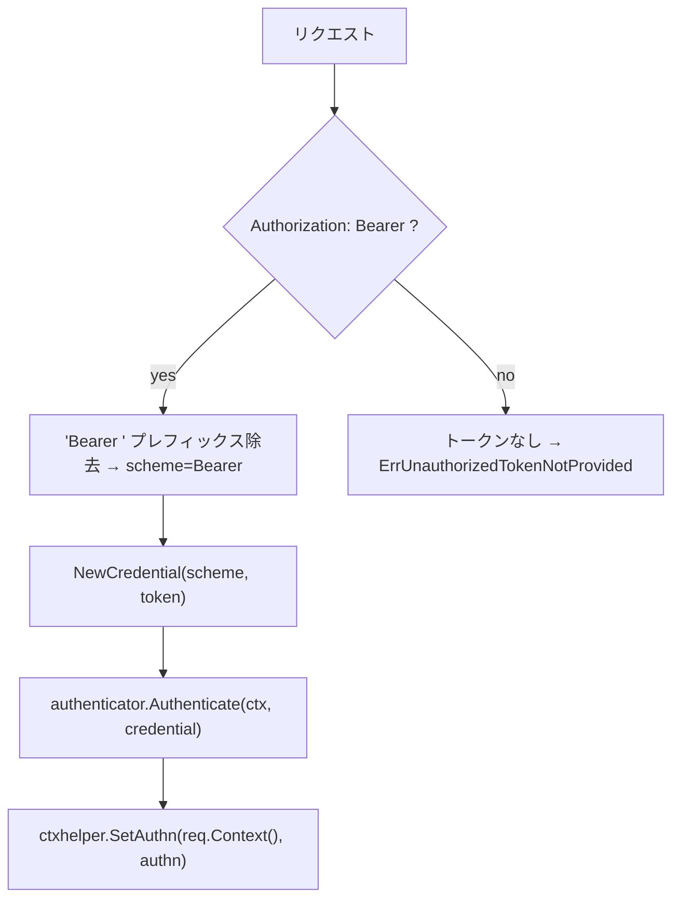
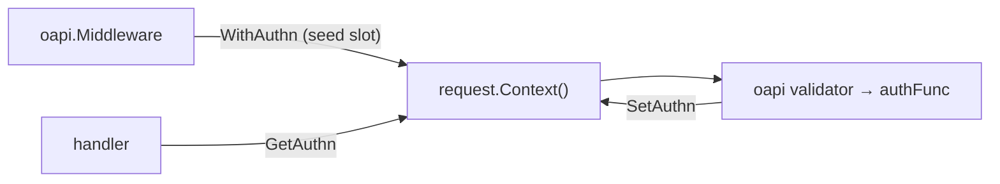

# oapi/auth

[English](README.md) | 日本語

`Authorization` ヘッダーから Bearer トークンを抽出し、boundary の `Authenticator` で検証し、結果をリクエストコンテキスト（authn スロット）に格納する OpenAPI 認証関数です。Cookie ベースの抽出はサポートしません（Bearer / リソースサーバーモデル）。

## トークン抽出フロー

### 抽出ルール

1. **Header** — 固定の `Authorization` ヘッダーから抽出。Bearer トークンは RFC 6750 で `Authorization` に固定されるため、ヘッダー名は可変にしない
2. **Bearer プレフィックス** — `Authorization: Bearer <token>` 形式のみ受理。`Bearer` プレフィックスを除去し credential のスキームは `Bearer` になる。それ以外の形式はトークンなしとして扱う
3. トークンが取得できない場合は `ErrUnauthorizedTokenNotProvided` を返す

### 認証ステップ

1. `Authorization` ヘッダーから Bearer トークンを抽出（上記ルールに従う）
2. スキームとトークンから `boundary/auth.Credential` を生成
3. `authenticator.Authenticate(ctx, credential)` を呼び出して `Authn` を取得。渡すのはバリデータから来る
   コンテキストではなく**リクエストの**コンテキスト —— バリデータは `context.Background()` から組み立てるため、
   スパン・deadline・キャンセルがいずれも失われ、認証がリクエストの予算の外・トレースの外で動くことになる
4. `ctxhelper.SetAuthn()` でリクエストコンテキストに `Authn` を格納（スロットは上流の `oapi.Middleware` が `ctxhelper.WithAuthn` で仕込む）。スロットが無ければ `ErrAuthnSlotNotFound` を返す

ハンドラコードでは `ctxhelper.GetAuthn()` で `Authn` を取得できます。

資格情報が提示されたうえで拒否された場合、その結果のエラーは返す前に `ctxhelper.SetAuthnFailure()` で
スロットへも記録されます。拒否された資格情報は、spec が認証を任意と宣言していてもリクエストを拒否
しなければならず、戻り値だけではそれを運べないためです（[`../README.ja.md`](../README.ja.md) の
fail-closed の節を参照）。資格情報が提示されなかったことは失敗ではなく、記録もされないため、
匿名の呼び出し元を受け入れる operation は従来どおり受け入れます。

## エラー

|エラー|ベースエラー|説明|
|---|---|---|
|`ErrUnauthorizedInvalidToken`|`ErrUnauthenticated`|`Authenticator` によるトークン検証失敗|
|`ErrUnauthorizedTokenNotProvided`|`ErrUnauthenticated`|`Authorization` ヘッダーにトークンが見つからない|
|`ErrUnauthorizedTokenMissing`|`ErrUnauthenticated`|認証トークンが欠落（**予約** — 現状は返さない。注意点を参照）|
|`ErrAuthnSlotNotFound`|`ErrInternal`|リクエストコンテキストに authn スロットが無い（`oapi.Middleware` が未注入）。資格情報と無関係な結線の不具合|
|`ErrInvalidAuthDefaultMode`|`ErrInternal`|デフォルト認証ポリシーが見つからない（**予約** — 現状は返さない。注意点を参照）|

authFunc から出るエラーはすべて HTTP ステータスを持つ形へ包まれ、そのステータスは
`controller/error/response` の中央の `apperror` 写像から来ます —— 認証フェーズは自前の表を持ちません。
認証の結論は 401、キャンセルは 499、依存先へ到達できない場合は 503、分類の無いものは 500 です。

これは見た目の問題ではありません。バリデーションミドルウェアはエラーから読み取れるステータスしか伝播させず、
それ以外は **403** へ丸めます —— 認可を評価していないリクエストに対する認可の結論です。
この段でステータスを持たせることが、それを防いでいます。

クライアントが取る行動が変わります。401 は「資格情報を拒否した」＝再認証、499 / 503 は「結論に至らなかった」＝再試行、
403 なら「本人だと分かったうえで操作を拒否した」。依存先の障害を 401 として返すと、誰も検査していないトークンを
直すようクライアントへ促し、こちら側の欠陥を「期待される定常ノイズ」である 401 の中に埋めることになります。

## authn スロット統合

この関数は OpenAPI バリデーションパイプライン内で動作するため、`*echo.Context` ではなく `context.Context` のみが利用可能です。親の `oapi.Middleware` がバリデーション実行前に `request.Context()` へ **authn スロット**（`ctxhelper.WithAuthn`）を仕込むことで、バリデータから呼ばれる authFunc がそのスロットへ認証結果 `Authn` を `ctxhelper.SetAuthn` で書き戻せます。ハンドラは後段で `ctxhelper.GetAuthn` により取得します。

## 注意点

- トークン抽出はヘッダーのみ。Cookie は参照しません（Bearer / リソースサーバーモデル）
- `Authorization: Bearer <token>` 形式のみ受理（RFC 6750）。非 Bearer スキームやカスタムヘッダー名はサポートしない
- `Authenticator` の実装は環境固有（ローカルモック、JWT、OAuth 等）で DI 経由で注入される
- **予約エラーシーム（現状は返さない）。** `ErrUnauthorizedTokenMissing` と `ErrInvalidAuthDefaultMode` は、本パッケージが未実装のシナリオに向けて意図的に用意した拡張ポイントです。前者は *`Authorization` ヘッダー自体の欠如* と *Bearer トークンが空* を将来区別するため、後者は将来の *デフォルト認証ポリシー* 解決経路のためのものです。現状、トークン欠如は `ErrUnauthorizedTokenNotProvided` のみで表現し、デフォルトポリシー解決は存在しません。削除せず意図的な API シームとして残しています。いずれかのシナリオを実際に実装する際は、素のセンチネルに頼らず、返却する実処理とテストを併せて追加してください
