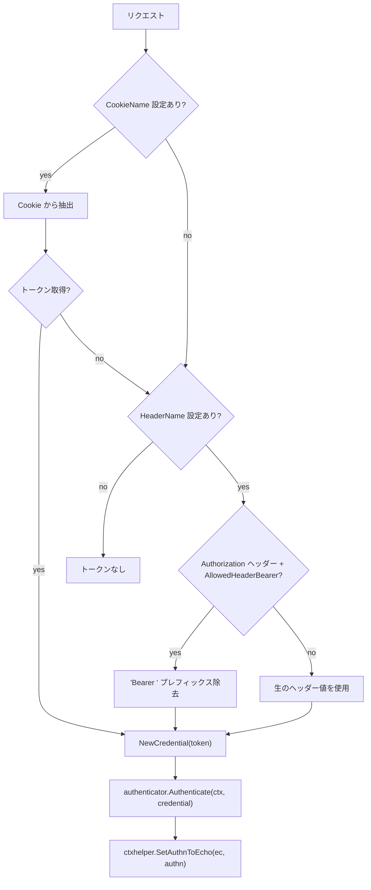
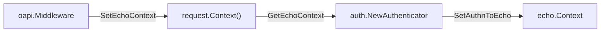

# oapi/auth

[English](README.md) | 日本語

Cookie またはヘッダーからトークンを抽出し、boundary の `Authenticator` で検証し、結果を Echo コンテキストに格納する OpenAPI 認証関数です。

## 公開 API

|関数|説明|
|---|---|
|`NewAuthenticator(authCfg, authenticator)`|OpenAPI セキュリティバリデーション用の `openapi3filter.AuthenticationFunc` を返す|

## トークン抽出フロー

### 抽出の優先順位

1. **Cookie** — `AuthConfig.CookieName()` が設定されている場合、まず Cookie から抽出
2. **Header** — Cookie が空 / 未設定で `AuthConfig.HeaderName()` が設定されている場合、ヘッダーから抽出
3. **Bearer プレフィックス** — `AllowedHeaderBearer` が true でヘッダーが `Authorization` の場合、`Bearer` プレフィックス（末尾のスペース込み）を除去
4. どちらからもトークンが取得できない場合は `ErrUnauthorizedTokenNotProvided` を返す

### 認証ステップ

1. Cookie またはヘッダーからトークンを抽出（上記の優先順位に従う）
2. トークンから `boundary/auth.Credential` を生成
3. `authenticator.Authenticate(ctx, credential)` を呼び出して `Authn` を取得
4. `ctxhelper.SetAuthnToEcho()` で Echo コンテキストに `Authn` を格納

ハンドラコードでは `ctxhelper.GetAuthn()` で `Authn` を取得できます。

## エラー

|エラー|ベースエラー|説明|
|---|---|---|
|`ErrUnauthorizedEchoContextNotFound`|`ErrConflict`|リクエストコンテキストに Echo コンテキストが見つからない（内部配線エラー）|
|`ErrUnauthorizedInvalidToken`|`ErrUnauthenticated`|`Authenticator` によるトークン検証失敗|
|`ErrUnauthorizedTokenNotProvided`|`ErrUnauthenticated`|Cookie / ヘッダーにトークンが見つからない|
|`ErrUnauthorizedTokenMissing`|`ErrUnauthenticated`|認証トークンが欠落|
|`ErrInvalidAuthDefaultMode`|`ErrInternal`|デフォルト認証ポリシーが見つからない|

## Echo コンテキスト統合

この関数は OpenAPI バリデーションパイプライン内で動作するため、`echo.Context` ではなく `context.Context` のみが利用可能です。親の `oapi.Middleware` がバリデーション実行前に `request.Context()` に Echo コンテキストを注入することで解決しています。

## 注意点

- Cookie 抽出がヘッダーより優先 — 両方設定されていて Cookie に値があればヘッダーは確認しない
- Bearer プレフィックス除去は `AllowedHeaderBearer` が true かつヘッダー名が `Authorization` の場合のみ適用
- `Authenticator` の実装は環境固有（ローカルモック、JWT、OAuth 等）で DI 経由で注入される
