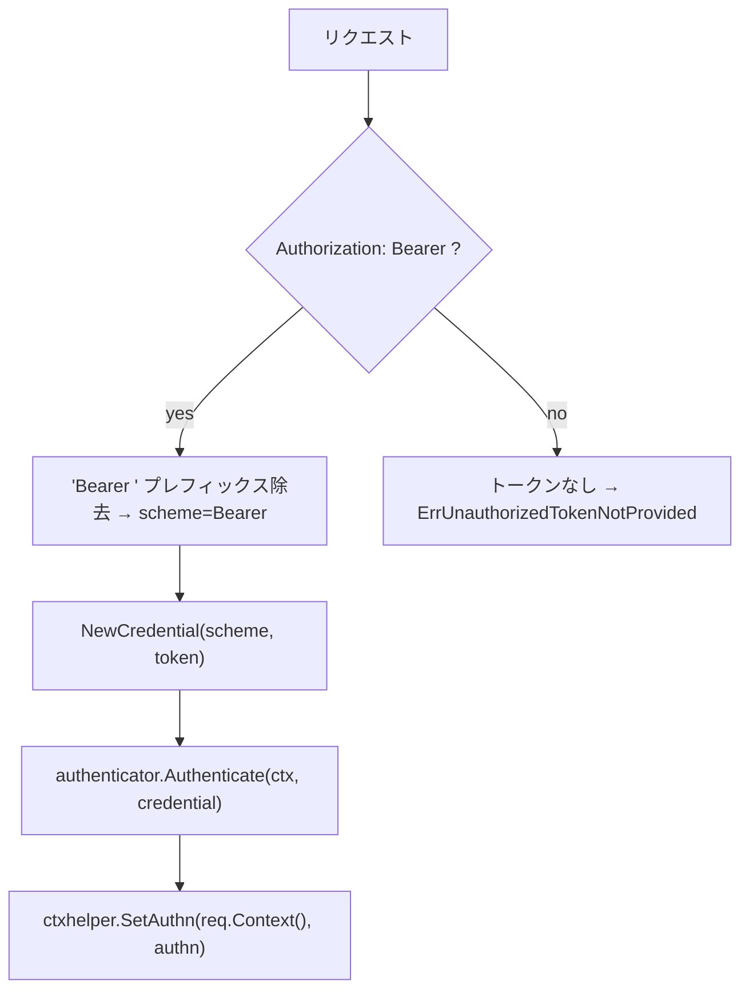
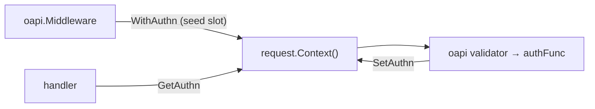

# oapi/auth

[English](README.md) | 日本語

`Authorization` ヘッダーから Bearer トークンを抽出し、boundary の `Authenticator` で検証し、結果をリクエストコンテキスト（authn スロット）に格納する OpenAPI 認証関数です。Cookie ベースの抽出はサポートしません（Bearer / リソースサーバーモデル）。

## トークン抽出フロー

### 抽出ルール

1. **Header** — 固定の `Authorization` ヘッダーから抽出。Bearer トークンは RFC 6750 で `Authorization` に固定されるため、ヘッダー名は可変にしない
2. **Bearer プレフィックス** — `Authorization: Bearer <token>` 形式のみ受理。`Bearer` プレフィックスを除去し credential のスキームは `Bearer` になる。それ以外の形式はトークンなしとして扱う
3. トークンが取得できない場合は `ErrUnauthorizedTokenNotProvided` を返す

### 認証ステップ

1. `Authorization` ヘッダーから Bearer トークンを抽出（上記ルールに従う）
2. スキームとトークンから `boundary/auth.Credential` を生成
3. `authenticator.Authenticate(ctx, credential)` を呼び出して `Authn` を取得
4. `ctxhelper.SetAuthn()` でリクエストコンテキストに `Authn` を格納（スロットは上流の `oapi.Middleware` が `ctxhelper.WithAuthn` で仕込む）。スロットが無ければ `ErrAuthnSlotNotFound` を返す

ハンドラコードでは `ctxhelper.GetAuthn()` で `Authn` を取得できます。

## エラー

|エラー|ベースエラー|説明|
|---|---|---|
|`ErrUnauthorizedInvalidToken`|`ErrUnauthenticated`|`Authenticator` によるトークン検証失敗|
|`ErrUnauthorizedTokenNotProvided`|`ErrUnauthenticated`|`Authorization` ヘッダーにトークンが見つからない|
|`ErrUnauthorizedTokenMissing`|`ErrUnauthenticated`|認証トークンが欠落|
|`ErrAuthnSlotNotFound`|`ErrUnauthenticated`|リクエストコンテキストに authn スロットが無い（`oapi.Middleware` が未注入）|
|`ErrInvalidAuthDefaultMode`|`ErrInternal`|デフォルト認証ポリシーが見つからない|

## authn スロット統合

この関数は OpenAPI バリデーションパイプライン内で動作するため、`echo.Context` ではなく `context.Context` のみが利用可能です。親の `oapi.Middleware` がバリデーション実行前に `request.Context()` へ **authn スロット**（`ctxhelper.WithAuthn`）を仕込むことで、バリデータから呼ばれる authFunc がそのスロットへ認証結果 `Authn` を `ctxhelper.SetAuthn` で書き戻せます。ハンドラは後段で `ctxhelper.GetAuthn` により取得します。

## 注意点

- トークン抽出はヘッダーのみ。Cookie は参照しません（Bearer / リソースサーバーモデル）
- `Authorization: Bearer <token>` 形式のみ受理（RFC 6750）。非 Bearer スキームやカスタムヘッダー名はサポートしない
- `Authenticator` の実装は環境固有（ローカルモック、JWT、OAuth 等）で DI 経由で注入される
