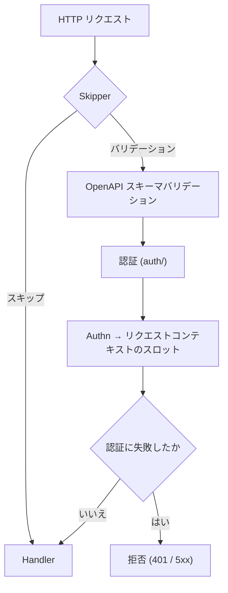

# oapi

[English](README.md) | 日本語

`oapi` は、Echo HTTP スタックに **リクエストバリデーションと認証を提供する OpenAPI 統合レイヤー**です。

スキーマバリデーション・認証・ルートスキップを1つの Echo ミドルウェアに統合するエントリポイントです。

## アーキテクチャ

1. **Skipper** がリクエストが ops エンドポイントかを判定 — ops ならバリデーションをバイパス
2. **Validator** がリクエストを OpenAPI 仕様に照合してバリデーション（パス、パラメータ、ボディ、Content-Type）
3. **Auth** がトークンを抽出し、boundary の `Authenticator` 経由で認証し、`Authn` をリクエストコンテキストのスロットに書き込む
4. **Fail-closed** が、spec が何を許していようと認証に失敗したリクエストを拒否する
5. Handler はバリデーション済み・認証済みのリクエストを受け取る

## Fail-closed な認証

operation は、複数の security requirement を並べ、そのうち 1 つを空にすることで認証を任意と宣言できます。
その operation のバリデーションは、いずれか 1 つの requirement が満たされた時点で成功し、空の requirement は
常に満たされます。したがって、提示されたが拒否された資格情報も、identity の解決中に起きたインフラ障害も、
バリデーションの結果としては成功として現れます。さらに一段を挟まなければ、認証されていない呼び出し元が
ハンドラへ到達し、DB の障害が匿名の成功として見えることになります。

そこで認証関数は、認証済みの `Authn` に用いるのと同じリクエストコンテキストのスロットへ失敗を記録し、
このパッケージがバリデーションの後・ハンドラの前にそのスロットを読み直します。失敗していれば、それが
持っていたステータス（資格情報の拒否なら 401、インフラ障害なら 503 / 500）でリクエストを拒否します。
資格情報が提示されなかったことは失敗ではないため、spec が許す限り匿名のアクセスは従来どおり通ります。

これが、「認証は任意」という宣言が「認証の失敗を受け入れる」という意味にならないようにしている仕組みで、
根拠は `docs/design/auth.md` の fail-closed 規則と `docs/design/security.md` の deny-by-default です。

## サブパッケージ

|パッケージ|説明|詳細|
|---|---|---|
|`auth/`|`Authorization` ヘッダからのトークン認証|[README](auth/README.ja.md)|
|`skipper/`|ops エンドポイントのバリデーションスキップ|[README](skipper/README.ja.md)|
|`validator/`|OpenAPI スキーマの読み込みと提供|[README](validator/README.ja.md)|

## 依存関係

|パッケージ|役割|
|---|---|
|`kin-openapi/openapi3`|OpenAPI 3.x スキーマモデル|
|`kin-openapi/openapi3filter`|リクエストバリデーションと認証フィルタ|
|`oapi-codegen/echo-v5-middleware`|OpenAPI バリデーションの Echo アダプタ|
|`ctxhelper`|リクエストコンテキストへの Authn スロット注入と get/set|
|`boundary/auth`|認証インターフェースと `Authn` 値オブジェクト|

## 注意点

- OpenAPI バリデーションはパスパラメータ、クエリパラメータ、リクエストボディ、Content-Type をカバー
- 認証は OpenAPI 仕様に `security` が定義されたエンドポイントでのみトリガーされる
- `Skipper` により ops エンドポイントはバリデーション・認証の対象外
- oapi-codegen バリデータに委譲する前に、`ctxhelper.WithAuthn` で空の `Authn` スロットを `request.Context()` に注入し、認証関数（`context.Context` のみを受け取る）が `ctxhelper.SetAuthn` で認証済みの `Authn` をそのスロットに書き込めるようにする。後段のハンドラは `ctxhelper.GetAuthn` で読み出す
- このレイヤーからのエラーは `errorhandler` で捕捉され、適切な HTTP レスポンスに変換される
