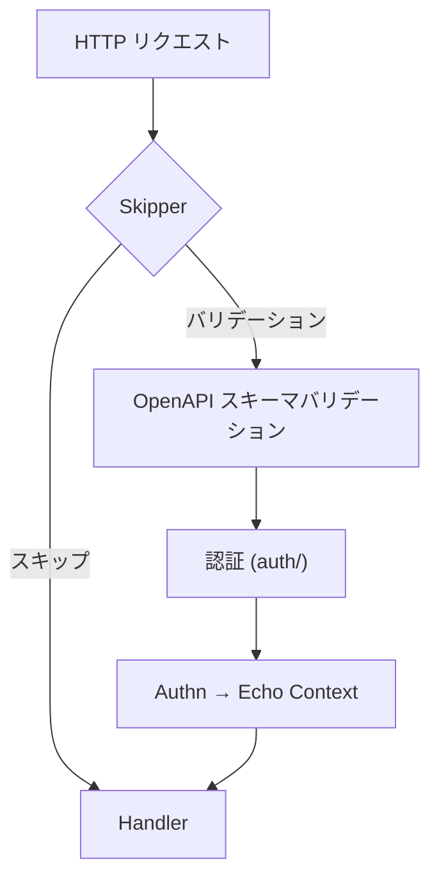

# oapi

[English](README.md) | 日本語

`oapi` は、Echo HTTP スタックに **リクエストバリデーションと認証を提供する OpenAPI 統合レイヤー**です。

スキーマバリデーション・認証・ルートスキップを1つの Echo ミドルウェアに統合するエントリポイントです。

## アーキテクチャ

1. **Skipper** がリクエストが ops エンドポイントかを判定 — ops ならバリデーションをバイパス
2. **Validator** がリクエストを OpenAPI 仕様に照合してバリデーション（パス、パラメータ、ボディ、Content-Type）
3. **Auth** がトークンを抽出し、boundary の `Authenticator` 経由で認証し、`Authn` を Echo コンテキストに格納
4. Handler はバリデーション済み・認証済みのリクエストを受け取る

## 公開 API

|関数|説明|
|---|---|
|`Middleware(spec, skipper, authFunc)`|バリデーション + 認証を統合した Echo ミドルウェアを返す|

### 重要な実装の詳細

oapi-codegen バリデータに委譲する前に、`ctxhelper.SetEchoContext` で Echo コンテキストを `request.Context()` に注入します。これにより、認証関数（`context.Context` のみを受け取る）が Echo コンテキストにアクセスして `Authn` を格納できるようになります。

## サブパッケージ

|パッケージ|説明|詳細|
|---|---|---|
|`auth/`|Cookie / Header からのトークン認証|[README](auth/README.ja.md)|
|`skipper/`|ops エンドポイントのバリデーションスキップ|[README](skipper/README.ja.md)|
|`validator/`|OpenAPI スキーマの読み込みと提供|[README](validator/README.ja.md)|

## 依存関係

|パッケージ|役割|
|---|---|
|`kin-openapi/openapi3`|OpenAPI 3.x スキーマモデル|
|`kin-openapi/openapi3filter`|リクエストバリデーションと認証フィルタ|
|`oapi-codegen/echo-middleware`|OpenAPI バリデーションの Echo アダプタ|
|`ctxhelper`|Echo コンテキストの注入 / 取得|
|`boundary/auth`|認証インターフェースと `Authn` 値オブジェクト|

## 注意点

- OpenAPI バリデーションはパスパラメータ、クエリパラメータ、リクエストボディ、Content-Type をカバー
- 認証は OpenAPI 仕様に `security` が定義されたエンドポイントでのみトリガーされる
- `Skipper` により ops エンドポイントはバリデーション・認証の対象外
- このレイヤーからのエラーは `errorhandler` で捕捉され、適切な HTTP レスポンスに変換される
