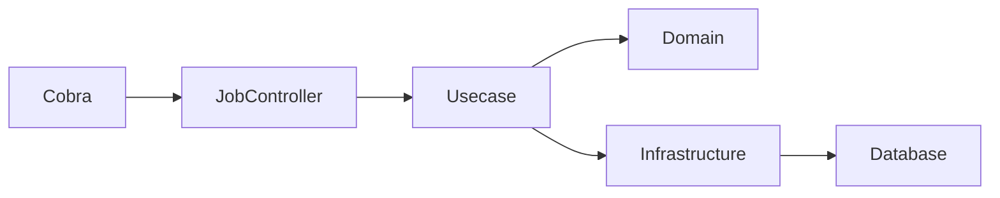
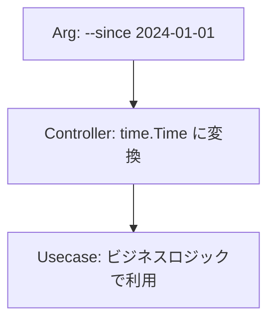
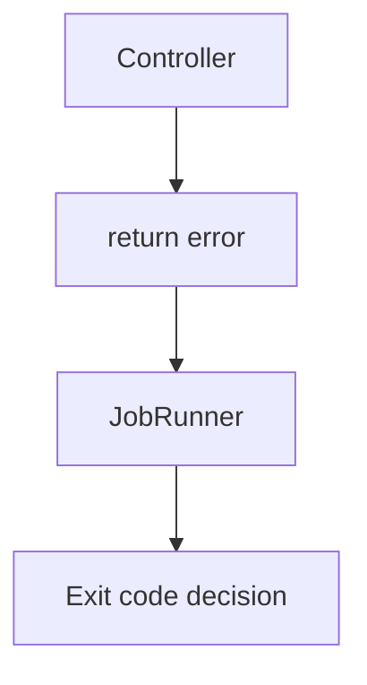
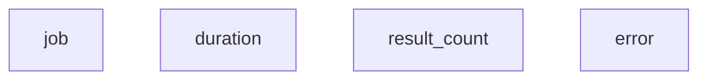
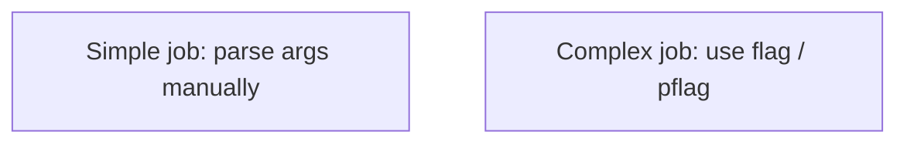
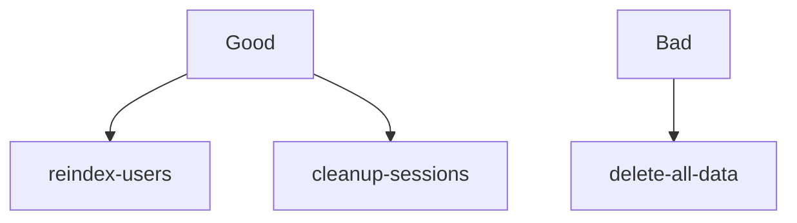
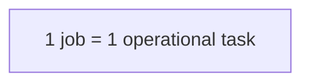
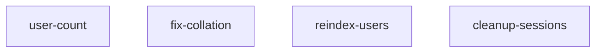
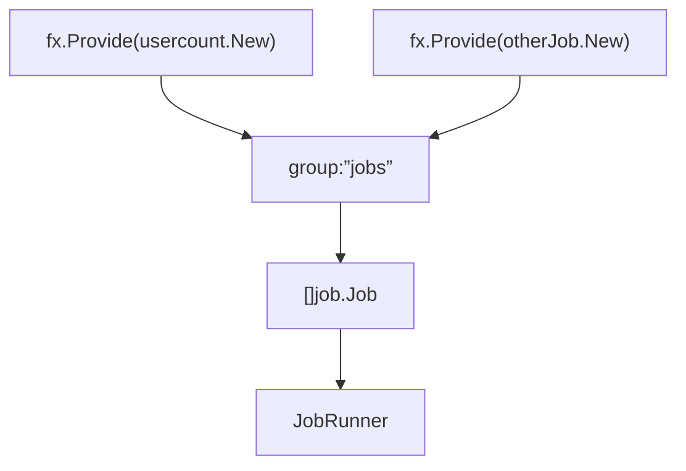

# コントローラー層のジョブ（`internal/controller/job`）ガイド

[English](README.md) | 日本語

## このプロジェクトでの役割

internal/controller/job は、CLI（Cobra）から起動される **バッチ/ジョブのエントリポイント（Controller層）**です。

- ジョブの入出力（引数 args の解釈、結果の出力形式）を整える
  - args からジョブのビジネスロジックに必要なパラメーターを抽出・変換する
- Observability（LayerTracer）で span を開始・終了する
- ユースケース（Usecase層）を呼び出す
- エラーを apperror / errorresponse（または Job 用のエラー表現）に寄せる
- 結果をログに整形して出す

「ビジネスロジック」「DBアクセス」「ドメインモデルの操作」は Usecase / Domain / Infra に寄せ、Controller は薄く保ちます。

配下の `usercount/` はサンプル実装です。実際のサービス構築時には参考にした上で、不要であれば削除してください。

## 公開 API

### Runner

ジョブの登録と実行を管理します。

|関数 / メソッド|説明|
|---|---|
|`NewRunner(jobs []job.Job)`|Job 一覧から Runner を生成（重複名はエラー）|
|`Run(ctx, jobName, args)`|指定されたジョブを実行|
|`Names()`|登録済みジョブ名の一覧を返す|

### State

ジョブの実行状態をスレッドセーフに保持します。

|関数 / メソッド|説明|
|---|---|
|`NewState()`|新しい State を生成|
|`Set(name, args, done)`|ジョブの状態を設定|
|`Snapshot()`|現在の状態のスナップショットを取得|

## アーキテクチャ

### ジョブ実行時の処理フロー



ジョブは HTTP を経由せず、CLI から直接 Controller に入ります。

処理の流れは次の通りです。

1. Cobra が CLI コマンドを受け取る
2. Job Controller が args を解釈する
3. Usecase を呼び出す
4. Domain / Infrastructure がデータ処理を行う
5. 結果をログとして出力する

HTTP Controller と Job Controller は **入力プロトコルが異なるだけで役割は同じ**です。

## Controller の種類

このプロジェクトでは Controller は2種類存在します。

- HTTP Controller: HTTP リクエストを Usecase 呼び出しに変換する
- Job Controller: CLI 実行を Usecase 呼び出しに変換する

Job Controller は **HTTP を持たない Controller** と考えると理解しやすいです。

### Job Controller と HTTP Controller の違い

HTTP Controller

- HTTP request を処理
- OpenAPI response を返す
- middleware を通る

Job Controller

- CLI args を処理
- ログ出力で結果を表現
- HTTP middleware は存在しない

## args 解析の責務

args の解析は Controller の責務です。

Controller は **CLI 構文を型付き値に変換する役割**を持ちます。

例



Controller

- CLI 引数の構文解釈
- 型変換
- 範囲チェック

Usecase

- ビジネスルールの適用

## Exit Code の扱い

Job Controller は `os.Exit()` を呼び出してはいけません。

理由

- CLI / Runner 層が終了コードを管理するため
- Controller がプロセス終了を制御すると責務が壊れるため

推奨



## ログ出力の推奨構造

ジョブ実行結果は **構造化ログ**で出力することを推奨します。

推奨フィールド



例

```go
// Log job execution result
u.logging.Named(jobName).Info(
    "Job completed",
    logging.Int64(logging.JobResultKey, count),
)
```

## args パースの方法

単純なジョブは `args` を直接解析して構いません。

複雑なジョブでは `flag` または `pflag` の利用を推奨します。



## Job 設計の指針

可能な限り **冪等性 (idempotency)** を保つよう設計してください。

理由

- バッチは再実行される可能性が高い
- 運用時にリトライしやすくするため

例



## Job の粒度

推奨



例



ジョブは **単一の運用タスク**を表す粒度で設計してください。

## 実装上の注意点

### 命名/構造

推奨の構造は「ジョブ 1 種類 = 1 パッケージ（1 ディレクトリ）」です。

命名は以下の方針が安定します。

- パッケージ名：lower_snake ではなく Go 流儀の lower（例：usercount, fixcollation）
- Job 名（Runner が引くキー）：kebab-case を推奨
  - 例：user-count / fix-collation / dump-schema
- Cobra の job <name> と一致させやすく、README にも書きやすい

## 呼び出せる層

- **Controller → Usecase のみ**（＋生成物`gen`、DTO/Presenter、`apperror`/`errorresponse`）。  
- **Infra / Domain を直接呼ばない**。  
- DI（`fx`）で `handler` は `usecase.Service` を受け取る。

## やっていいこと / いけないこと(まとめ)

### Do

- args を「そのジョブが必要とする引数」に 最小限に解釈する
  - 例：--dry-run、--limit、--since など
- 入力値のバリデーション（型変換・範囲チェック）を Controller で行う
  - ビジネスルール（例：状態遷移の可否）まではやらない
- Usecase を呼び出して結果を受け取り、ログや標準出力に整形して出す
- apperror を返す / 変換して返す（JobRunner 側で統一的に処理しやすい）
- LayerTracer で span を開始して、必ず defer で閉じる
- Job の開始/終了、入力、結果（件数など）を 構造化ログで残す

### Don’t

- DB ドライバや sqlc の Querier を Controller で直接触る（Infra の責務）
- Repository を Controller で直接呼ぶ（Usecase を飛ばさない）
- ドメインエンティティの生成・永続化ロジックを Controller に書く
- OTel SDK を直接触る（sdktrace.NewTracerProvider() 等を Controller で書かない）
- ジョブの途中で os.Exit() する（Runner/CLI の制御と衝突しやすい）
- 出力フォーマット（ログ/標準出力）の統一ルールを無視する（運用で地獄を見る）

## テスト戦略

Job Controller 層のテストは **CLI 境界の振る舞い** を検証します。

この層では **Usecase の実装は使用せず mock を利用**します。

### テストの依存関係

|依存|テスト方法|
|---|---|
|Usecase|mock|
|Domain|使用しない|
|Infrastructure|使用しない|
|Logger|test logger|
|Tracer|noop tracer|

### テスト対象

Job Controller テストでは次の内容を検証します。

- CLI args の解析
- Usecase 呼び出し
- エラー伝播
- ログ出力

### テスト構成

Job Controller のテストは次の構成で実装します。

```go
func TestNew(t *testing.T) {
    // Test implementation
}
func TestJob_Name(t *testing.T) {
    // Test implementation
}
func TestJob_Execute(t *testing.T) {
    // Test implementation
}
```

### 正常系テスト

正常系では以下を確認します。

- args が正しく解釈される
- Usecase が正しい引数で呼び出される
- エラーが発生しない

例：

```go
mockApp.EXPECT().
    CountUsers(gomock.Any(), gomock.Any()).
    Return(int64(42), nil)
```

### 異常系テスト

異常系では Usecase が返すエラーがそのまま返ることを確認します。

```go
mockApp.EXPECT().
    CountUsers(gomock.Any(), gomock.Any()).
    Return(int64(0), assertError)

require.Equal(t, assertError, err)
```

### Runner のテスト

Runner は **Job の registry / dispatch のみ**をテストします。

```go
func Test_NewRunner(t *testing.T) {
    // Test implementation
}
func TestRunner_Run(t *testing.T) {
    // Test implementation
}
func TestRunner_Names(t *testing.T) {
    // Test implementation
}
```

確認対象

- 重複 job 名検出
- 未登録 job のエラー
- job の実行

### State のテスト

state は **mutex を含む状態保持ロジック**のみをテストします。

```go
func TestState(t *testing.T) {
    // Test implementation
}
```

確認対象

- Set → Snapshot の整合性
- channel の利用可能性

### テストポリシー

Job Controller テストでは次を行いません。

- DB 接続
- SQL 実行
- Domain ロジック検証
- Usecase 内部ロジック検証

これらは **Usecase / Domain / Infrastructure テストの責務**です。

## DI（Dependency Injection）の仕組み

このプロジェクトでは、Job Controller は Uber Fx によって依存性注入（DI）されます。

### 全体構成

Job は `group:"jobs"` にまとめられ、Runner に集約されます。



### module/job.go の役割

```go
func JobModule() fx.Option {
    return fx.Module("job",
        provideJobs(
            usercount.New,
        ),
        fx.Provide(
            dijob.ProvideRunner,
            job.NewState,
        ),
        fx.Invoke(hook.RegisterJobHooks),
    )
}
```

- `provideJobs(...)`
  - 各 Job のコンストラクタを `group:"jobs"` に登録
- `ProvideRunner`
  - Job の一覧を受け取り、実行を管理する Runner を生成
- `RegisterJobHooks`
  - アプリ起動時に Job を CLI にバインド

### Job のコンストラクタ設計

Job は **Usecase / Logger / Tracer を DI で受け取る**構造にします。

```go
func New(
    tf observability.TracerFactory,
    usecase user.Usecase,
    logging logging.Logger,
) job.Job {
    return &jobImpl{
        tracer:  tf.Controller(),
        usecase: usecase,
        logging: logging,
    }
}
```

ポイント：

- Controller は自分で依存を生成しない
- 必ず DI（fx）から受け取る
- これによりテスト時は mock に差し替え可能

### なぜ group:"jobs" を使うのか

- Job を追加しても Runner 側の修正が不要
- Plug-in 的に Job を増やせる
- Open/Closed Principle を満たす

### AI/開発者向けルール

- Job を追加する場合は `module/job.go` の `provideJobs(...)` に追加すること
- DI をバイパスして new しないこと
- 依存は必ず constructor 経由で受け取ること

## Observability（Tracing）の使い方

このプロジェクトでは、Controller層で直接OpenTelemetrySDKを扱わず、
observability.LayerTracerを経由してspanの開始・終了を行います。

### 1. Controller層でのspanの開始と終了

各ハンドラーの先頭で必ず次の2行を記述してください。

```go
ctx, endSpan := s.tracer.Start(ctx)
defer endSpan()
```

- Start(ctx)でspanが開始され、trace_id/span_idがcontextに紐づきます。
- endSpan()は、spanの終了（span.End）を行います。
- defer endSpan()により例外や早期returnがあっても必ず終了されます。

ポイント：

- Controllerはspanの開始・終了だけを知り、OpenTelemetry SDK の詳細には一切触れません。
- Job Controller でも同様に span を開始します。これにより CLI 実行のトレースも HTTP トレースと同じトレース基盤に統合されます。

### 2. TracerのDI（observability.LayerTracer）

Controllerは以下のようにobservability.LayerTracerを依存として受け取ります。

```go
type jobImpl struct {
    tracer  observability.LayerTracer // o11y用のトレーサー
    logging logging.Logger // 結果ログ出力用
    usecase hoge.Usecase // それぞれのジョブで使うユースケース
}
```

BindHandler側では、`observability.NewControllerTracer`でController専用のトレーサーを生成します。

```go
func New(
    tf observability.TracerFactory,
    usecase user.Usecase,
    logging logging.Logger,
) job.Job {
    return &jobImpl{
        tracer:  tf.Controller(),
        usecase: usecase,
        logging: logging,
    }
}
```

ここではSDKの生インスタンスを直接使わず、
observability層がtracerの生成ルール（レイヤー名やパッケージ名・関数名の抽出）を内部で隠蔽します。

## 参考スニペット

```go
package usercount

import (
    "context"

    "go-boilerplate/internal/observability"
    // それぞれ実装で使うパッケージをimport
)

// ジョブ名の定義
const jobName = "user-count"

type jobImpl struct {
    tracer  observability.LayerTracer // o11y用のトレーサー
    usecase user.Usecase // コントローラからはUsecaseを呼び出す
    logging logging.Logger // 結果ログ出力用
}

// この関数をinternal/di/module/job.goで、[<package>.New,]として登録する。
func New(
    tf observability.TracerFactory,
    usecase user.Usecase,
    logging logging.Logger,
) job.Job {
    return &jobImpl{
        tracer:  tf.Controller(),
        usecase: usecase,
        logging: logging,
    }
}

// Name は、job.Job インターフェースの Name メソッドを実装します。
// 特に意図がなければこの実装をそのまま使ってください。
func (u *jobImpl) Name() string {
    return jobName
}

// Execute は、job.Job インターフェースの Execute メソッドを実装します。
func (u *jobImpl) Execute(ctx context.Context, args []string) error {
    // トレース用のspanを開始
    ctx, endSpan := u.tracer.Start(ctx)
    defer endSpan()

    // ジョブの主要ロジックをここに実装(引数の解析)
    // 複雑なジョブでは flag または pflag の利用を推奨します。
    var active *bool
    for _, a := range args {
        switch a {
        case "--active-only":
            active = ptr.To(true)
        case "--inactive-only":
            active = ptr.To(false)
        }
    }

    // ユースケースを呼び出し
    count, err := u.usecase.CountUsers(ctx, active)
    if err != nil {
        return err
    }

    // 結果をログに出力
    u.logging.Named(jobName).Info( // 出力はInfoレベル推奨 Nameでジョブ名を付与
        "Result: total user count",
        logging.Int64(logging.JobResultKey, count), // 結果の定数キーを使う
    )

    return nil
}
```
