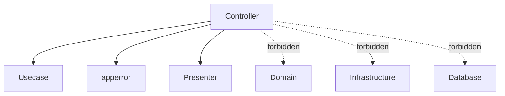

# コントローラー層（`internal/controller`）ガイド

[English](README.md) | 日本語

## オニオンアーキテクチャでの役割

- **外界（HTTP/CLI）とアプリケーションの境界面**
- **プロトコル適応（Adapter）** を担い、入力を **アプリ語彙（DTO/Value）** に変換して **Usecase** を呼ぶ
- **出力整形（Presenter）** で Usecase の結果を **OpenAPI のレスポンス型** へ詰め替える
- 例外（`error`）を **HTTP ステータス** + **エラーコード** へマッピング（`apperror` → Status）

> ポイント：**ビジネスロジックは一切持たない**。持つのは「HTTP / CLI の解釈と整形」だけ。

## ディレクトリ構成

```text
internal/controller/
├── handler/        # HTTP ハンドラ（サーバーのエントリポイント）
├── job/            # ジョブコントローラ（CLI のエントリポイント）
├── worker/         # ワーカーエンジン（メッセージキューのエントリポイント）
├── outbox/         # outbox リレーエンジン（outbox テーブルを poll して publish）
├── server/         # Echo インスタンス生成・サーバー起動
├── httpstack/      # HTTP ミドルウェア群
├── error/response/ # エラーレスポンス生成
├── conv/           # OpenAPI 生成型 → ドメイン型への境界ヘルパー
└── ctxhelper/      # Echo コンテキストヘルパー
```

## サブディレクトリの役割

|ディレクトリ|説明|詳細|
|---|---|---|
|`handler/`|HTTP リクエストを受け取り Usecase へ委譲するハンドラ|[README](handler/README.ja.md)|
|`job/`|CLI から起動されるジョブのコントローラ|[README](job/README.ja.md)|
|`worker/`|pull-ack メッセージキューを消費し Usecase へディスパッチするワーカーエンジン|[README](worker/README.ja.md)|
|`outbox/`|outbox テーブルを周期的に poll し未 publish メッセージを送るリレーエンジン|—|
|`server/`|Echo インスタンスの初期化と DI ライフサイクルへの統合|[README](server/README.ja.md)|
|`httpstack/`|ミドルウェア群（CORS, セキュリティ, ログ, 認証等）|[README](httpstack/README.ja.md)|
|`error/response/`|統一的な HTTP エラーレスポンスの生成と apperror マッピング|[README](error/response/README.ja.md)|
|`conv/`|OpenAPI 生成型をドメイン型へ変換する境界ヘルパー|[README](conv/README.ja.md)|
|`ctxhelper/`|Echo コンテキストへの値の設定・取得ヘルパー|[README](ctxhelper/README.ja.md)|

## 依存関係ルール



Controller は **Usecase を通してのみ下位層にアクセス**します。

## テスト戦略

ハンドラテストは usecase を mock し、Echo 経由でハンドラを駆動する（`testkit/testecho` + `testkit/testassert`）。ビジネスロジックは usecase 側にありここでは再テストしない。各ハンドラテストが検証する観点:

- HTTP I/O 変換 — リクエストの bind（path / query / body）→ usecase 入力、usecase 出力 → レスポンス DTO / status
- リクエスト validation 経路（OpenAPI / bind 失敗 → 400 等）
- `apperror` → HTTP status マッピング（usecase のエラーが適切な status / code として表出する）
- middleware が乗せる context — ハンドラが context から読む値（auth principal / request id / idempotency）

境界レベルの HTTP 結線（Router → Middleware → Handler → Presenter）は `internal/integration` の HTTP 境界テストで別途カバーする。
