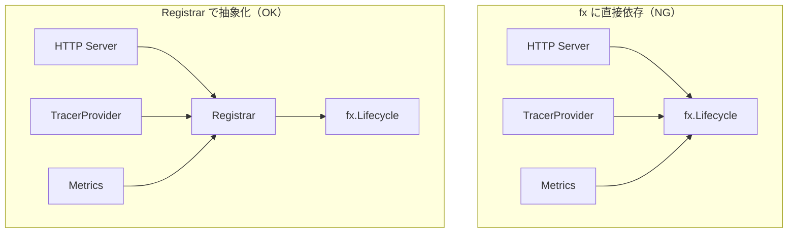

# lifecycle

[English](README.md) | 日本語

`internal/di/lifecycle` は、アプリケーションの起動 / 停止時に実行するフック（Start / Stop）を登録するための **DI 抽象化レイヤ**です。

`fx.Lifecycle` をラップした `Registrar` インターフェースを提供し、アプリケーションコードが fx に直接依存しないようにします。

## なぜ独立パッケージなのか

`lifecycle/` パッケージは、**アプリケーション全体の Start / Stop を一元管理する中立なレイヤ**を提供するために独立したディレクトリとして存在します。

`fx.Lifecycle` を直接使うと、以下の問題が生じます。



### 1. fx 依存がアプリケーション全体へ漏れる

`fx.Lifecycle` を直接使うと、すべての層（HTTP サーバー、Observability、メトリクス、ワーカーなど）が fx に依存し、外部の技術詳細を内側の層へ持ち込まないという Onion Architecture の原則に反します。

`lifecycle.Registrar` は **fx 依存を DI 層に閉じ込め**、下位の層は Start / Stop という抽象だけを参照できるようにします。

### 2. Start / Stop 処理が分散する

各パッケージが個別に `fx.Lifecycle.Append()` を呼ぶと、何がどこで起動し、何がどこでどの順に停止するのかを追いにくくなります。

「Start / Stop の登録窓口」を `lifecycle/` に集約することで、**アプリケーション全体のライフサイクルを一箇所で管理できます**。

### 3. fx を直接使うとテストが難しくなる

`fx.Lifecycle` のフック登録は DI 依存のコードであり、`domain` や `usecase` のテストでは不要かつ煩雑です。

`Registrar` へ抽象化することで、以下が可能になります。

- テストでは Noop スタブを渡せる
- `fx.App.Start/Stop` はフックを発火させたいときだけ使う

### 4. Start / Stop はアプリケーション全体の関心事

ライフサイクルに依存する処理は HTTP サーバーに留まりません。

- Tracer の初期化 / シャットダウン
- メトリクスエクスポーター
- DB コネクションのクローズ
- キューコンシューマー
- Cron / ワーカー
- キャッシュクライアントの初期化

これらを `server/` や `controller/` に置くのは責務違反です。**アプリケーション全体のライフサイクル管理は横断的関心事として切り出すのが自然です**。

### 5. DI の制御点として必要

`lifecycle.Module()` を見れば、Start / Stop の仕組みがどこで提供され、fx とアプリケーションの境界がどこにあるのかがすぐに分かります。

## ファイル構成

|ファイル|役割|
|---|---|
|`lifecycle.go`|`Registrar` インターフェースと `NewLifecycleRegistrar` の実装|
|`supervisor.go`|`SupervisedRunner` — detached background runner の共通プリミティブ|
|`lifecycle_di.go`|`Module()` による DI 登録|
|`mock/`|テスト用モック（mockgen 自動生成）|

## SupervisedRunner

`SupervisedRunner` は、**detached background runner**（`OnStart` より長く生きる goroutine）を fx ライフサイクルへ結線する共通プリミティブです。job / worker / outbox relay の各 hook は、同じ Start/Stop 配線を重複させず本プリミティブの上に載ります。

```go
lifecycle.SupervisedRunner{
    OnStartAux: startHealth,                 // 任意: goroutine 起動前の同期処理（例: health listener）
    Body:       func(ctx context.Context) { _ = engine.Run(ctx) }, // background ループ本体
    OnStopAux:  stopHealth,                  // 任意: drain 後の処理
}.Register(reg)
```

- **OnStart**: `OnStartAux`（あれば）を実行後、`Body` を goroutine で起動（ブロックしない）。
- **OnStop**: 実行 context をキャンセルし、停止 `ctx`（grace）の範囲で `Body` の完了を待ち、`OnStopAux` を実行。

実行 context は `context.Background()` を `WithCancel` で派生させるため、`OnStart` 完了後に fx が起動 context をキャンセルしても goroutine は巻き込まれず、`OnStop` でのみキャンセルされます。この「Background 由来 + 停止時キャンセル」の型を 3 hook で揃えることで、停止シグナルが実行中の処理へ確実に伝播します。

## 利用箇所の例

- HTTP サーバーの起動 / Graceful Shutdown
- TracerProvider の初期化 / Shutdown
- メトリクスサーバーの起動 / 停止
- DB コネクションのクローズ

## 注意点

- `fx.App` のライフサイクルで Start / Stop が呼ばれる前提の実装
- テストでフックの実行を検証する場合は `fx.App` を Start / Stop して発火させる必要がある
