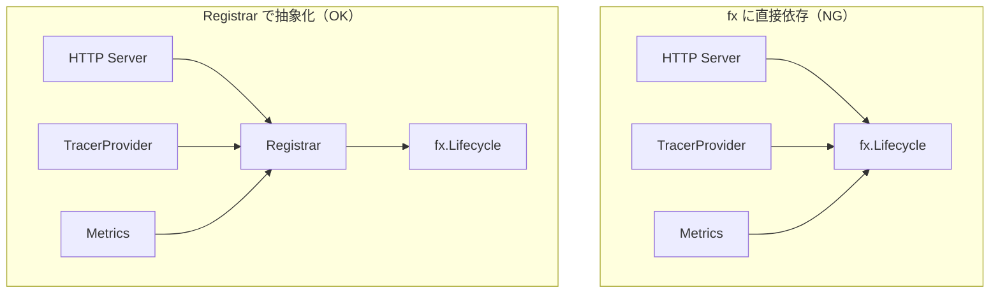

# lifecycle

[English](README.md) | 日本語

`internal/di/lifecycle` は、アプリケーションの起動 / 停止時に実行するフック（Start / Stop）を登録するための **DI 抽象化レイヤ**です。

`fx.Lifecycle` をラップした `Registrar` インターフェースを提供し、アプリケーションコードが fx に直接依存しないようにします。

## なぜ独立パッケージなのか



- **fx 依存を DI 層に閉じ込める** — Onion Architecture の原則を守る
- **Start / Stop の登録窓口を一元化** — 起動・停止の順序と全体像が把握しやすい
- **テスト容易性** — テストでは Noop スタブを渡せる

## ファイル構成

|ファイル|役割|
|---|---|
|`lifecycle.go`|`Registrar` インターフェースと `NewLifecycleRegistrar` の実装|
|`supervisor.go`|`SupervisedRunner` — detached background runner の共通プリミティブ|
|`lifecycle_di.go`|`Module()` による DI 登録|
|`mock/`|テスト用モック（mockgen 自動生成）|

## SupervisedRunner

`SupervisedRunner` は、**detached background runner**（`OnStart` より長く生きる goroutine）を fx ライフサイクルへ結線する共通プリミティブです。job / worker / outbox relay の各 hook は、同じ Start/Stop 配線を重複させず本プリミティブの上に載ります。

```go
lifecycle.SupervisedRunner{
    OnStartAux: startHealth,                 // 任意: goroutine 起動前の同期処理（例: health listener）
    Body:       func(ctx context.Context) { _ = engine.Run(ctx) }, // background ループ本体
    OnStopAux:  stopHealth,                  // 任意: drain 後の処理
}.Register(reg)
```

- **OnStart**: `OnStartAux`（あれば）を実行後、`Body` を goroutine で起動（ブロックしない）。
- **OnStop**: 実行 context をキャンセルし、停止 `ctx`（grace）の範囲で `Body` の完了を待ち、`OnStopAux` を実行。

実行 context は `context.Background()` を `WithCancel` で派生させるため、`OnStart` 完了後に fx が起動 context をキャンセルしても goroutine は巻き込まれず、`OnStop` でのみキャンセルされます。この「Background 由来 + 停止時キャンセル」の型を 3 hook で揃えることで、停止シグナルが実行中の処理へ確実に伝播します。

## 利用箇所の例

- HTTP サーバーの起動 / Graceful Shutdown
- TracerProvider の初期化 / Shutdown
- メトリクスサーバーの起動 / 停止
- DB コネクションのクローズ

## 注意点

- `fx.App` のライフサイクルで Start / Stop が呼ばれる前提の実装
- テストでフックの実行を検証する場合は `fx.App` を Start / Stop して発火させる必要がある
