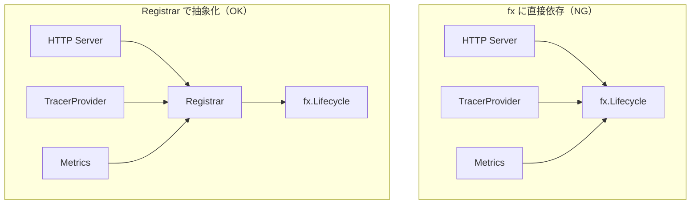

# lifecycle

[English](README.md) | 日本語

`internal/di/lifecycle` は、アプリケーションの起動 / 停止時に実行するフック（Start / Stop）を登録するための **DI 抽象化レイヤ**です。

`fx.Lifecycle` をラップした `Registrar` インターフェースを提供し、アプリケーションコードが fx に直接依存しないようにします。

## なぜ独立パッケージなのか



- **fx 依存を DI 層に閉じ込める** — Onion Architecture の原則を守る
- **Start / Stop の登録窓口を一元化** — 起動・停止の順序と全体像が把握しやすい
- **テスト容易性** — テストでは Noop スタブを渡せる

## 公開 API

### Registrar インターフェース

```go
type Registrar interface {
    RegisterStart(start func(ctx context.Context) error)
    RegisterStop(stop func(ctx context.Context) error)
}
```

|メソッド|説明|
|---|---|
|`RegisterStart`|アプリケーション開始時に実行される関数を登録|
|`RegisterStop`|アプリケーション停止時に実行される関数を登録|

### コンストラクタ

|関数|説明|
|---|---|
|`NewLifecycleRegistrar(lc fx.Lifecycle)`|`fx.Lifecycle` をラップした `Registrar` を生成|

### DI モジュール

|関数|説明|
|---|---|
|`Module()`|`Registrar` を DI コンテナに登録する `fx.Module` を返す|

## ファイル構成

|ファイル|役割|
|---|---|
|`lifecycle.go`|`Registrar` インターフェースと `NewLifecycleRegistrar` の実装|
|`lifecycle_di.go`|`Module()` による DI 登録|
|`mock/`|テスト用モック（mockgen 自動生成）|

## 利用箇所の例

- HTTP サーバーの起動 / Graceful Shutdown
- TracerProvider の初期化 / Shutdown
- メトリクスサーバーの起動 / 停止
- DB コネクションのクローズ

## 注意点

- `fx.App` のライフサイクルで Start / Stop が呼ばれる前提の実装
- テストでフックの実行を検証する場合は `fx.App` を Start / Stop して発火させる必要がある
