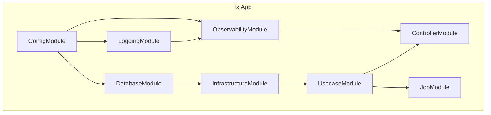

# DI モジュール (`internal/di/module`)

[English](README.md) | 日本語

アプリケーションの各レイヤを `fx` ベースで束ねる **DI モジュール群**を配置するディレクトリです。

各ファイルは `fx.Option` を返す関数を公開し、アプリ起動時に必要なコンポーネントを DI コンテナに登録します。

## モジュール一覧

|関数|ファイル|提供するコンポーネント|
|---|---|---|
|`ConfigModule()`|`config.go`|設定（`*Config` + 全 SubConfig プロバイダー + `*time.Location`）|
|`ControllerModule()`|`controller.go`|HTTP ハンドラの登録（`fx.Invoke` で `BindHandler` を実行）|
|`DatabaseModule()`|`db.go`|DB 接続（`*pgxpool.Pool`）+ ドライバ / トランザクションマネージャ / メトリクス|
|`InfrastructureModule()`|`infrastructure.go`|リポジトリ / クエリサービス / system query + Clock / パスワードハッシュ|
|`JobModule()`|`job.go`|ジョブ登録（`group:"jobs"`）+ Runner + State + Hook|
|`LoggingModule()`|`logging.go`|Logger + LogFieldBuilder|
|`ObservabilityModule()`|`observability.go`|TracerProvider + TracerFactory|
|`SystemModule()`|`system.go`|BuildInfo（バージョン / リビジョン / ビルド日時）|
|`UsecaseModule()`|`usecase.go`|ユースケース実装の登録|

### サブディレクトリ

|ディレクトリ|説明|詳細|
|---|---|---|
|`core/`|HTTP スタック共通コンポーネント（認証等）の DI モジュール群|[README](core/README.ja.md)|

## アーキテクチャ

## 設計方針

- 各モジュールはレイヤの境界に対応（config / logging / db / infra / usecase / controller / job）
- モジュール間の依存は fx が自動解決する
- モジュールの追加は新しいファイルを作成し、アプリのルートモジュールに追加するだけ

## 注意点

- 各モジュールは `fx.App` の Start / Stop ライフサイクルに依存する
- モジュールを無効化すると、そのコンポーネントが注入されずアプリが起動しなくなる
- テストでは各モジュールが `fx.ValidateApp` で正しく組み立てられることを検証している
