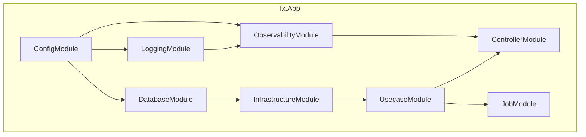

# DI モジュール (`internal/di/module`)

[English](README.md) | 日本語

アプリケーションの各レイヤを `fx` ベースで束ねる **DI モジュール群**を配置するディレクトリです。

各ファイルは `fx.Option` を返す関数を公開し、アプリ起動時に必要なコンポーネントを DI コンテナに登録します。

## モジュール一覧

|関数|ファイル|提供するコンポーネント|
|---|---|---|
|`ConfigModule()`|`config.go`|設定（`*Config` + 全 SubConfig プロバイダー + `*time.Location`）|
|`ControllerModule()`|`controller.go`|HTTP ハンドラの登録（`fx.Invoke` で `BindHandler` を実行）|
|`DatabaseModule()`|`db.go`|DB 接続（`*pgxpool.Pool`）+ ドライバ / トランザクションマネージャ / メトリクス|
|`InfrastructureModule()`|`infrastructure.go`|concern ごとのサブモジュールの集約: persistence（repository / query service / command service / system query）+ clock + httpclient + webapi gateway + outbox publisher + security + authz|
|`JobModule()`|`job.go`|ジョブ登録（`group:"jobs"`）+ Runner + State + Hook|
|`LoggingModule()`|`logging.go`|Logger + LogFieldBuilder|
|`ObservabilityModule()`|`observability.go`|TracerProvider + TracerFactory|
|`OutboxRelayModule()`|`outboxrelay.go`|outbox relay engine + `provideRelaySettings` + `NewRelay` usecase + `OutboxMetrics` + Hook（`RegisterRelayHooks`）。`outboxPublisherModule()` を内包。relay 専用プロセス（`cmd outbox-relay`）のみで使用|
|`SystemModule()`|`system.go`|BuildInfo（バージョン / リビジョン / ビルド日時）|
|`UsecaseModule()`|`usecase.go`|ユースケース実装の登録|
|`WorkerModule()`|`worker.go`|worker 登録（`group:"workers"`）+ Engine（`ProvideEngine`）+ State + `WorkerMetrics` + queue stats 収集器（`provideQueueStatsCollector`）+ 停止猶予検証（`ValidateShutdownGrace`）+ Hook（`RegisterWorkerHooks`）。既定では worker を 1 つも登録しない|

### サブディレクトリ

|ディレクトリ|説明|詳細|
|---|---|---|
|`core/`|HTTP スタック共通コンポーネント（認証等）の DI モジュール群|[README](core/README.ja.md)|

## アーキテクチャ

## 設計方針

- 各モジュールはレイヤの境界に対応（config / logging / db / infra / usecase / controller / job / worker / outbox-relay）
- モジュール間の依存は fx が自動解決する
- モジュールの追加は新しいファイルを作成し、アプリのルートモジュールに追加するだけ
- `InfrastructureModule()` は純粋な**集約ポイント**であり、concern ごとのサブモジュールを束ねるだけ。これにより fx の依存グラフをコンポーネント単位で読みやすく保つ。各 concern はそれぞれ独立したファイルに置く — `persistence.go`（`persistenceModule()`）/ `clock.go`（`clockModule()`）/ `httpclient.go`（`httpClientModule()`）/ `webapi.go`（`webapiModule()`）/ `outboxpublisher.go`（`outboxPublisherModule()`）/ `security.go`（`securityModule()`）/ `authz.go`（`authzModule()`） — `infrastructure.go` はこれらを `infrastructure` モジュール配下に束ねるだけ。各 concern ファイルには対の `*_test.go` があり個別の `Test<Concern>Module_GraphIsValid` を持つ。`infrastructure_test.go` は集約後の全体を検証する。
  - RDB 系プロバイダ（`repository` / `query_service` / `command_service` / `system_query`）は `persistence` サブモジュール配下に入れ子化し、`DatabaseModule()` の `db`（接続レイヤ）と区別している。clock サブモジュールは `SystemModule()` の `system` ラベルとの衝突を避けるため `system` ではなく `clock` と命名している。`webapi` / `outbox_publisher` は `httpclient` substrate に依存する。`authz` サブモジュール（`provideAuthorizer`）は環境ゲート付きで、全許可スタブを local / CI / test のみに配線し、それ以外では fail-closed（エラーを返す）。スタブ配線時には起動時 WARN を出す（`core` の `authn` プロバイダと対をなす）。

## テスト戦略

各モジュールには対の `*_test.go` があり、`fx.ValidateApp` を呼ぶ `Test<Module>_GraphIsValid` を持つ（`graph_helper_test.go` の `validateGraph` / `commonDeps` 参照）。これは依存グラフが型欠落なく結線されることを検証する — `fx.ValidateApp` はコンストラクタやライフサイクルフックを実行しないため、実インフラ（DB / ネットワーク）を立てずに済む。

同じ性質ゆえ、独自ロジックを持つ provider / `fx.Invoke` 本体（例: `provideQueueStatsCollector`）はグラフ検証テストでは**実行されない** — 分岐網羅には直接の単体テスト（関数を実際に呼ぶ）が要る。

## 注意点

- 各モジュールは `fx.App` の Start / Stop ライフサイクルに依存する
- モジュールを無効化すると、そのコンポーネントが注入されずアプリが起動しなくなる
