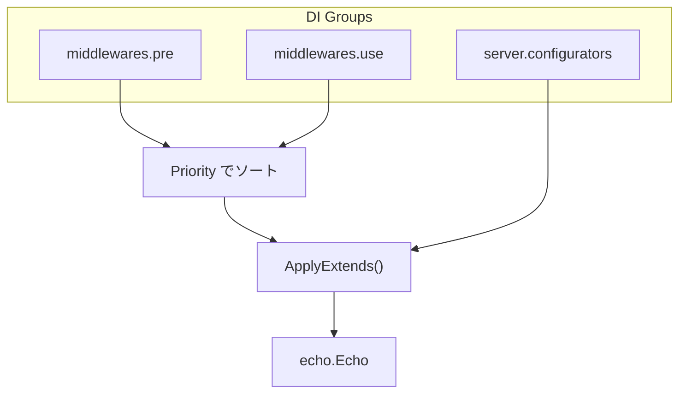

# extension

[English](README.md) | 日本語

Echo サーバーに対して **ミドルウェア・設定関数（Configurator）の適用を統一管理する拡張レイヤー**です。

Uber FX の DI グループを利用し、`middlewares.pre`・`middlewares.use`・`server.configurators` の3系統でサーバーを拡張します。

## 適用の仕組み

- **Pre ミドルウェア**: ルーティング前に実行（`e.Pre()`）
- **Use ミドルウェア**: ルーティング後に実行（`e.Use()`）
- **Configurator**: Echo インスタンスへの設定適用（クライアント IP 抽出・エラーハンドラ等）
- Priority の重複は自動検出されエラーになる

## サブディレクトリ一覧

### inbound（リクエスト受信）

|モジュール|種別|説明|
|---|---|---|
|`URIModule()`|Pre|末尾スラッシュ除去|
|`TimeoutModule()`|Pre|リクエスト deadline budget（`SERVER_REQUEST_TIMEOUT`）|
|`BodyLimitModule()`|Pre|リクエストボディ上限（`SERVER_BODY_LIMIT_MB`）|
|`IPExtractorModule()`|Configurator|クライアント IP 抽出|
|`OpenAPIModule()`|Use|OpenAPI バリデーション|

### instrumentation（計装）

|モジュール|種別|説明|
|---|---|---|
|`RequestIDModule()`|Use|X-Request-ID 生成|
|`ObservabilityModule()`|Use|OpenTelemetry トレーシング|
|`HTTPRedMetricsModule()`|Use|HTTP RED（Rate / Errors / Duration）メトリクス|
|`LoggingModule()`|Use|HTTP リクエスト / レスポンスログ|

### outbound（レスポンス出力）

|モジュール|種別|説明|
|---|---|---|
|`ErrorHandlerModule()`|Configurator|統一エラーハンドラ|
|`ForceJSONModule()`|Use|Content-Type を JSON に強制|
|`RecoveryModule()`|Use|パニックキャッチとログ出力|

### security（セキュリティ）

|モジュール|種別|説明|
|---|---|---|
|`Module()`|Use|セキュリティヘッダ（HSTS 等）|
|`CORSModule()`|Use|CORS 設定|
|`CookieModule()`|Use|Cookie セキュリティ属性|

## 注意点

- Pre / Use ミドルウェアは必ず Priority を付けて定義する
- Priority の重複は自動検出されるが、カテゴリごとに Priority 管理表を持つことを推奨
- Configurator は Echo インスタンスの状態変化を意図した処理のみを書くこと
- ミドルウェア実装は `internal/controller/httpstack` の責務であり、ここは DI 登録のみ行う
