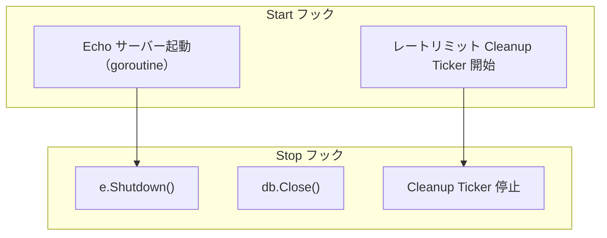

# server hook

[English](README.md) | 日本語

`internal/di/server/hook` は、アプリケーションサーバーのライフサイクルに結び付く **各種フックを登録する**パッケージです。

## フック一覧

|関数|Start|Stop|説明|
|---|---|---|---|
|`RegisterHTTPServerHooks`|Echo サーバー起動|Graceful Shutdown|HTTP サーバーのライフサイクル管理|
|`RegisterDBCloseHooks`|—|DB 接続クローズ|シャットダウン時に DB コネクションを安全に閉じる|
|`RegisterRateLimitHooks`|クリーンアップ開始|クリーンアップ停止|IP レートリミッターの期限切れエントリを定期削除|

## フロー



## RegisterHTTPServerHooks

HTTP サーバーの起動・停止を `lifecycle.Registrar` に登録します。

- **Start**: goroutine で `e.Start()` を実行し、起動ログにポート / allowed_origins / CIDR / モードを出力
- **Stop**: `e.Shutdown(ctx)` で Graceful Shutdown
- `extension.AppliedServerExtends` を受け取ることで、サーバー拡張が適用された後に登録されることを保証

## RegisterDBCloseHooks

シャットダウン時にデータベース接続を閉じるフックを登録します。

- **Stop**: `db.Close()` を呼び出し、エラーがあればログに出力

## RegisterRateLimitHooks

IP レートリミッターの定期クリーンアップを管理します。

- `ipCfg.Enabled()` が `false` の場合は何も登録しない
- **Start**: `time.NewTicker(ipCfg.CleanupInterval())` でクリーンアップループを goroutine で開始
- **Stop**: `stopCh` を close してループを安全に終了

## DI 登録例

```go
fx.Invoke(
    hook.RegisterHTTPServerHooks,
    hook.RegisterDBCloseHooks,
    hook.RegisterRateLimitHooks,
)
```

## 注意点

- `RegisterHTTPServerHooks` は `AppliedServerExtends` トークンに依存するため、extension 適用後に実行される
- HTTP サーバーは goroutine で起動するため、起動失敗はログに出力されるが Start フック自体はエラーを返さない
- レートリミットのクリーンアップ間隔は `config.IPRateLimitConfig` で制御される
