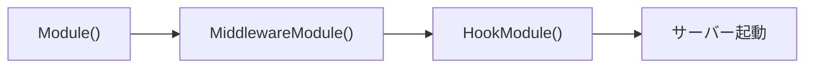

# server DI モジュール

[English](README.md) | 日本語

Echo サーバーの初期化・起動・DI 管理を担う **サーバーモジュール層**です。

3つの `fx.Module` 関数を中心に、HTTP サーバー生成・ミドルウェア集約・ライフサイクルフック登録を提供します。

## 構成

```text
internal/di/server/
├── server.go       # Module / HookModule / MiddlewareModule
├── extension/      # ミドルウェア・Configurator の DI 登録
└── hook/           # サーバーライフサイクルフック（HTTP 起動/停止、DB クローズ、レートリミット）
```

## 公開 API

|関数|説明|
|---|---|
|`Module()`|`server.NewAppServer` で `*echo.Echo` を提供|
|`HookModule()`|サーバーライフサイクルフックを登録（HTTP 起動/停止、レートリミットクリーンアップ）|
|`MiddlewareModule()`|HTTP スタック全体のミドルウェア・Configurator を集約|

### MiddlewareModule の構成

`MiddlewareModule()` は以下のサブモジュールを集約します。

|カテゴリ|モジュール|
|---|---|
|decoration|`BannerModule`, `DefaultPortModule`|
|inbound|`IPExtractorModule`, `URIModule`, `OpenAPIModule`|
|outbound|`ErrorHandlerModule`, `ForceJSONModule`, `RecoveryModule`|
|security|`Module`, `CORSModule`, `CookieModule`, `RateLimitModule`|
|instrumentation|`RequestIDModule`, `LoggingModule`, `ObservabilityModule`|
|nonprod|`DebugModeModule`|

加えて、`extension.ApplyExtends` が提供され、収集されたミドルウェアと Configurator を Echo インスタンスに一括適用します。

## アプリケーション起動順序



1. `Module()` — Echo インスタンス生成
2. `MiddlewareModule()` — 全ミドルウェア・Configurator を適用
3. `HookModule()` — 起動/停止フック登録（ここでサーバーが起動）

## サブディレクトリ

|ディレクトリ|説明|詳細|
|---|---|---|
|`extension/`|Priority 管理付きのミドルウェア・Configurator DI 登録|[README](extension/README.ja.md)|
|`hook/`|サーバーライフサイクルフック（HTTP、DB クローズ、レートリミット）|[README](hook/README.ja.md)|

## 注意点

- `Module()` は `MiddlewareModule()` より先にロードする必要がある — ミドルウェア適用に Echo インスタンスが必要
- `HookModule()` は最後にロードする — ミドルウェア・Configurator 適用後にサーバーが起動
- `NewAppServer` は副作用を持つため、domain / usecase から参照しないこと
- extension は **MiddlewareModule → HookModule** の順で適用される
