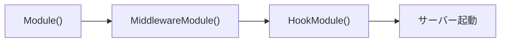

# server DI モジュール

[English](README.md) | 日本語

Echo サーバーの初期化・起動・DI 管理を担う **サーバーモジュール層**です。

3つの `fx.Module` 関数を中心に、HTTP サーバー生成・ミドルウェア集約・ライフサイクルフック登録を提供します。

## 構成

`server.go` がモジュールを提供し、`extension/` がミドルウェアとコンフィギュレータを、`hook/` が
ライフサイクルフックを登録する。この分割があるのは、hook が「ある時点で走るもの」であるのに対し、
module は配線の記述にすぎないからである。

## アプリケーション起動順序

1. `Module()` — Echo インスタンス生成
2. `MiddlewareModule()` — 全ミドルウェア・Configurator を適用
3. `HookModule()` — 起動/停止フック登録（ここでサーバーが起動）

## サブディレクトリ

|ディレクトリ|説明|詳細|
|---|---|---|
|`extension/`|Priority 管理付きのミドルウェア・Configurator DI 登録|[README](extension/README.ja.md)|
|`hook/`|サーバーライフサイクルフック（HTTP、DB クローズ）|[README](hook/README.ja.md)|

## 注意点

- `Module()` は `MiddlewareModule()` より先にロードする必要がある — ミドルウェア適用に Echo インスタンスが必要
- `HookModule()` は最後にロードする — ミドルウェア・Configurator 適用後にサーバーが起動
- `NewAppServer` / `NewHTTPServer` は副作用を持つため、domain / usecase から参照しないこと
- extension は **MiddlewareModule → HookModule** の順で適用される
