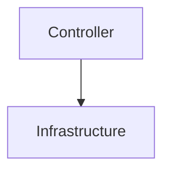
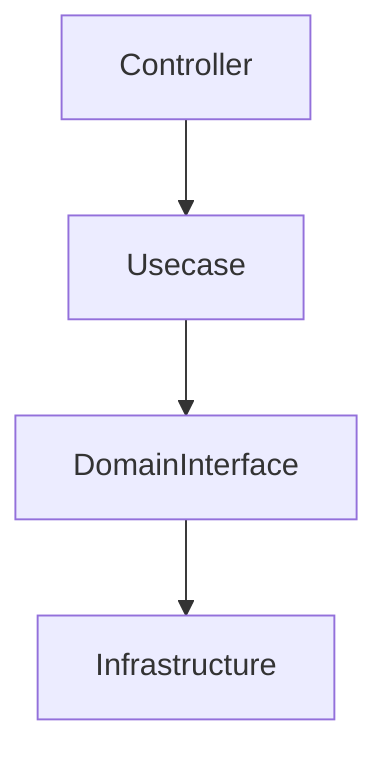
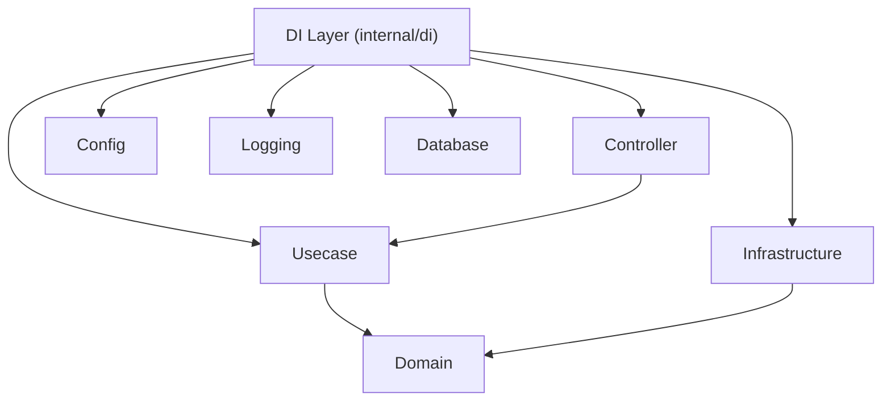
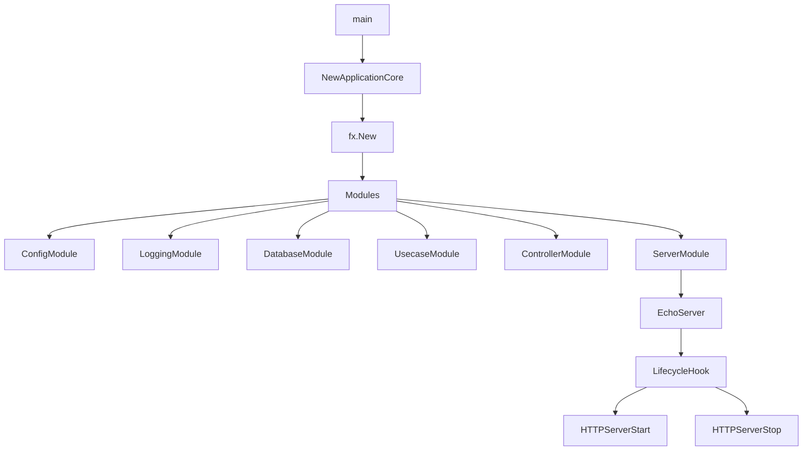
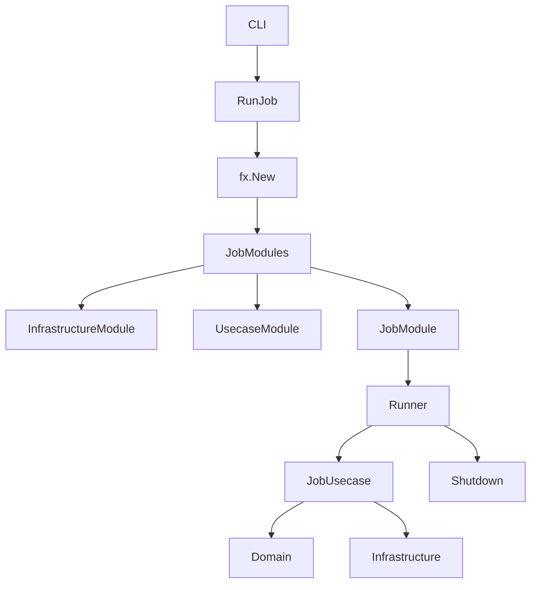
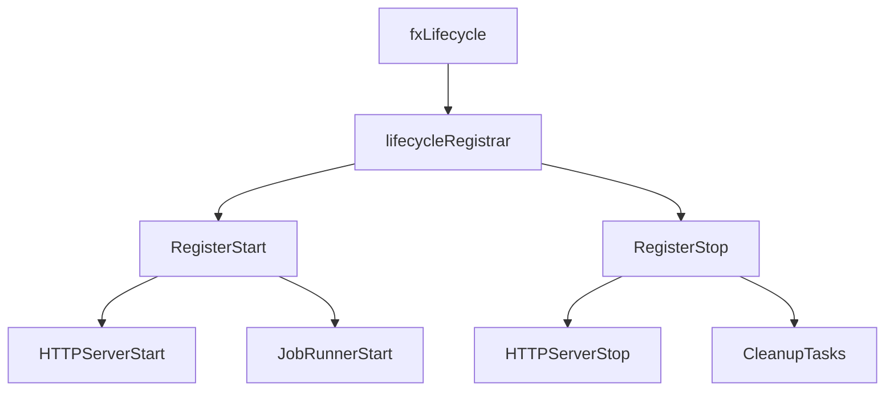
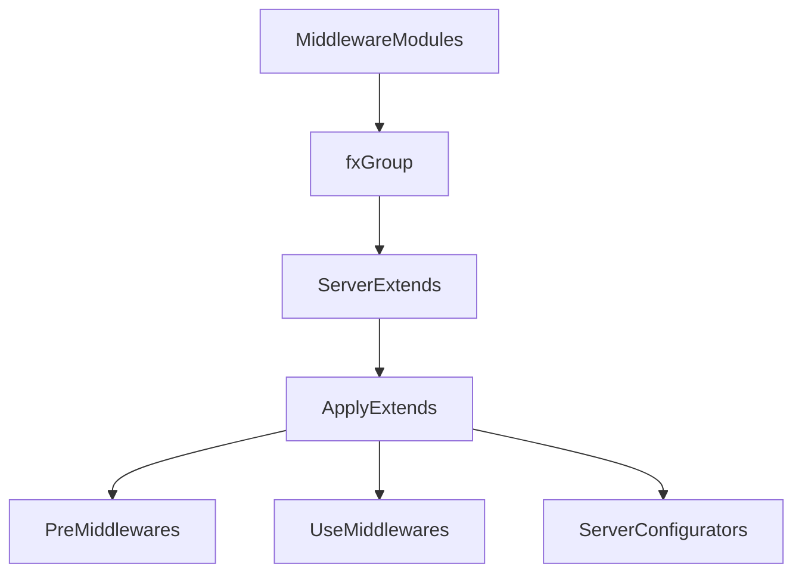

# DI Layer (`internal/di`)

[English](README.md) | 日本語

`internal/di` は、このアプリケーションにおける **依存性注入 (Dependency Injection: DI)** の中枢レイヤです。

この層は **Uber Fx** をベースとした DI コンテナを構築し、  
アプリケーションの **初期化 / 実行 / シャットダウン / ライフサイクル管理** を統括します。

このレイヤは **ビジネスロジックを持ちません**。  
代わりに以下の責務を担います。

- 各レイヤの **依存関係の構築**
- アプリケーション **実行モードの切り替え**
- ライフサイクル管理
- ミドルウェア / 拡張機能の構成
- Infrastructure / Usecase / Controller の接続

## Dependency Injection とは

Dependency Injection (DI) は、

> **依存関係の生成をアプリケーションコードから分離する設計パターン**

です。

通常のコードでは次のような依存関係が発生します。

```go
service := NewService(NewRepository(NewDB()))
```

このようなコードは

- 依存関係が固定される
- テストが困難になる
- 実行環境ごとの切り替えが難しい

という問題を引き起こします。

DI を利用すると、依存関係の生成は **コンテナが担当**します。

```go
fx.Provide(
    NewDB,
    NewRepository,
    NewService,
)
```

コンテナは依存関係を解析し、自動的にオブジェクトグラフを構築します。

## このアーキテクチャにおける DI の役割

このプロジェクトは **Onion Architecture / DDD** をベースに構成されています。

各レイヤの依存関係は次のようになります。

```mermaid
flowchart TD

Controller --> Usecase
Usecase --> Domain Interface
Infrastructure --> DomainInterface
```

DI レイヤはこの **依存関係の接合点 (Composition Root)** を提供します。

つまり

- Domain
- Usecase
- Infrastructure
- Controller

を **最終的に組み合わせる唯一の場所**です。

## このプロジェクトでの DI の役割

このプロジェクトでは DI は次の用途で使用されています。

## 1. アプリケーション実行

DI は **アプリケーションの起動処理を管理します**

```go
fx.New(
    module.ConfigModule(),
    module.LoggingModule(),
    module.DatabaseModule(),
)
```

ここで

- 設定
- ログ
- DB
- ミドルウェア
- Controller
- Usecase

などがすべて接続されます。

## 2. 実行モードの切り替え

このプロジェクトでは **2種類の実行モード**があります。

### HTTP Server

```txt
internal/di/server.go
```

### Job Runner

```txt
internal/di/job.go
```

これにより

|実行モード|用途|
|---|---|
|Server|Web API|
|Job|CLI / Batch|

が **同じアーキテクチャ上で実行できます。**

## 3. 環境ごとの依存関係切り替え

DI によって **環境ごとの実装切り替え**が可能になります。

例：

```go
switch appCfg.Env() {
case config.EnvLocal:
    return local.New()
}
```

これにより

- Local
- CI
- Test
- Production

などの環境差分を吸収できます。

## DI レイヤの構造

```txt
internal/di

server.go
job.go

lifecycle/
module/
server/
shutdowner/
job/
```

## Do / Don't

## Do（やってよいこと）

### 依存関係の組み立て

DI レイヤでは **コンポーネントの接続**を行います。

```go
fx.Provide(
    NewRepository,
    NewUsecase,
    NewController,
)
```

### 環境ごとの実装切り替え

DI は **実行環境ごとの実装差し替えポイント**です。

```go
switch cfg.Env() {
case config.EnvLocal:
    return local.New()
case config.EnvProd:
    return production.New()
}
```

### ライフサイクル管理

DI レイヤでは **起動・停止フック**を登録できます。

```go
reg.RegisterStart(startFunc)
reg.RegisterStop(stopFunc)
```

例

- HTTP Server 起動
- RateLimit Cleanup
- Job Runner

### 外部フレームワークの隔離

以下の依存は **DI層に閉じ込めます**

- Echo
- Uber Fx
- DB driver
- OpenTelemetry SDK

これにより

- Domain
- Usecase

は **フレームワーク非依存になります。**

## Don't（やってはいけないこと）

### ビジネスロジックを書くこと

DI 層に書いてはいけないもの

特に、**ビジネスロジック**を書いてはいけません。

- ドメインロジック
- DBクエリ
- ビジネスルール

### レイヤを飛び越えた依存を作る

NG



正しい依存



### DI を使わず new する

NG

```go
svc := NewService()
```

正しい方法

```go
fx.Provide(NewService)
```

### Framework を Domain / Usecase に持ち込む

NG

```go
type Usecase struct {
    echo *echo.Echo
}
```

## DI 依存構造



## Server 起動フロー



## Job 実行フロー



## Lifecycle 管理



## Server Extension Architecture



## 設計原則

この DI レイヤは次の原則に基づいています。

### Composition Root

依存関係の接続は **DI 層のみ**

### Framework Isolation

フレームワーク依存は **DI に閉じ込める**

### Environment Switch

環境差分は **DI で切り替える**

### Plugin Architecture

拡張機能は **Module / Extension として追加**
