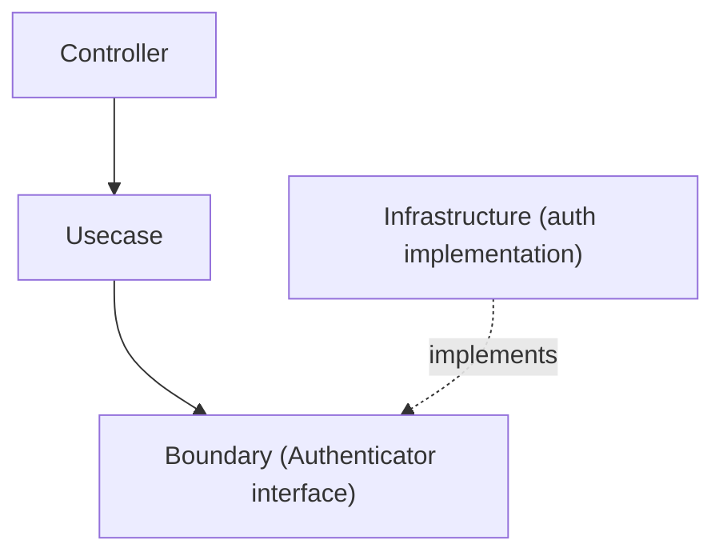

# auth ディレクトリ

`internal/infrastructure/auth` は、**認証基盤（Authentication Infrastructure）**を提供するディレクトリです。

このディレクトリには、アプリケーションが使用する **Authenticator の実装**が含まれます。  
実装は**検証方式別（local / jwt など）に分離**され、DI 層が**環境ごとにどの方式を配線するか**を選択します。

認証の抽象インターフェースは、**Usecase 層の Boundary** として定義されています。

```txt
internal/usecase/boundary/auth
```

Infrastructure 層では、この Boundary を**具体的に実装**します。

## 役割

このディレクトリの責務は次のとおりです。

- `Authenticator` の**方式別実装**を提供する
- 外部認証システム（JWT / OAuth / OIDC など）との連携を実装する
- **認証トークンから Authn 情報**を生成する

この層は**ビジネスロジックを扱いません**。

## アーキテクチャ上の位置づけ

認証処理は次の層構造で実装されます。



Infrastructure は **Boundary を実装するだけ**であり、  
Usecase から直接呼び出される具体実装です。

## 分離軸: 環境ではなく方式

実装は**検証方式**で分離し、DI 層がある環境でどの方式を使うかを選択します。これにより各パッケージは 1 つの検証戦略に集中でき、環境と方式の対応づけは 1 か所（`provideAuthenticator`）にまとまります。

- `local` — 署名検証なし。トークン文字列から subject を抽出する。ローカル開発と CI / test 専用。
- `jwt` — 固定公開鍵による JWT 検証（デファクト標準コア）。本番向けの方式。

```txt
internal/infrastructure/auth
├── README.md
├── local
│   └── auth_local.go
└── jwt
    └── auth_jwt.go
```

|ディレクトリ|検証方式|
|---|---|
|`local`|開発用スタブ — 署名検証なし|
|`jwt`|固定公開鍵による JWT 検証（標準コア）|

環境 → 方式の対応づけは DI で適用されます（「DI への登録」参照）。非本番環境は `local` を使い、`jwt` は実トークン検証を配線する環境向けです。

## local 実装

`local` は、**ローカル開発専用の認証実装**です。

特徴

- トークンの署名検証を行わない
- トークン文字列から Subject を抽出する
- 開発用の簡易認証として使用する

例

```txt
Authorization: Bearer debug:user123
```

この場合

```txt
subject = user123
provider = mock
```

の Authn が生成されます。

詳細は `local/README.md` を参照してください。

## jwt 実装

`jwt` は、**固定 RSA 公開鍵**でアクセストークン（JWT）を検証し、デファクト標準の検証コアを扱います。

ここでは次を行います。

- 署名検証（非対称、アルゴリズム allowlist。`alg=none` / `HS256` は拒否）
- クレーム検証（`iss` / `aud` / `exp` / `nbf` / `sub`）
- スコープ抽出（標準 `scope` クレーム）

IdP 固有の方言（Cognito `token_use`、Azure AD `scp`、opaque トークン、EC 鍵）は対象外であり、拡張ポイントとして記載します。詳細は `jwt/README.md` を参照してください。

## DI への登録

Authenticator は DI モジュールに登録されます。

```txt
internal/di/module/core/auth.go
```

例

```txt
func provideAuthenticator(...) auth.Authenticator
```

環境に基づき、

```txt
local
dev
stg
prd
```

**検証方式**が選択されます（例: local / CI / test では `local`）。

## 設計方針

このディレクトリは次の方針に基づいて設計されています。

### 1 Boundary を実装する

Infrastructure は次の `Authenticator` を実装します。

```txt
usecase/boundary/auth
```

### 2 ビジネスロジックを含めない

このパッケージは**認証処理のみ**を責務とします。

次は扱いません。

- 認可チェック
- ロール判定
- ビジネスルール

これらは **Usecase 層**で扱います。

### 3 検証方式で分離する

認証は異なる検証戦略を使い得るため、

```txt
local
jwt
```

を方式ごとにディレクトリ分離し、DI が環境ごとに方式を選択します。

### 4 コンストラクタ規約

Authenticator のコンストラクタは、入力に応じて一貫した形を取ります。

- 検証パラメータを取らない軽量コンストラクタはインターフェースのみを返す — `func New() Authenticator`（例: `local`）。
- 検証を要するパラメータ（鍵パース、必須フィールド）を取るコンストラクタは `(Authenticator, error)` を返し、構築時に失敗する — `func New(Params) (Authenticator, error)`（例: `jwt`）。
