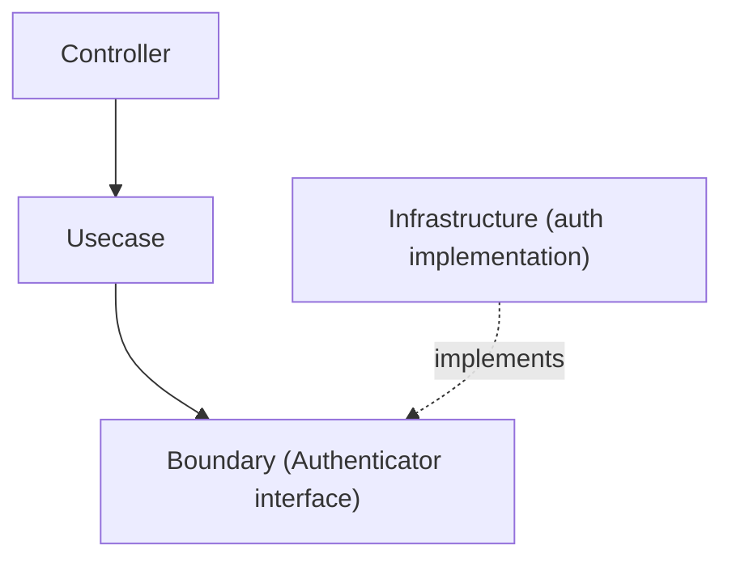

# auth Directory

[English](README.md) | 日本語

> このファイルは canonical な [README.md](README.md) の日本語訳です。直接編集せず、更新は README.md 側から反映してください。

`internal/infrastructure/auth` は **認証インフラストラクチャ** を提供するディレクトリです。

このディレクトリは、アプリケーションで用いる **auth Boundary インターフェース（`Authenticator` と `IdentityResolver`）の実装** を格納します。  
Authenticator の実装は **検証方式（local / jwt など）ごとに分離** され、DI 層がどの方式を配線するかを **環境ごとに** 選択します。

認証の抽象インターフェースは **Usecase 層の Boundary** として定義されます。

```txt
internal/usecase/boundary/auth
```

Infrastructure 層では、この Boundary を **具体的に実装** します。

## 役割

このディレクトリの責務は次のとおりです。

- `Authenticator` の **方式別実装** を提供する
- 外部認証システム（JWT / OAuth / OIDC など）との連携を実装する
- **認証トークンから Authn 情報を生成** する

この層は **ビジネスロジックを扱いません**。

## アーキテクチャ上の位置づけ

認証処理は次の層構造で実装されます。



Infrastructure は **Boundary を実装するのみ** であり、Usecase から直接呼び出される具体実装です。

## 分離軸: 環境ではなく方式

実装は **検証方式** ごとに分離され、DI 層が各環境でどの方式を使うかを選択します。これにより各パッケージは 1 つの検証戦略に専念でき、環境と方式の対応付けは 1 箇所（`provideAuthenticator`）に集約されます。

- `local` — 署名検証を行わず、トークン文字列から subject を抽出する。CI / test 用のスタブのみ。
- `jwt` — JWT 検証（デファクト標準のコア）。署名鍵は固定公開鍵か JWKS エンドポイントのいずれかから解決する。本番向けの方式。

```txt
internal/infrastructure/auth
├── README.md
├── local
│   └── auth_local.go
└── jwt
    └── auth_jwt.go
```

|ディレクトリ|検証方式|
|---|---|
|`local`|開発用スタブ — 署名検証なし|
|`jwt`|JWT 検証（標準コア）。鍵は固定公開鍵または JWKS から取得|

環境 → 方式の対応付けは DI で適用されます（「DI への登録」を参照）。CI / test は `local` スタブを使い、`jwt` はローカル開発（mock 認証サーバーの実 JWT を検証）と、実トークン検証を配線する環境を担当します。

## local 実装

`local` は **CI / test 用の認証スタブ** です（署名検証なし）。

特徴

- トークンの署名検証を行わない
- トークン文字列から Subject を抽出する
- CI / test 用の簡易スタブとして使う

例

```txt
Authorization: Bearer debug:user123
```

この場合

```txt
subject = user123
provider = mock
```

として Authn を生成します。

詳細は `local/README.md` を参照してください。

## jwt 実装

`jwt` は access token（JWT）を検証し、デファクト標準の検証コアをカバーします。署名鍵は **固定 RSA 公開鍵**（`New`）か **`kid` による JWKS エンドポイント**（`NewJWKS`）のいずれかから解決し、クレーム検証ロジックは共通です。

ここでは次を行います。

- 署名検証（非対称・アルゴリズム allowlist。`alg=none` / `HS256` は拒否）
- 鍵解決（固定公開鍵、または `kid` ルックアップ / TTL キャッシュ付き JWKS。`go-jose` でパースし `httpclient` substrate 経由で遅延取得）
- クレーム検証（`iss` / `aud` / `exp` / `nbf` / `sub`）
- スコープ抽出（標準 `scope` クレーム）

IdP 固有の方言（Cognito `token_use`、Azure AD `scp`、opaque token、EC 鍵）は対象外で、拡張ポイントとして文書化されています。詳細は `jwt/README.md` を参照してください。

## IdentityResolver 実装

`Authenticator` に加えて、このディレクトリは `IdentityResolver` Boundary の実装（認証済みの外部アイデンティティ — issuer + subject — を内部ユーザーへ解決する）も格納します。

- `identity` — substrate 既定（`passthrough`）。内部 UserID を未解決のまま通す。ユーザーストアが無い場合に配線される。
- `useridentity` — `user_identities` テーブルから内部ユーザーを解決する（サンプル。user サンプルと同梱削除され、削除後は DI が `identity` にフォールバックする）。

## DI への登録

Authenticator は DI モジュールに登録されます。

```txt
internal/di/module/core/auth.go
```

例

```txt
func provideAuthenticator(...) auth.Authenticator
```

環境

```txt
local
dev
stg
prd
```

に応じて **検証方式** が選択されます（例: CI / test は `local` スタブ、local / development は `jwt`）。

## Test Strategy

このディレクトリに単一の基盤はありません。テストが何を立ち上げる必要があるかは、ディレクトリではなく検証方式が決めます。したがって infrastructure 層の実 DB 戦略がここ全体を統治することはありません。以下の各実装が、自分が何で閉じるかを述べます。本当に DB を要する実装だけが、そう述べます。

- **`local`** — 代替物を必要としない文字列パース。受理する / 拒否するトークン形に対する素のユニットテストです。署名検証を省くスタブである以上、受理よりも拒否のほうが重要です。不正なトークンは sentinel を返さねばならず、途中まで組み立てた `Authn` を返してはなりません。
- **`jwt`** — 外部依存を持つ唯一の実装であり、その依存は `httpclient.Client` Boundary のみを経由します。したがって JWKS / discovery の応答は生成モックで組み立て、ネットワークには一切触れません。署名材料はフィクスチャとしてコミットするのではなく、テストごとに新しい鍵ペアを in-process で生成します（`go-jose`）。未知の `kid`・鍵ローテーション・allowlist 外のアルゴリズムに到達できるのは、これによります。時刻依存のクレーム（`exp` / `nbf` / leeway）は注入した `clock` testkit を通します。トークンの失効を実時間の経過で待つテストは、構造的に flaky です。
- **`identity`** — 分岐を持たない passthrough です。そのテストは、これが passthrough の **ままである** ことを固定するために存在します。resolver は内部 UserID に値を捏造せず、未解決のまま通さねばなりません。
- **`useridentity`** — このディレクトリにおける例外です。RDB driver を通じて `user_identities` を読むため、[`../README.ja.md`](../README.ja.md) の実 DB 戦略が統治します。実 DB・`rdb/testkit`・トランザクション rollback による状態隔離です。読み取る identity は seed 由来で、その issuer は環境依存であるため、素の `go test` ではなく `make test` 経由で実行します。

どの環境がどの方式を受け取るかは DI 層のスコープであり、検証もそちらで行います。ここでは行いません。

## 設計方針

このディレクトリは次の方針に基づいて設計されています。

### 1 Boundary を実装する

Infrastructure は次の `Authenticator` を実装します。

```txt
usecase/boundary/auth
```

### 2 ビジネスロジックを含めない

このパッケージは **認証処理のみ** を責務とします。

次は扱いません。

- 認可チェック
- ロール判定
- ビジネスルール

これらは **Usecase 層** で扱います。

### 3 検証方式ごとに分離する

認証は異なる検証戦略を取りうるため、

```txt
local
jwt
```

を方式ごとにディレクトリ分離し、DI が環境ごとに方式を選択します。

### 4 コンストラクタ規約

Authenticator のコンストラクタは、入力に応じた一貫した形をとります。

- 検証パラメータを取らない軽量なコンストラクタはインターフェースのみを返す — `func New() Authenticator`（例: `local`）。
- 検証を要するパラメータ（鍵パース・必須項目）を取るコンストラクタは `(Authenticator, error)` を返し、構築時に失敗する — `func New(Params) (Authenticator, error)`（例: `jwt`）。
