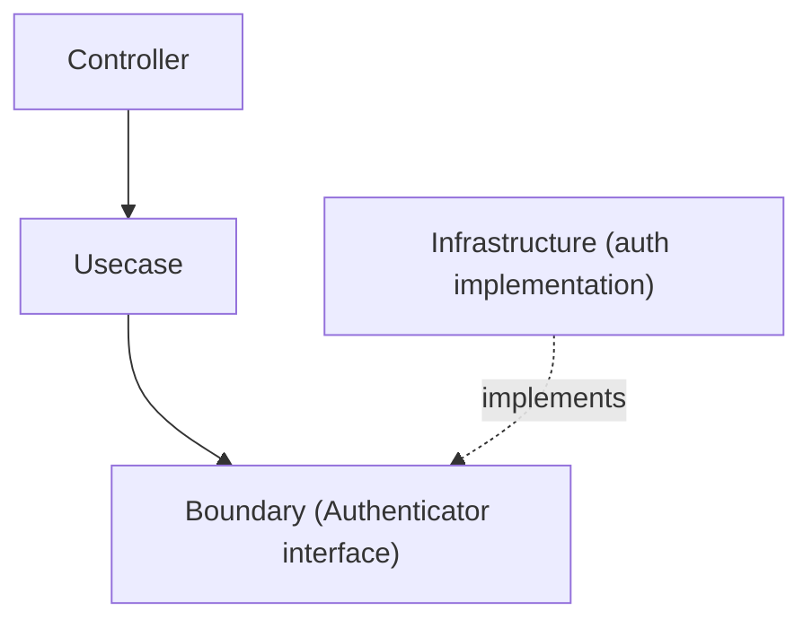

# auth ディレクトリ

`internal/infrastructure/auth` は **認証基盤 (Authentication Infrastructure)** を提供するディレクトリです。

このディレクトリには、アプリケーションが利用する **Authenticator の実装**を配置します。  
実装は **環境ごと（local / stg / prd など）に分離**されます。

認証の抽象インターフェースは **Usecase 層の Boundary** に定義されています。

```txt
internal/usecase/boundary/auth
```

Infrastructure 層では、この Boundary を **具体実装**します。

## 役割

このディレクトリの責務は次の通りです。

- `Authenticator` の **環境別実装**を提供する
- 外部認証基盤（JWT / OAuth / Cognito など）との連携を実装する
- 認証トークンから **Authn 情報を生成**する

ここでは **ビジネスロジックは扱いません。**

## アーキテクチャ上の位置

認証処理は次の層構造で実装されます。



Infrastructure は **Boundary を実装するだけ**であり、  
Usecase から直接呼ばれる具体実装となります。

## ディレクトリ構成

将来的な構成は次のようになります。

```txt
internal/infrastructure/auth
├── README.md
├── local
│   └── auth_local.go
├── stg
│   └── auth_stg.go
└── prd
    └── auth_prd.go
```

|ディレクトリ|用途|
|---|---|
|`local`|ローカル開発用の簡易認証|
|`stg`|ステージング環境の認証|
|`prd`|本番環境の認証|

## Local 実装

`local` は **ローカル開発専用の認証実装**です。

特徴

- トークンの署名検証を行わない
- トークン文字列から Subject を抽出
- 開発用の簡易認証として利用

例

```txt
Authorization: Bearer debug:user123
```

この場合

```txt
subject = user123
provider = mock
```

の Authn が生成されます。

## Staging / Production 実装

stg / prd では通常、次のような認証を実装します。

例

- JWT 検証
- OAuth2
- OpenID Connect
- AWS Cognito
- Auth0

ここでは

- 署名検証
- token validation
- claims 抽出

などを行います。

## DI への登録

Authenticator は DI モジュールで登録されます。

```txt
internal/di/module/core/auth.go
```

例

```txt
func provideAuthenticator(...) auth.Authenticator
```

環境変数や設定に応じて

```txt
local
dev
stg
prd
```

の実装を切り替えます。

## 設計ポリシー

このディレクトリは次の方針で設計されています。

### 1 Boundary を実装する

Infrastructure は

```txt
usecase/boundary/auth
```

の `Authenticator` を実装します。

### 2 ビジネスロジックを持たない

このパッケージは **認証処理のみ**を担当します。

以下は扱いません。

- 権限チェック
- ロール判定
- ビジネスルール

それらは **Usecase 層**で処理します。

### 3 環境ごとに分離

認証方式は環境ごとに異なる場合があるため

```txt
local
stg
prd
```

のディレクトリで分離します。
