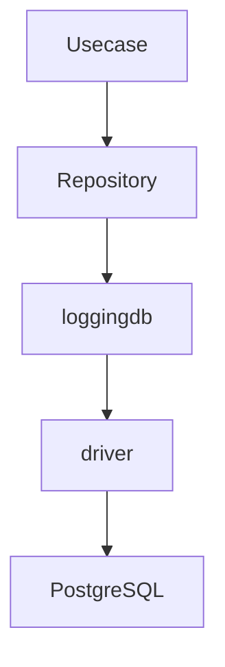
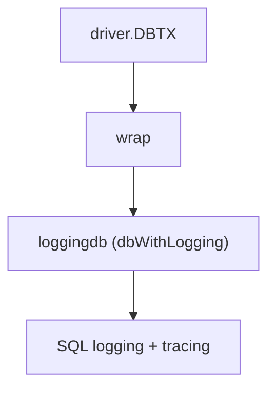
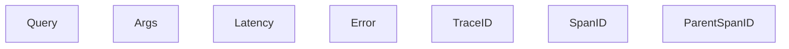
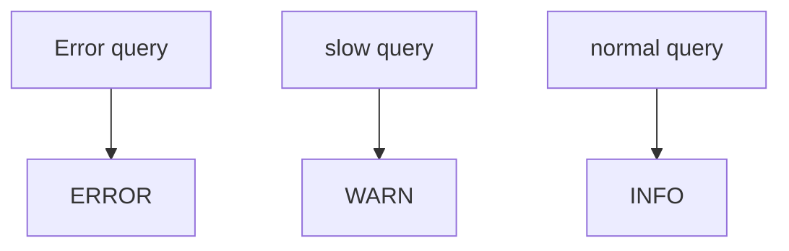
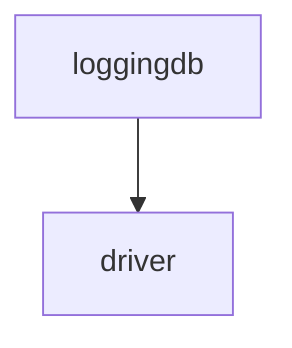

# loggingdb

[English](README.md) | 日本語

概要: **DB アクセスに対して SQL 実行ログとトレース情報を付与するための Observability ラッパーレイヤー。実際のクエリ実行は driver 層へ委譲し、ログ整形・トレース連携のみを追加します。**

loggingdb は **driver の上位に配置される observability adapter** です。

## アーキテクチャ上の位置



loggingdb は **DB 実行処理そのものは行いません。**

`driver.DBTX` をラップし、SQL 実行時に以下の処理を追加します。

- SQL ログ出力
- OpenTelemetry トレース連携
- クエリ実行時間計測
- slow query 判定

## 役割

このディレクトリは **SQL 実行時の observability（可観測性）** を提供します。

主な責務:

- `driver.DBTX` をラップする logging wrapper の提供
- SQL 実行ログの出力
- OpenTelemetry span の生成
- クエリ実行時間の測定
- slow query の検出
- ログフィールドの構造化

これにより上位レイヤ（repository / usecase / handler）は

- ログ実装
- トレース実装

を一切意識する必要がなくなります。

## DBTX Wrapper

loggingdb のコア実装は **DBTX wrapper** です。



`dbWithLogging` は `driver.DBTX` をラップし、SQL 実行前後で次の処理を行います。

1. OpenTelemetry span を開始
2. SQL 実行
3. 実行時間計測
4. SQL ログ出力
5. エラー判定

## SQL ログ内容

出力されるログには以下の情報が含まれます。



これにより

- API リクエスト
- DB クエリ

を **トレース単位で追跡**できます。

## Slow Query

loggingdb では slow query を自動判定します。

slow query の判定は次の設定に依存します。

```go
DBConfig().SlowQueryWarnThreshold()
```

ログレベルは以下のルールで決定されます。



## Provider

`DBProvider` は loggingdb に必要な依存関係をまとめる **DI Adapter** です。

提供する依存:

- `DatabaseDriver`
- `Logger`
- `LogFieldBuilder`
- `DatabaseConfig`
- `LayerTracer`

これにより loggingdb は

- ログ実装
- トレース実装

に直接依存せず、DI 経由で利用できます。

## 必要度

### 本番運用

推奨

理由:

- 遅延クエリの検知
- DB エラー調査
- API と DB のトレース連携

などの観点で **運用監視に非常に有用**です。

ただし、極端に高トラフィックな環境ではログ量増加を考慮して

- sampling
- slow query のみログ

などの構成も検討できます。

### 開発 / テスト

強く推奨

理由:

- SQL の発行内容確認
- sqlc クエリの動作確認
- DB テスト時のデバッグ

のため、開発段階では非常に有効です。

## 注意点

### loggingdb は DB I/O を行わない

loggingdb は **pure wrapper** です。

実際の SQL 実行はすべて driver 層に委譲されます。



### Context を必ず伝搬する

トレース情報は`context.Context`に格納されます。

そのため`ctx`を必ず下位レイヤに伝搬してください。

### 大量クエリ時のログ量

`ExecContext`

`QueryContext`

`QueryRowContext`

など **DB 操作ごとにログが出力されます。**

大量クエリを実行する処理ではログ量が増える可能性があります。
