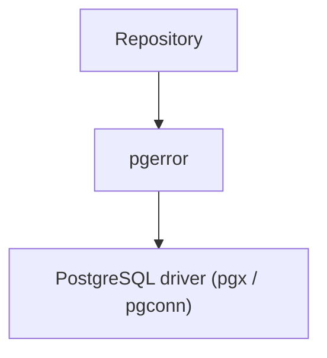
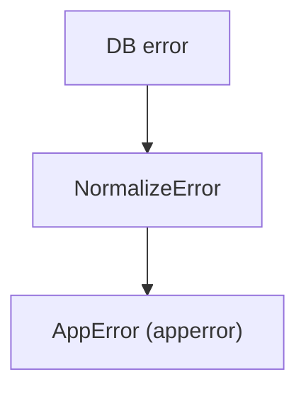
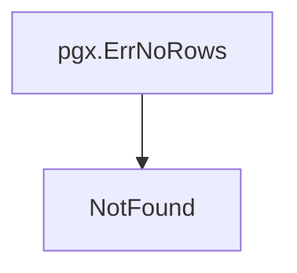

# pgerror パッケージ

[English](README.md) | 日本語

概要: **PostgreSQL 固有のエラーをアプリケーション共通エラーへ正規化し、接続エラーを判定するための Infrastructure レイヤーコンポーネント。DB 固有のエラー仕様を上位レイヤーから隠蔽するための変換レイヤーです。**

## アーキテクチャ上の位置



pgerror は **DB driver が返すエラーをアプリケーション共通エラーへ変換するレイヤー**です。

このレイヤーを挟むことで、

- Usecase
- Domain
- Handler

などの上位レイヤーが **PostgreSQL 固有のエラー仕様を意識する必要がなくなります。**

## 役割

このパッケージは PostgreSQL 固有のエラー処理をアプリケーション共通形式へ正規化します。

主な責務:

- PostgreSQL SQLSTATE を `apperror` へ変換
- DB 接続不可エラーの判定
- `pgx.ErrNoRows` を `NotFound` へ変換
- Infrastructure → Usecase 間のエラー仕様を統一

これにより **DB 実装依存のエラー判定をアプリケーションコードから分離**できます。

## エラー正規化

`NormalizeError` は PostgreSQL エラーをアプリケーション共通エラーへ変換します。

```go
func NormalizeError(err error) error
```

処理の流れ:



この関数は **Infrastructure 層から Usecase 層へ返すエラーの唯一の正規化ポイント**として使用することが推奨されます。

影響行数を返す書き込み系クエリ（sqlc `:execrows`）には `NormalizeExecResult` を使います。これは `NormalizeError` をエラーに適用したうえで、**影響行数 0 を `apperror.ErrNotFound` として扱い**、存在しない行への `UPDATE` / `DELETE` がサイレント成功せずに NotFound で失敗するようにします。この「0 件判定」は各 repository に inline せず、`NormalizeError` と同じここに集約し、全書き込み経路で共有します。

```go
func NormalizeExecResult(affected int64, err error) error
```

**保存済み行からのエンティティ再構築**（`rowToXxx` → `New(...)`）でドメインコンストラクタが返したエラーには `NormalizeReconstructError` を使います。保存済みデータがドメイン不変条件に違反するのはデータ不整合（サーバ側障害）であり、クライアントへ `422` + フィールド `details` として露出させないため、エラーを意図的に **`apperror.ErrInternal` へ平坦化**します（load-bearing flatten: 検証センチネルと `apperror.Meta` をチェーンから消す）。理由文はメッセージに残るためログには届きます。

```go
func NormalizeReconstructError(err error) error
```

## SQLSTATE マッピング

以下の PostgreSQL SQLSTATE がアプリケーションエラーへ変換されます。

|SQLSTATE|意味|AppError|
|--------|------|----------|
|23505|unique violation|Conflict|
|23503|foreign key violation|InvalidArgument|
|23502|not null violation|InvalidArgument|
|23514|check violation|InvalidArgument|
|22001|string too long|InvalidArgument|
|22P02|invalid text representation|InvalidArgument|
|42501|insufficient privilege|PermissionDenied|
|40001|serialization failure|Unavailable|
|40P01|deadlock detected|Unavailable|
|57014|query canceled|Unavailable|

これらに該当しない PostgreSQL エラーは `Internal` エラーへ変換されます。

## 特別処理

### pgx.ErrNoRows

`pgx.ErrNoRows` は PostgreSQL SQLSTATE ではないため特別扱いされます。



これにより Repository 層は

```go
return NormalizeError(err)
```

のみで `NotFound` エラーを扱えます。

## 接続不可エラー判定

`IsUnavailable` はデータベース接続不可エラーを判定します。

```go
func IsUnavailable(err error) bool
```

以下のエラーが接続不可として扱われます。

- context.DeadlineExceeded
- net.Error（タイムアウト・接続拒否・DNS 失敗など）
- PostgreSQL SQLSTATE 08XXX（接続例外）

なお context.Canceled（クライアントのキャンセル/切断）は接続不可ではなく、クライアント起因エラー（`apperror.ErrCanceled`、HTTP 499 Client Closed Request）として分類されます。

この判定は

- リトライ
- サーキットブレーカー
- フェイルオーバー

などの復旧処理に利用できます。

## リトライ / ロック判定述語

`pgerror` は正規化に加えて、driver のリトライ / メトリクス経路で使う判定述語を提供します。これらは正規化後の sentinel ではなく **生の** `pgconn.PgError` の SQLSTATE で判定するため、無関係な `Unavailable` エラー（接続断など）をリトライ対象に巻き込みません。

```go
func IsRetryableTxError(err error) bool // 40001 serialization_failure / 40P01 deadlock_detected
func IsLockNotAvailable(err error) bool // 55P03 lock_not_available（lock_timeout 失効）
```

`IsRetryableTxError` は `driver.NewTransactionManager` がトランザクション全体を再試行するか判断する際に利用します。

## エラーラッピング

`NormalizeError` は `apperror` の sentinel と元の DB エラーを `xerrors.Join` で結合し、元のエラーを chain に保持します。

これにより `xerrors.Is` は

- アプリケーションエラー種別（例: `apperror.ErrConflict`）
- 元の DB エラー（例: 下層の `pgconn.PgError` / `pgx.ErrNoRows`）

の両方に一致します。

（`NormalizeExecResult` の 0 件ケースは例外で、結合すべき下層の DB エラーが無いため `xerrors.Wrap(apperror.ErrNotFound, ...)` を使います。）

## 必要度

### 本番運用

必須

理由:

- DB 制約違反を正しい HTTP ステータスへ変換
- DB 接続断の検知
- セキュリティ上の raw error 隠蔽

を行うため、アプリケーションとして必須のレイヤーです。

### 開発 / テスト

必須

理由:

- DB エラー仕様をテストから隠蔽
- CI でのエラーハンドリング安定化
- sqlc / repository テストの可読性向上

## 注意点

### NormalizeError を一箇所で使用する

`NormalizeError` は **Infrastructure → Usecase の境界で一度だけ適用する**ことが推奨されます。

複数箇所で変換するとエラー構造が崩れる可能性があります。

### PostgreSQL 固有仕様

SQLSTATE `08XXX` は PostgreSQL 固有の接続エラーです。

他 DB (MySQL / TiDB など) に移行する場合は`pgerror`の実装を差し替える必要があります。

### 上位レイヤーで DB 判定をしない

Usecase / Domain 層で`SQLSTATE` / `pgconn` / `pgx`などの DB 依存ロジックを書かないようにしてください。
