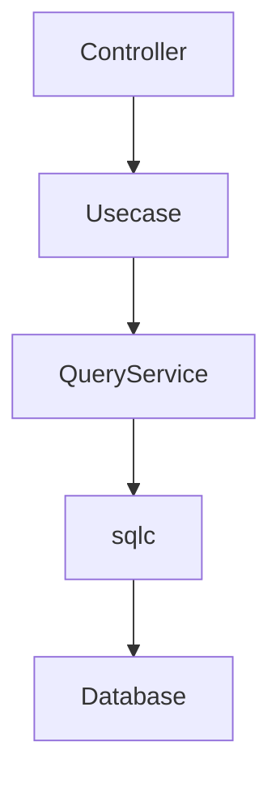
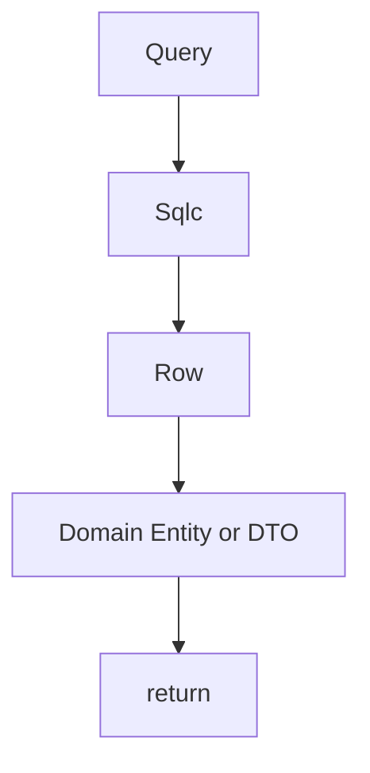
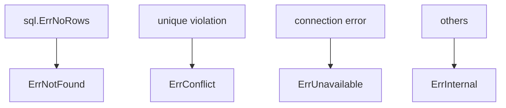
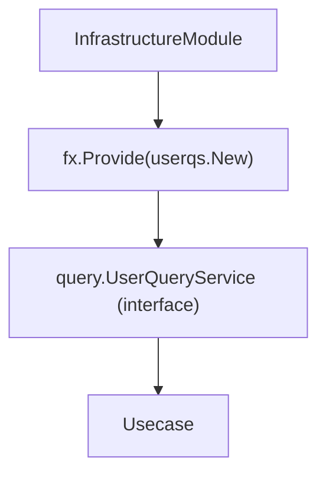
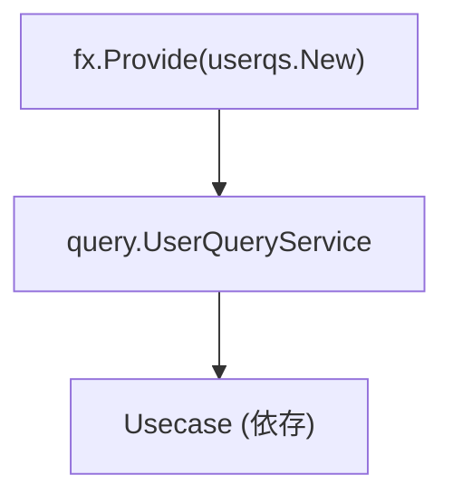

# Query Service 実装ガイド

## 役割

Query Service は **検索・一覧取得などの読み取り専用クエリーを提供する層**です。

Repository が **Aggregate 永続化の抽象**であるのに対して、  
Query Service は **検索用途の専用クエリー**を提供します。



Query Service の責務は次の通りです。

1. SQL検索の実行
2. Row → Domain 変換
3. DBエラー正規化

Query Service は **ビジネスロジックを持ちません。**

## アーキテクチャ上の位置

QueryService 実装は次の場所に配置します。

`internal/infrastructure/rdb/query_service/<aggregate>/`

例

```txt
query_service/
 └ user/
     └ user_query_service.go
```

QueryService Interface は **Usecase 層**に配置します。

`internal/usecase/<aggregate>/query`

例

```txt
internal/usecase/user/query/user_query_service.go
```

Infra はこの Interface を **実装するのみ**です。

## QueryService の責務

QueryService は **検索専用のデータ取得**を担当します。



QueryService は次を行いません。

- ビジネスルール
- Usecaseロジック
- Controller処理
- トランザクション管理

## sqlc の利用

QueryService は **sqlc 生成クエリ**を利用します。

```go
rows, err := db.ListUsersByKeywords(ctx, ...)
```

sqlc により

- 型安全なSQL実行
- コンパイル時SQL検証

が可能になります。

生成コードは、`internal/infrastructure/rdb/sqlc/gen` に配置されます。

## LIKE検索ヘルパー

キーワード検索では`internal/infrastructure/rdb/sqlc`のヘルパーを利用します。

例

```go
escaped := sqlc.EscapeForLike(keyword, sqlc.DefaultLikeEscapeChar)
pattern := sqlc.WrapContainsLikePattern(escaped)
```

目的

- LIKEインジェクション防止
- 検索パターン統一

## 削除状態の制御

削除状態のフィルタリングは

```go
DeletedState: sqlc.BoolPtrToDeletedState(active)
```

を利用します。

これにより

- `active`
- `inactive`
- `all`

の状態制御が可能になります。

## Row → 返却型への変換

sqlc の Row は **Infrastructure 型**です。

QueryService は必ず **返却型(Domain Entity or DTO)に変換**します。

```go
user, err := user.New(
    uuid.FromPrimitive(row.Users.ID),
    ...,
)
```

重要ルールとしては、  
**sqlc Row を上位層に返さない**

## UUID 変換

DB は primitive UUID を使用します。

Domain は`pkg/uuid.UUID`を使用します。

変換

```go
uuid.FromPrimitive(row.ID)
```

## Nullable 変換

Nullable DB値は`internal/infrastructure/rdb/conv`を利用して変換します。

例

```go
conv.StringPtrFromNull(row.Users.Building)
conv.TimePtrFromNull(row.Users.DeletedAt)
```

## LoggingDBProvider

QueryService は DB Driver を直接使用しません。

```go
db := gen.New(s.db.NewLoggingDB(ctx))
```

`loggingdb.DBProvider` は

- SQLログ
- DB / Tx切替
- Context接続

を提供します。

## エラー正規化

PostgreSQL エラーは`internal/infrastructure/rdb/postgres/pgerror`で正規化します。

```go
return pgerror.NormalizeError(err)
```

主な変換



## Observability（Tracing）

QueryService では`observability.LayerTracer`を利用してトレースを提供します。

```go
ctx, endSpan := s.tracer.Start(ctx)
defer endSpan()
```

QueryService は`Span start / end`のみを扱います。

## DI（Dependency Injection）の仕組み（Query Service）

Query Service は **Uber Fx による DI** で生成されます。  
Repository と同様に、Infrastructure 層で実装し、Usecase 層の interface に注入されます。

### 全体構成

Query Service は `fx.Provide` により登録され、Usecase に注入されます。



### internal/di/module/infrastructure.go の役割

```go
func InfrastructureModule() fx.Option {
    return fx.Module("infrastructure",
        fx.Module("query_service",
            fx.Provide(
                userqs.New,
            ),
        ),
    )
}
```

- `fx.Provide`
  - Query Service のコンストラクタを登録
- 戻り値は **Usecase 層で定義された interface**
  - 例: `query.UserQueryService`

### Query Service のコンストラクタ設計

```go
func New(
    db loggingdb.DBProvider,
    tf observability.TracerFactory,
) query.UserQueryService {
    return &service{
        db:     db,
        tracer: tf.Infra(),
    }
}
```

ポイント：

- 戻り値は **interface（Usecase定義）**
- 依存はすべて引数で受け取る（new禁止）
- DB / Tracer などの外部依存は Infrastructure に閉じ込める

### DI の流れ



Usecase 側では

```go
type service struct {
    qs query.UserQueryService
}
```

のように interface で受け取ります。

### Repository との違い（DI観点）

||Repository|Query Service|
|---|---|---|
|interface 定義場所|domain|usecase|
|返却型|domain.Repository|query.QueryService|
|用途|永続化|検索|

### なぜ Usecase interface を返すのか

- Query は Usecase の関心事（ユースケース単位）
- Aggregate単位ではないため Domain に置かない
- 検索仕様変更に柔軟に対応できる

### AI / 開発者向けルール

- Query Service の constructor は必ず `New` で定義すること
- 戻り値は Usecase interface にすること
- Query Service 内で依存を new しないこと
- DI登録は `internal/di/module/infrastructure.go` に追加すること

## QueryService 構造体

QueryService は次の依存を持ちます。

```go
type service struct {
    db     loggingdb.DBProvider
    tracer observability.LayerTracer
}
```

constructor

```go
func New(
    db loggingdb.DBProvider,
    tf observability.TracerFactory,
) query.UserQueryService {
    return &service{
        db:     db,
        tracer: tf.Infra(),
    }
}
```

## Repository との違い

Repository と QueryService の役割は異なります。

||Repository|QueryService|
|---|---|---|
|目的|Aggregate 永続化|検索|
|操作|CRUD|検索|
|責務|Aggregate単位|検索専用|
|配置|domain interface|usecase interface|

## Anti-Patterns

### 1. Repository に検索を書く

検索を Repository に書いてはいけません。

NG

```go
func (r *repository) FindByKeyword(...)
```

検索は`QueryService`に実装します。

### 2. ビジネスロジックを書く

QueryService は **データ取得のみ**です。

NG

```go
if user.IsPremium() {
}
```

### 3. sqlc Row を返す

NG

```go
return rows
```

必ず Domain に変換します。

## 実装例

```go
// serviceで名称固定
type service struct {
  db     loggingdb.DBProvider
  tracer observability.LayerTracer
}

// Newで名称固定
func New(
  db loggingdb.DBProvider,
  tf observability.TracerFactory,
) query.UserQueryService {
  return &service{
    db:     db,
    tracer: tf.Infra(),
  }
}

func (s *service) FindByKeyword(ctx context.Context, keywords []string, active *bool, limit, offset int32) (user.Users, error) {
    // Spanの開始・終了呼び出して設定
    ctx, endSpan := s.tracer.Start(ctx)
    defer endSpan()

    // QueryServiceを利用する側での前処理
    tokens := make([]string, len(keywords))
    for i, kw := range keywords {
        escaped := sqlc.EscapeForLike(kw, sqlc.DefaultLikeEscapeChar)
        tokens[i] = sqlc.WrapContainsLikePattern(escaped)
    }

    // driver.ResolveDriverWithLogを使うことでログを自動で出力
    // 不要な場合は、driver.ResolveDriver(ctx, r.db)を使う
    db := gen.New(s.db.NewLoggingDB(ctx))

    rows, err := db.ListUsersByKeywords(ctx, &gen.ListUsersByKeywordsParams{
        PatternsParam: tokens,
        DeletedState:  sqlc.BoolPtrToDeletedState(active),
        LimitParam:    limit,
        OffsetParam:   offset,
    })
    if err != nil {
        // エラー正規化して返す。
        // エラー内容はpgerrorパッケージ（internal/infrastructure/rdb/postgres/pgerror）で判定される
        return nil, pgerror.NormalizeError(err)
    }

    // Domainエンティティ or DTO への詰め替え
    users := make(user.Users, len(rows))
    for i, row := range rows {
        u, err := user.New(
            uuid.FromPrimitive(row.Users.ID),
            row.Users.FirstName,
            row.Users.LastName,
            row.Users.PasswordHash,
            row.Users.Email,
            row.Users.Phone,
            uuid.FromPrimitive(row.Users.PrefectureID),
            row.Users.City,
            row.Users.Street,
            conv.StringPtrFromNull(row.Users.Building),
            row.Users.PostalCode,
            row.Users.CreatedAt,
            row.Users.UpdatedAt,
            conv.TimePtrFromNull(row.Users.DeletedAt),
        )
        if err != nil {
            return nil, err
        }
        users[i] = u
    }

    return users, nil
}
```
