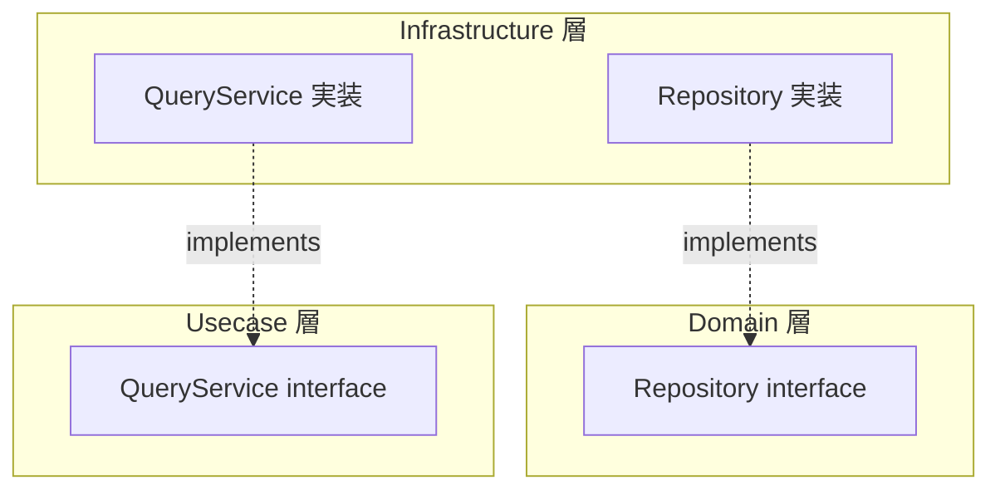
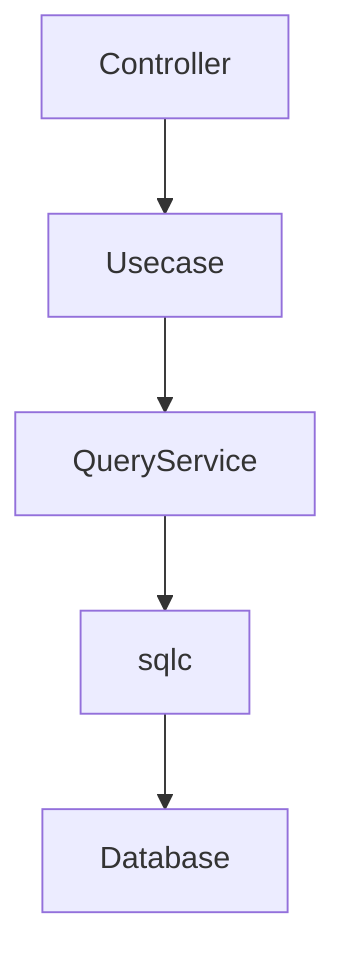
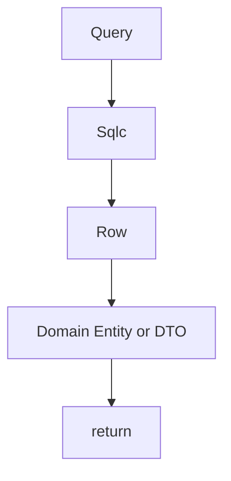
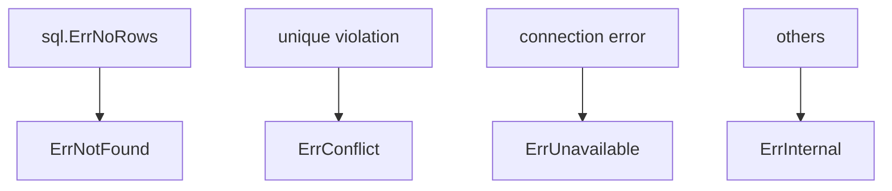
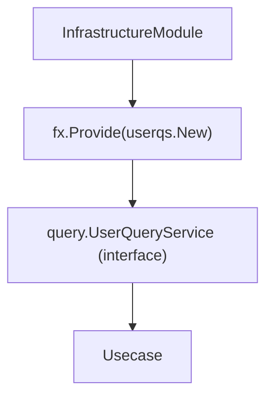
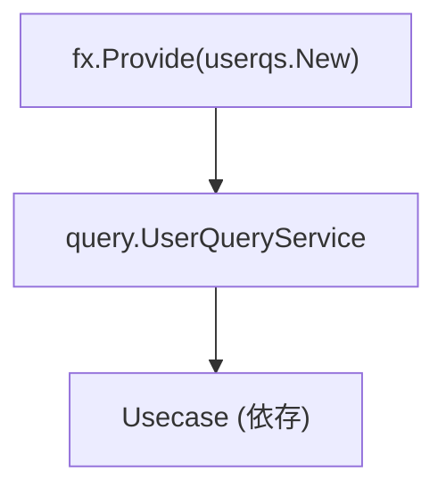

# Query Service 実装ガイド

[English](README.md) | 日本語

## オニオンアーキテクチャにおける Query Service の位置づけ

オニオンアーキテクチャでは、永続化の抽象は Domain 層の **Repository interface** として定義されます。Repository は Aggregate 単位の CRUD を担い、Domain の不変条件を守ります。

一方、Query Service（QS）は **この原則に対する意図的な例外**です。



### なぜ QS の interface を Domain ではなく Usecase に置くのか

|観点|Repository|Query Service|
|---|---|---|
|関心事|Aggregate の永続化|ユースケース固有の検索|
|粒度|Aggregate 単位|画面 / API レスポンス単位|
|返却型|Domain Entity|DTO（表示用の射影）|
|不変条件|Domain が保証|関与しない|
|interface 配置|Domain 層|Usecase 層|

QS が返すのは **Aggregate の完全な再構成ではなく、ユースケースが必要とする射影（projection）** です。これは Domain の関心事ではなく Usecase の関心事であるため、interface は Usecase 層（`internal/usecase/<aggregate>/query`）に配置します。

### CQRS との関係

QS の導入は **軽量 CQRS（Command Query Responsibility Segregation）** のアプローチです。

- **Command（書き込み）**: Repository を経由し、Domain Entity の不変条件を守る
- **Query（読み取り）**: QS を経由し、パフォーマンス最適化された検索クエリを直接実行

完全な CQRS（別 DB / イベントソーシング）ではなく、**同一 DB 上で読み書きの責務を分離する実用的な設計**です。

### QS を採用する判断基準

以下に該当する場合、Repository ではなく QS を検討します。

- 複数テーブルの JOIN が必要な検索
- ページネーション付きの一覧取得
- 全文検索やキーワード検索
- 集計・グルーピングが必要なクエリ
- Aggregate の完全な再構成が不要な読み取り

逆に、ID による単一取得や件数カウントなどの単純なクエリは Repository に留めて構いません。

## 役割

Query Service は **検索・一覧取得などの読み取り専用クエリーを提供する層**です。



Query Service の責務は次の通りです。

1. SQL検索の実行
2. Row → Domain Entity / DTO 変換
3. DBエラー正規化

Query Service は **ビジネスロジックを持ちません。**

## アーキテクチャ上の位置

QueryService 実装は次の場所に配置します。

`internal/infrastructure/rdb/query_service/<aggregate>/`

例

```txt
query_service/
 └ user/
     └ user_query_service.go
```

QueryService Interface は **Usecase 層**に配置します。

`internal/usecase/<aggregate>/query`

例

```txt
internal/usecase/user/query/user_query_service.go
```

Infra はこの Interface を **実装するのみ**です。

## QueryService の責務

QueryService は **検索専用のデータ取得**を担当します。



QueryService は次を行いません。

- ビジネスルール
- Usecaseロジック
- Controller処理
- トランザクション管理

## sqlc の利用

QueryService は **sqlc 生成クエリ**を利用します。

```go
rows, err := db.SearchUsers(ctx, &gen.SearchUsersParams{...})
```

## SQL分割設計

検索条件（active / deleted / all）は SQL 内で分岐せず、クエリを分割して実装します。

例：

- SearchUsers
- SearchActiveUsers
- SearchDeletedUsers

理由：

- SQLの可読性向上
- インデックス効率の向上
- sqlc生成コードの単純化

## LIKE検索ヘルパー

キーワード検索では`internal/infrastructure/rdb/sqlc`のヘルパーを利用します。

例

```go
escaped := sqlc.EscapeForLike(keyword, sqlc.DefaultLikeEscapeChar)
pattern := sqlc.WrapContainsLikePattern(escaped)
```

目的

- LIKEインジェクション防止
- 検索パターン統一

キーワード検索は OR 条件（ILIKE ANY）で実行されます。

## 削除状態の制御

削除状態のフィルタリングは、Go側で分岐し、専用クエリを呼び分けます。

```go
switch {
case filter.Active == nil:
    // 全件
case *filter.Active:
    // active
case !*filter.Active:
    // deleted
}
```

この設計により：

- SQLの複雑化を防ぐ
- インデックス効率を維持する
- 可読性を向上させる

## Row → 返却型への変換

sqlc が返す Row 構造体は **Infrastructure 専用型**です。

ただし、本プロジェクトでは sqlc の override を利用して、生成時に次のような型変換を適用しています。

- nullable → pointer 型
- UUID → `pkg/uuid` 型

そのため QueryService では、追加の変換処理をほとんど行わず、生成済みの型をそのまま Domain constructor または DTO に渡せます。

```go
u, err := user.New(
    row.ID,
    row.FirstName,
    row.LastName,
    ...
)
```

重要ルール

- sqlc Row をそのまま上位層へ返さない
- Domain Entity または DTO に変換する

## UUID について

本プロジェクトでは sqlc override により、DB 上の UUID と Domain で利用する `pkg/uuid` を同一の扱いに寄せています。

そのため QueryService での明示的な UUID 変換は基本的に不要です。

```go
row.Users.ID // そのまま利用可能
```

UUID の生成・比較・補助処理は `pkg/uuid` のラッパーを利用します。

## Nullable について

nullable 値は sqlc override により pointer 型として扱われます。

そのため QueryService では追加の変換処理は不要です。

```go
row.Users.Building   // *string
row.Users.DeletedAt  // *time.Time
```

## LoggingDBProvider

QueryService は通常、`loggingdb.DBProvider` を利用して DB にアクセスします。

```go
db := gen.New(s.db.NewLoggingDB(ctx))
```

`loggingdb.DBProvider` は次を提供します。

- SQL ログ出力
- DB / Tx の透過切り替え
- Contextベース接続取得

QueryService は **DB接続状態を意識しない設計**になります。

## driver の直接利用

ロギングが不要な場合は、ロギングなしの DB アクセスを利用できます。

```go
db := gen.New(s.db.NewDB(ctx))
```

用途

- 高頻度処理でログノイズを抑えたい場合
- ロギング不要な単純処理
- ベンチマークや最小経路の確認

原則

- 通常は `NewLoggingDB(ctx)` を使用する
- 明確な理由がある場合のみ `NewDB(ctx)` を使用する

## エラー正規化

PostgreSQL エラーは`internal/infrastructure/rdb/postgres/pgerror`で正規化します。

```go
return pgerror.NormalizeError(err)
```

主な変換



## Observability（Tracing）

QueryService では

`observability.LayerTracer`

を利用します。

```go
ctx, endSpan := s.tracer.Start(ctx)
defer endSpan()
```

QueryService は

- span開始
- span終了

のみを責務とします。

### span名について

span名は LayerTracer 側で統一的に付与されるため、QueryService 側で明示的に指定する必要はありません。

### 設計意図

- トレーシングの一貫性確保
- 各レイヤーでの責務分離
- OpenTelemetry への直接依存排除

## DI（Dependency Injection）の仕組み（Query Service）

Query Service は **Uber Fx による DI** で生成されます。  
Repository と同様に、Infrastructure 層で実装し、Usecase 層の interface に注入されます。

### 全体構成

Query Service は `fx.Provide` により登録され、Usecase に注入されます。



### internal/di/module/infrastructure.go の役割

```go
func InfrastructureModule() fx.Option {
    return fx.Module("infrastructure",
        fx.Module("query_service",
            fx.Provide(
                userqs.New,
            ),
        ),
    )
}
```

- `fx.Provide`
  - Query Service のコンストラクタを登録
- 戻り値は **Usecase 層で定義された interface**
  - 例: `query.UserQueryService`

### Query Service のコンストラクタ設計

```go
func New(
    db loggingdb.DBProvider,
    tf observability.TracerFactory,
) query.UserQueryService {
    return &service{
        db:     db,
        tracer: tf.Infra(),
    }
}
```

ポイント：

- 戻り値は **interface（Usecase定義）**
- 依存はすべて引数で受け取る（new禁止）
- DB / Tracer などの外部依存は Infrastructure に閉じ込める

### DI の流れ



Usecase 側では

```go
type service struct {
    qs query.UserQueryService
}
```

のように interface で受け取ります。

### Repository との違い（DI観点）

||Repository|Query Service|
|---|---|---|
|interface 定義場所|domain|usecase|
|返却型|domain.Repository|query.QueryService|
|用途|永続化|検索|

### なぜ Usecase interface を返すのか

- Query は Usecase の関心事（ユースケース単位）
- Aggregate単位ではないため Domain に置かない
- 検索仕様変更に柔軟に対応できる

### AI / 開発者向けルール

- Query Service の constructor は必ず `New` で定義すること
- 戻り値は Usecase interface にすること
- Query Service 内で依存を new しないこと
- DI登録は `internal/di/module/infrastructure.go` に追加すること

## QueryService 構造体

QueryService は次の依存を持ちます。

```go
type service struct {
    db     loggingdb.DBProvider
    tracer observability.LayerTracer
}
```

constructor

```go
func New(
    db loggingdb.DBProvider,
    tf observability.TracerFactory,
) query.UserQueryService {
    return &service{
        db:     db,
        tracer: tf.Infra(),
    }
}
```

## Repository との違い

Repository と QueryService の役割は異なります。

||Repository|QueryService|
|---|---|---|
|目的|Aggregate 永続化|検索|
|操作|CRUD|検索|
|責務|Aggregate単位|検索専用|
|配置|domain interface|usecase interface|

## Anti-Patterns

### 1. Repository に検索を書く

検索処理は Repository ではなく QueryService に実装します。

ただし Repository では、次のような単純なフィルタは許容されます。

- ID / 外部キーによる取得
- 単純な条件絞り込み
- 件数取得（COUNT）

それ以上の検索（複数条件・全文検索など）は QueryService に実装します。

### 2. ビジネスロジックを書く

QueryService は **データ取得のみ**です。

NG

```go
if user.IsPremium() {
}
```

### 3. sqlc Row を返す

NG

```go
return rows
```

必ず Domain に変換します。

## 実装例

```go
// service は QueryService の実装です。
// DBアクセスとトレーシングを責務として持ちます。
type service struct {
    db     loggingdb.DBProvider
    tracer observability.LayerTracer
}

// New は QueryService のコンストラクタです。
// 依存はすべて外から注入し、内部で new は行いません。
func New(
    db loggingdb.DBProvider,
    tf observability.TracerFactory,
) query.UserQueryService {
    return &service{
        db:     db,
        tracer: tf.Infra(),
    }
}

// FindByFilter は、キーワードと削除状態に基づいてユーザーを検索します。
// - キーワードは LIKE パターンに変換
// - 削除状態は Go 側で分岐
// - SQL は専用クエリを呼び分ける
func (s *service) FindByFilter(ctx context.Context, filter *query.UserSearchFilter, limit, offset int32) (query.UserSearchResults, error) {
    ctx, endSpan := s.tracer.Start(ctx)
    defer endSpan()

    // キーワードを LIKE 検索用のパターンに変換
    tokens := make([]string, len(filter.Keywords))
    for i, kw := range filter.Keywords {
        escaped := sqlc.EscapeForLike(kw, sqlc.DefaultLikeEscapeChar)
        tokens[i] = sqlc.WrapContainsLikePattern(escaped)
    }

    // loggingDB を利用して DB 接続を取得
    db := gen.New(s.db.NewLoggingDB(ctx))

    // 削除状態に応じてクエリを切り替える
    switch {
    case filter.Active == nil:
        return fetchSearchAll(ctx, db, &gen.SearchUsersParams{
            PatternsParam: tokens,
            LimitParam:    limit,
            OffsetParam:   offset,
        })
    case *filter.Active:
        return fetchSearchActive(ctx, db, &gen.SearchActiveUsersParams{
            PatternsParam: tokens,
            LimitParam:    limit,
            OffsetParam:   offset,
        })
    case !*filter.Active:
        return fetchSearchDeleted(ctx, db, &gen.SearchDeletedUsersParams{
            PatternsParam: tokens,
            LimitParam:    limit,
            OffsetParam:   offset,
        })
    default:
        panic("unreachable: invalid active")
    }
}

// fetchSearchAll は、全ユーザーを検索するヘルパー関数です。
// QueryService からロジックを分離し、責務を明確にします。
func fetchSearchAll(
    ctx context.Context,
    db *gen.Queries,
    params *gen.SearchUsersParams,
) (query.UserSearchResults, error) {
    rows, err := db.SearchUsers(ctx, params)
    if err != nil {
        return nil, pgerror.NormalizeError(err)
    }

    // Row → DTO 変換
    results := make(query.UserSearchResults, len(rows))
    for i, row := range rows {
        results[i] = &query.UserSearchResult{
            FirstName:      row.FirstName,
            LastName:       row.LastName,
            Email:          row.Email,
            Phone:          row.Phone,
            PostalCode:     row.PostalCode,
            PrefectureName: row.PrefectureName,
            City:           row.City,
            Street:         row.Street,
            Building:       row.Building,
            RegisteredAt:   row.CreatedAt,
            DeletedAt:      row.DeletedAt,
        }
    }

    return results, nil
}
```
