# Repository 実装ガイド

[English](README.md) | 日本語

## オニオンアーキテクチャにおける Repository の位置づけ

オニオンアーキテクチャにおいて、Repository は **依存性逆転の原則（DIP）を体現する中心的なパターン**です。

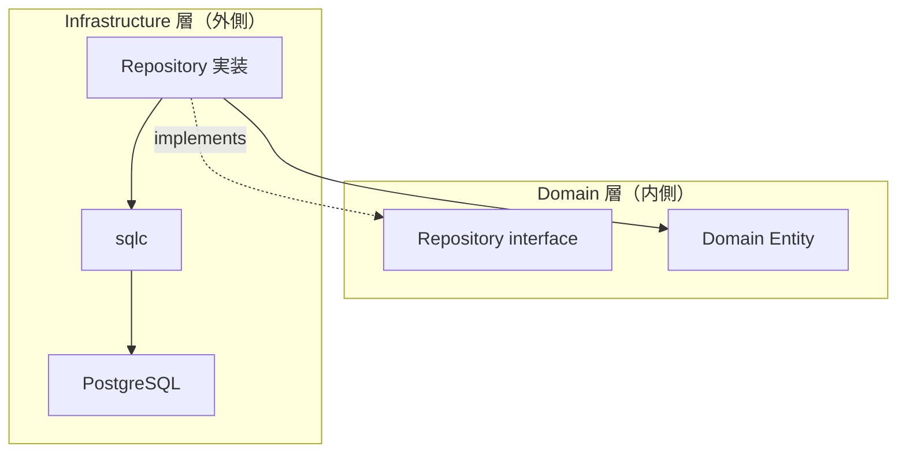

### Repository の核心的な役割

|原則|Repository での実現|
|---|---|
|依存性逆転|Domain が interface を定義し、Infrastructure が実装する|
|Aggregate 境界の保護|永続化の単位は Aggregate 単位で行う|
|Domain の純粋性維持|Domain は DB / SQL / フレームワークを知らない|
|不変条件の検証|Domain constructor 経由でのみ Entity を再構成する|

### QueryService との責務分担

Repository は **Aggregate の永続化（CRUD）** を担います。検索・一覧取得などの読み取り専用クエリは [QueryService](../query_service/README.ja.md) に分離します。

|観点|Repository|QueryService|
|---|---|---|
|目的|Aggregate の永続化|ユースケース固有の検索|
|interface 配置|Domain 層|Usecase 層|
|返却型|Domain Entity|DTO（表示用の射影）|
|不変条件|Domain constructor で保証|関与しない|
|トランザクション|Usecase が制御（`tx.Manager`）|原則 読み取り専用|

この分離により、Repository は Aggregate の整合性に集中でき、検索パフォーマンスの最適化は QS に委ねることができます。

## 役割

Repository は **Domain の永続化抽象（Repository Interface）を Infrastructure で実装する層**です。

この層の責務は次の 3 つに限定されます。

1. sqlc を利用したクエリ実行
2. DB Row → Domain エンティティ変換
3. DB エラーの正規化

Repository は **ビジネスロジックを持ちません**。

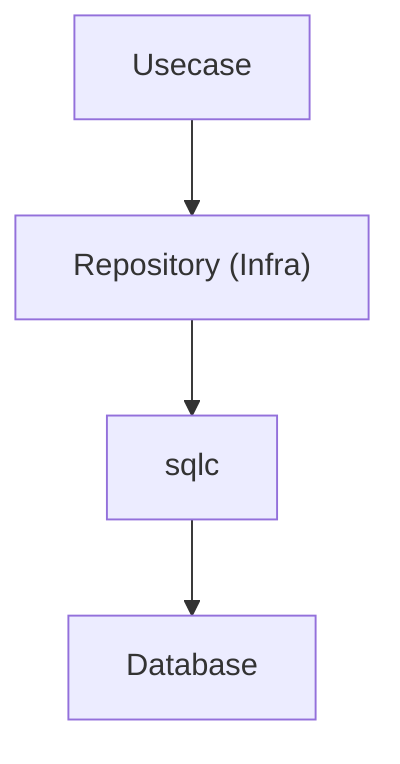

Repository は Domain が定義する Repository Interface を **実装するだけ**の層です。

## アーキテクチャ上の位置

Repository 実装は次の場所に配置します。

`internal/infrastructure/rdb/repository/<aggregate>/`

例

```txt
repository/
 └ <aggregate>/
     └ <aggregate>_repository.go
```

Repository Interface は **Domain 層に配置**されます。

配置場所：`internal/domain/<aggregate>/<aggregate>_repository.go`

Infra はこのインターフェースを **実装するのみ**です。

## Repository メソッドの責務

Repository メソッドは次の処理だけを行います。

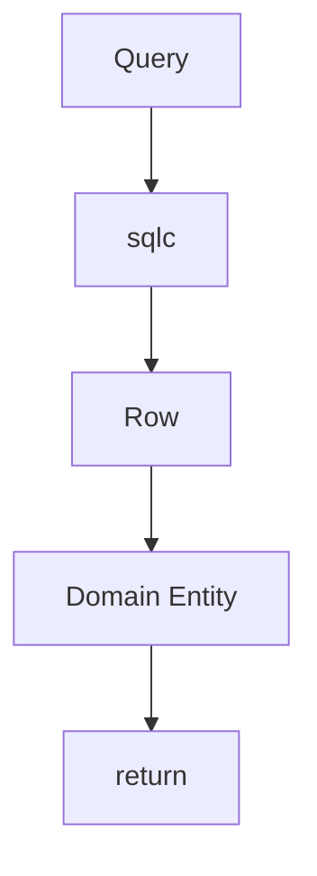

Repository は次を行いません。

- ビジネスルール
- 集計処理
- DTO生成
- Usecaseロジック

これらは **Usecase / Domain の責務**です。

## sqlc の利用

Repository は **sqlc が生成したクエリコード**を利用します。

```go
rows, err := db.List<Entities>(ctx, &gen.List<Entities>Params{...})
```

sqlc により

- 型安全な SQL 実行
- コンパイル時検証

が可能になります。

sqlc の生成コードは次の場所にあります。

`internal/infrastructure/rdb/sqlc/gen`

## Row → Domain 変換

sqlc が返す Row 構造体は **Infrastructure 専用型**です。

ただし、本プロジェクトでは sqlc の override を利用して、生成時に次のような型変換を適用しています。

- nullable → pointer 型
- UUID → `pkg/uuid` 型

そのため Repository では、追加の変換処理をほとんど行わず、生成済みの型をそのまま Domain constructor に渡せます。

```go
entity, err := <aggregate>.New(
    row.<Entity>.ID,
    row.<Entity>.Field1,
    row.<Entity>.Field2,
    ...
)
```

重要ルール

- `sqlc` 型をそのまま上位層へ返さない
- Domain constructor を利用する
- Repository は Row / Model を Domain エンティティへ詰め替えて返す

## Domain constructor error

Domain エンティティ生成に失敗した場合、
そのエラーは **そのまま返却します。**

```go
entity, err := <aggregate>.New(...)
if err != nil {
    return nil, err
}
```

理由

- Domain invariant violation
- DBデータ不整合
- migrationミス

これらは **Domainレイヤーの責務として扱う**ためです。

## UUID について

本プロジェクトでは sqlc override により、DB 上の UUID と Domain で利用する `pkg/uuid` を同一の扱いに寄せています。

そのため Repository での明示的な UUID 変換は基本的に不要です。

```go
row.<Entity>.ID // そのまま Domain constructor に渡せる
```

UUID の生成・比較・補助処理は `pkg/uuid` のラッパーを利用します。

## sqlc helper

LIKE検索などの補助処理は

`internal/infrastructure/rdb/sqlc`

の helper を使用します。

例

```go
escaped := sqlc.EscapeForLike(keyword, sqlc.DefaultLikeEscapeChar)
pattern := sqlc.WrapContainsLikePattern(escaped)
```

削除状態の制御は SQL 内で行わず、Go 側で分岐して専用クエリを呼び分けます。

```go
switch {
case active == nil:
    // 全件
case *active:
    // active
case !*active:
    // deleted
}
```

## LIKE検索について

LIKE 検索は Repository で実装して問題ありません。

ただし、次の条件を満たす必要があります。

- 単一フィールドの単純検索であること
- ドメインロジックを含まないこと
- sqlc helper を利用すること
- 集約の永続化責務の範囲に収まること

次のようなケースは QueryService に分離します。

- 複数フィールド検索
- AND / OR を組み合わせた検索
- relevance やスコアリングを伴う検索
- 複雑なフィルタ + ソート + ページング
- 一覧画面専用の読み取り最適化検索

## DB アクセス（driver）

Repository は `driver.DatabaseDriver` を通じて DB にアクセスします。

```go
db := gen.New(driver.New(ctx, r.db))
```

`driver.New(ctx, db)` は次を提供します。

- DB / Tx の透過切り替え（context に tx があればそれを採用）
- Context ベース接続取得

SQL のログ / トレースは driver の接続層に結線した pgx クエリトレーサーが透過的に付与します
（`driver/README.md` 参照）。そのため Repository は **DB 接続状態を意識しない設計**になります。

## エラー正規化

PostgreSQL エラーは

`internal/infrastructure/rdb/pgerror`

で `apperror` に変換します。

```go
return pgerror.NormalizeError(err)
```

主な変換

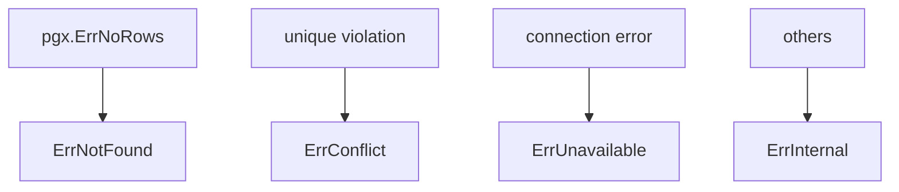

## トランザクション

トランザクション境界は **Usecase** の責務です。

トランザクション管理は **Usecase** の責務です。

クエリ実行は

```go
gen.New(driver.New(ctx, r.db))
```

を利用して行います。

これにより

Repository は

```go
gen.New(driver.New(ctx, r.db))
```

を使用して `Tx / DB` を透過的に利用します。

## Observability（Tracing）

Infrastructure 層では

`observability.LayerTracer`

を利用します。

```go
ctx, endSpan := r.tracer.Start(ctx)
defer endSpan()
```

Repository は

- span開始
- span終了

のみを責務とします。

### span名について

span名は LayerTracer 側で統一的に付与されるため、Repository 側で明示的に指定する必要はありません。

### 設計意図

- トレーシングの一貫性確保
- 各レイヤーでの責務分離
- OpenTelemetry への直接依存排除

## DI（Dependency Injection）の仕組み（Repository）

Repository は **Uber Fx による DI** で生成されます。  
Infrastructure 層では **Domain の Repository Interface を実装し、DIコンテナに提供する**役割を持ちます。

### 全体構成

Repository は `fx.Provide` により登録され、Usecase に注入されます。

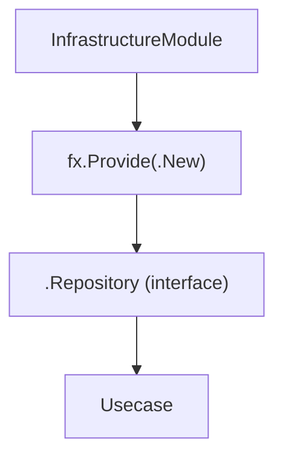

### internal/di/module/persistence.go の役割

永続化系のプロバイダ（repository / query_service / system_query）は `persistenceModule`
に登録され、`InfrastructureModule()` がこれを合成します。

```go
func persistenceModule() fx.Option {
    return fx.Module("persistence",
        fx.Module("repository",
            fx.Provide(
                <aggregate>.New,
            ),
        ),
    )
}
```

- `fx.Provide`
  - Repository のコンストラクタを登録
- 戻り値は **Domain の interface 型**
  - 例: `<aggregate>.Repository`

### Repository のコンストラクタ設計

```go
func New(
    db driver.DatabaseDriver,
    tf observability.TracerFactory,
) <aggregate>.Repository {
    return &repository{
        db:       db,
        tracer:   tf.Infra(),
    }
}
```

ポイント：

- 戻り値は **interface（Domain定義）**
- 依存はすべて引数で受け取る（new禁止）
- DB / Tracer などの外部依存は Infrastructure に閉じ込める

### DI の流れ

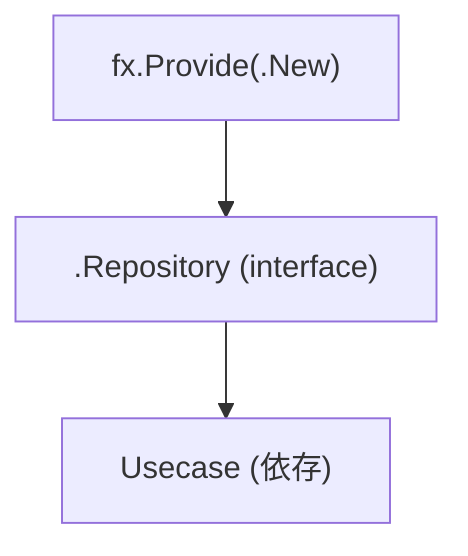

Usecase 側では

```go
type service struct {
    repo <aggregate>.Repository
}
```

のように interface で受け取ります。

### なぜ interface を返すのか

- Domain が依存するのは interface のみ
- Infrastructure の差し替えが可能（mock / 別DB）
- Onion Architecture の依存逆転を守る

### AI / 開発者向けルール

- Repository の constructor は必ず `New` で定義すること
- 戻り値は interface（Domain定義）にすること
- Repository 内で依存を new しないこと
- DI登録は `internal/di/module/persistence.go`（`persistenceModule`）に追加すること

## Repository構造体

Repository 実装は次の依存を持ちます。

- driver.DatabaseDriver は、Repository が通常利用する DB アクセス入口です。
  - SQL ログ出力
  - トレース連携
  - DB / Tx の透過切り替え
  を提供します。

- observability.TracerFactory は、LayerTracer を生成するためのファクトリです。
  - Repository では Infra レイヤー用 tracer を使用します

```go
type repository struct {
    db     driver.DatabaseDriver
    tracer observability.LayerTracer
}
```

constructor

```go
func New(
    db driver.DatabaseDriver,
    tf observability.TracerFactory,
) <aggregate>.Repository {
    return &repository{
        db:       db,
        tracer:   tf.Infra(),
    }
}
```

## テスト戦略

Repository のテストは **Infrastructure Integration Test** として実装します。

Repository は SQL 実行の正しさも責務に含むため、
**mock を使用せず実際の DB を利用して検証します。**

テスト対象の構造は次の通りです。

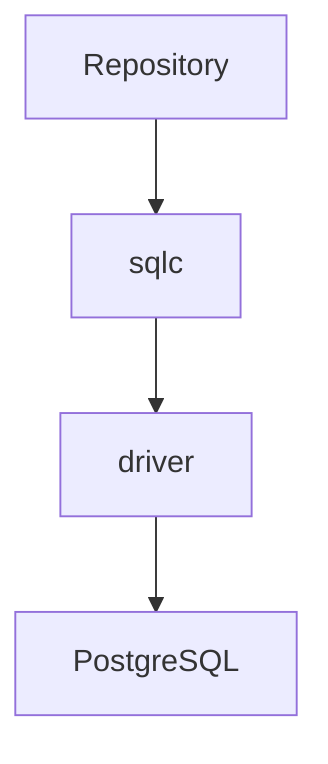

このレイヤー全体を **実 DB でテスト**します。

### テストの目的

Repository テストでは次を検証します。

- SQL クエリが正しく実行される
- Row → Domain 変換が正しい
- Domain constructor エラーが正しく伝搬される
- PostgreSQL エラーが `pgerror.NormalizeError` により正規化される
- Pagination（limit / offset）が正しく機能する

Repository テストは **Domain ロジックの検証を目的としません**。

### テスト実行環境

Repository テストは `testkit` を使用して DB を初期化します。

```go
db := testkit.NewTestDB(t)
```

この関数は次を提供します。

- `NewTestDB`: 共有テスト用 DB 接続（`driver.DatabaseDriver`）。Repository コンストラクタへ直接渡す

### トランザクションテスト

各テストは **トランザクション内で実行されます**。

```go
txm := testkit.NewTestTransactionRunner(t)

txm.WithinTx(func(ctx context.Context) {
    // test logic
})
```

内部動作

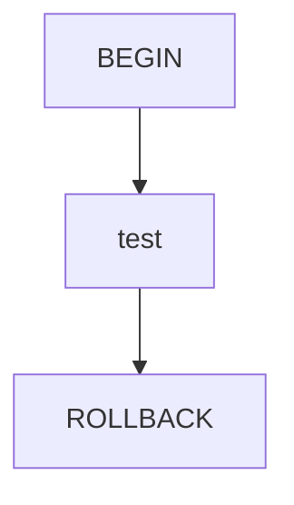

これにより

- DB 状態が汚れない
- テストの独立性が保たれる

### 並列実行

Repository テストでは `t.Parallel()` を使用してテスト自体は並列実行できます。

ただし、`testkit.NewTestTransactionRunner(t)` が提供するトランザクションマネージャは
内部でトランザクション実行を **直列化**します。

そのため実行モデルは次のようになります。

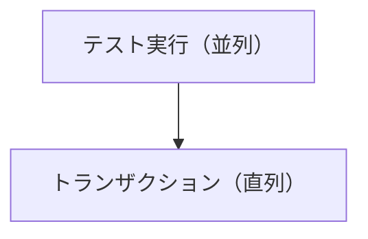

各テストは `WithinTx` 内で


の形で実行されます。

トランザクションを直列化することで、複数テストが同時に走っても
DB状態の競合やテスト間の干渉が発生しないようにしています。

### Domain エラーの検証

Repository は Domain constructor を利用して
Row → Domain 変換を行います。

そのため DB 内に **不正データが存在する場合**、
Domain エラーが発生します。

テストではこれも検証します。

```go
require.ErrorIs(t, err, <aggregate>.ErrInvalid<Field>)
```

これは次のケースを検証します。

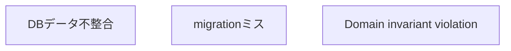

### テストのエラー正規化

DB エラーは `pgerror.NormalizeError` により `apperror` に変換されます。

例


Repository テストでは

- `ErrConflict`
- `ErrNotFound`

などの **正規化結果**を検証します。

## Repository Anti-Patterns

Repository 層では **よくある誤った実装パターン**があります。  
これらはアーキテクチャ境界を壊す原因になるため **実装してはいけません。**

### 1. ビジネスロジックを書く

Repository は **永続化層**です。  
ビジネスルールを書いてはいけません。

NG例

```go
func (r *repository) Create(ctx context.Context, entity *<aggregate>.<Aggregate>) error {
    if entity.IsPremium() {
        // ❌ ビジネスルール
    }
}
```

正しい責務

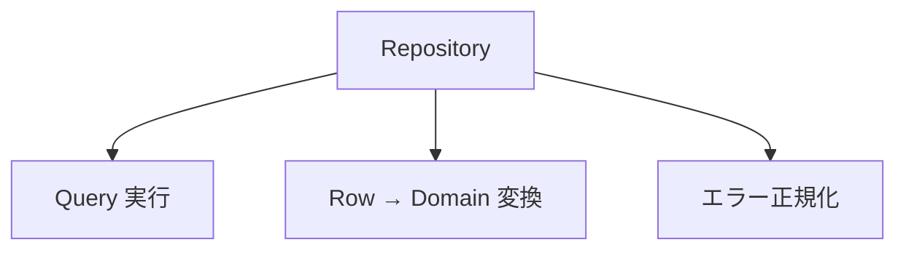

ビジネスルールは **Domain / Usecase 層の責務**です。

### 2. DTO を生成する

Repository は **DTO を生成しません。**

NG例

```go
return <Aggregate>DTO{
    Name: row.<Entity>.Name,
}
```

Repository は **Domain エンティティのみ返却**します。

```go
return <aggregate>.New(...)
```

DTO 変換は **Usecase / Presenter 層の責務**です。

### 3. sqlc Row をそのまま返す

sqlc の Row 型は **Infrastructure 専用型**です。

NG例

```go
return rows
```

必ず Domain へ変換します。

```go
entity, err := <aggregate>.New(...)
```

理由：**sqlc 型を上位層に漏らさない**

### 4. QueryService を書く

Repository は **集約単位の永続化抽象**です。

そのため、以下のような処理は Repository に含めて問題ありません。

- 単純な条件フィルタ
- 件数取得（COUNT）
- ID / 外部キーによる取得
- 集約の責務に収まる単純な絞り込み

例

```go
CountByActive(ctx context.Context, active *bool)
```

一方で、以下のような **検索専用 API** は Repository に実装してはいけません。

- フルテキスト検索
- 複数条件を横断する複雑な検索
- 集計・ランキング
- UI依存の検索
- 一覧画面専用の読み取り最適化検索

これらは `QueryService` として別レイヤーに分離します。

### 5. トランザクションを開始する

Repository は **トランザクション境界を管理しません。**

NG例

```go
tx, _ := db.Begin()
```

トランザクション管理は **Usecase** の責務です。

Repository は

```go
gen.New(driver.New(ctx, r.db))
```

を使用して `Tx / DB` を透過的に利用します。

### 6. Controller 型を参照する

Repository は **HTTP 層に依存しません。**

NG例

```go
func (r *repository) Create(ctx echo.Context)
```

Repository は **純粋な Go インターフェース**で実装します。

```go
func (r *repository) Create(ctx context.Context, entity *<aggregate>.<Aggregate>)
```

### 7. Domain interface を Infra に定義する

Repository Interface は **Domain 層に定義します。**

NG例

`internal/infrastructure/repository/<aggregate>_repository_interface.go`

正しい配置

`internal/domain/<aggregate>/<aggregate>_repository.go`

Infra は **Domain Interface の実装のみ**を行います。

## Do / Don't

### Do

- sqlc 生成コードを使用
- Row → Domain 変換
- nullable → pointer 変換は sqlc override に任せる
- pgerror.NormalizeError を利用（INSERT/UPDATE の影響行数 0 → NotFound は NormalizeExecResult）
- LIKE helper を利用

### Don't

- Domain interface を Infra に定義
- sqlc 型を上位に返す
- ビジネスロジックを書く
- Controller 型を参照
- QueryService を書く

## 実装例

```go
package <aggregate>

type repository struct {
    db     driver.DatabaseDriver
    tracer observability.LayerTracer
}

// New は Repository のコンストラクタです。
// 依存はすべて外から注入します。
func New(
    db driver.DatabaseDriver,
    tf observability.TracerFactory,
) <aggregate>.Repository {
    return &repository{
        db:     db,
        tracer: tf.Infra(),
    }
}

// FindByActive は、アクティブ状態に基づいてエンティティを取得します。
// 削除状態は Go 側で分岐し、SQL は専用クエリを呼び分けます。
func (r *repository) FindByActive(ctx context.Context, active *bool, limit, offset int32) (<aggregate>.<Aggregate>s, error) {
    ctx, endSpan := r.tracer.Start(ctx)
    defer endSpan()

    db := gen.New(driver.New(ctx, r.db))

    switch {
    case active == nil:
        return fetchList(ctx, db, &gen.List<Entities>Params{
            OffsetParam: offset,
            LimitParam:  limit,
        })
    case *active:
        return fetchListByActive(ctx, db, &gen.ListActive<Entities>Params{
            OffsetParam: offset,
            LimitParam:  limit,
        })
    case !*active:
        return fetchListByDeleted(ctx, db, &gen.ListDeleted<Entities>Params{
            OffsetParam: offset,
            LimitParam:  limit,
        })
    default:
        panic("unreachable: invalid active")
    }
}

// fetchList は、全エンティティ取得処理を行います。
// Repository からロジックを分離し、責務を明確にします。
func fetchList(
    ctx context.Context,
    db *gen.Queries,
    params *gen.List<Entities>Params,
) (<aggregate>.<Aggregate>s, error) {
    rows, err := db.List<Entities>(ctx, params)
    if err != nil {
        return nil, pgerror.NormalizeError(err)
    }

    entities := make(<aggregate>.<Aggregate>s, len(rows))
    for i, row := range rows {
        // sqlc override により nullable → pointer / UUID → pkg/uuid は変換済みのため、
        // 各カラムをそのまま Domain constructor へ渡します。
        e, err := <aggregate>.New(
            row.<Entity>.ID,
            row.<Entity>.Field1,
            // ...
        )
        if err != nil {
            return nil, err
        }
        entities[i] = e
    }
    return entities, nil
}
```
