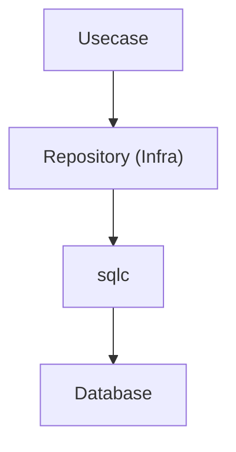
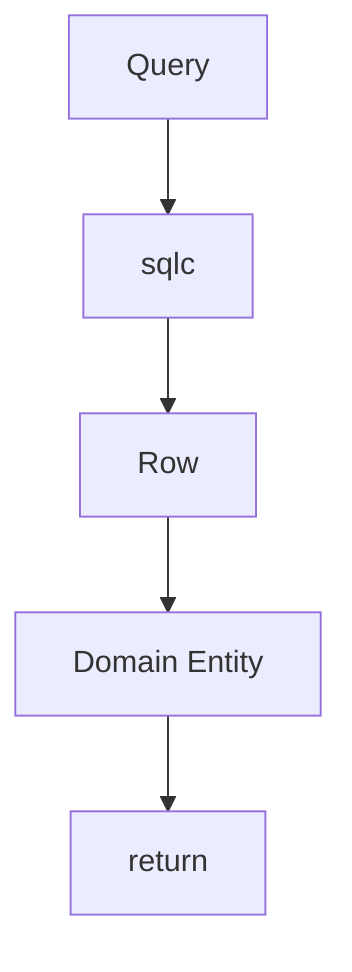
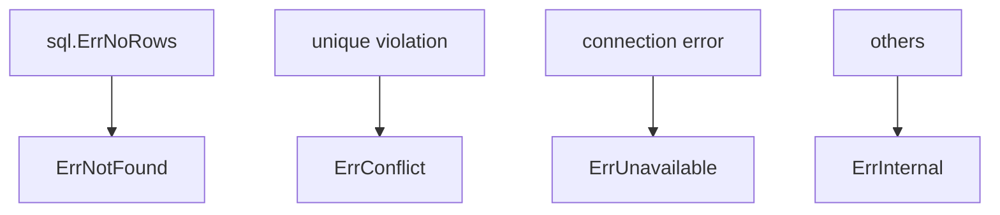
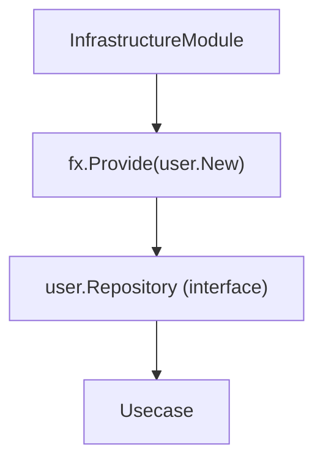
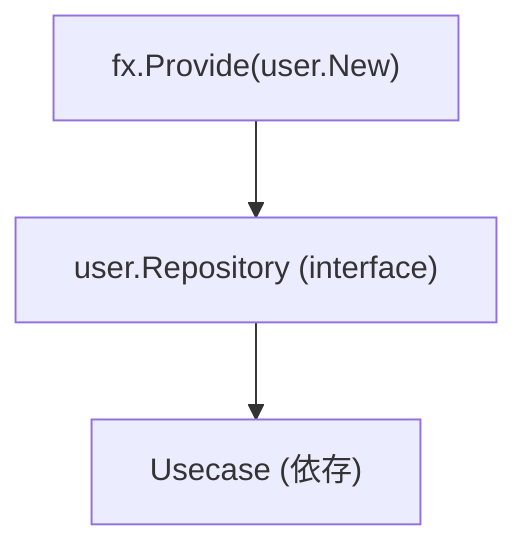
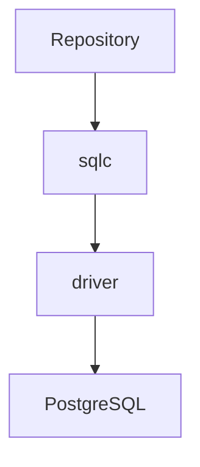
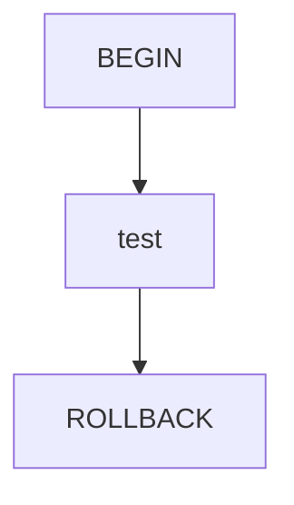
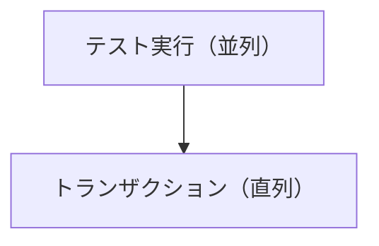
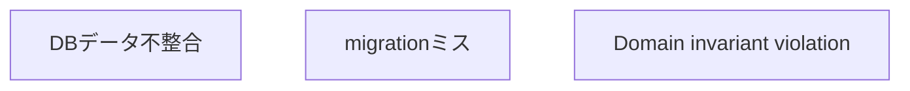
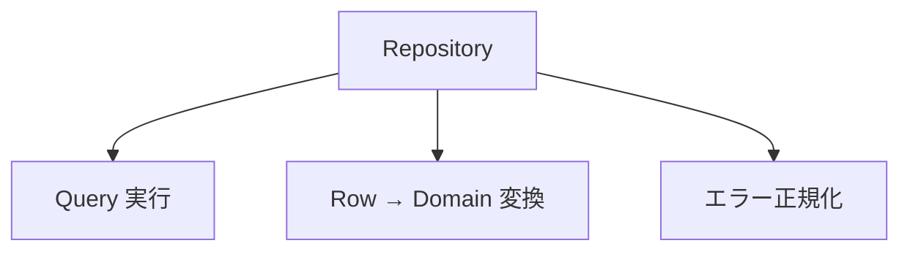

# Repository 実装ガイド

[English](README.md) | 日本語

## 役割

Repository は **Domain の永続化抽象（Repository Interface）を Infrastructure で実装する層**です。

この層の責務は次の 3 つに限定されます。

1. sqlc を利用したクエリ実行
2. DB Row → Domain エンティティ変換
3. DB エラーの正規化

Repository は **ビジネスロジックを持ちません**。



Repository は Domain が定義する Repository Interface を **実装するだけ**の層です。

## アーキテクチャ上の位置

Repository 実装は次の場所に配置します。

`internal/infrastructure/rdb/repository/<aggregate>/`

例

```txt
repository/
 ├ user/
 │   └ user_repository.go
 └ prefecture/
     └ prefecture_repository.go
```

Repository Interface は **Domain 層に配置**されます。

配置場所：`internal/domain/<aggregate>/repository.go`

Infra はこのインターフェースを **実装するのみ**です。

## Repository メソッドの責務

Repository メソッドは次の処理だけを行います。



Repository は次を行いません。

- ビジネスルール
- 集計処理
- DTO生成
- Usecaseロジック

これらは **Usecase / Domain の責務**です。

## sqlc の利用

Repository は **sqlc が生成したクエリコード**を利用します。

```go
rows, err := db.ListUsers(ctx, &gen.ListUsersParams{...})
```

sqlc により

- 型安全な SQL 実行
- コンパイル時検証

が可能になります。

sqlc の生成コードは次の場所にあります。

`internal/infrastructure/rdb/sqlc/gen`

## Row → Domain 変換

sqlc が返す Row 構造体は **Infrastructure 専用型**です。

ただし、本プロジェクトでは sqlc の override を利用して、生成時に次のような型変換を適用しています。

- nullable → pointer 型
- UUID → `pkg/uuid` 型

そのため Repository では、追加の変換処理をほとんど行わず、生成済みの型をそのまま Domain constructor に渡せます。

```go
userEntity, err := user.New(
    row.Users.ID,
    row.Users.FirstName,
    row.Users.LastName,
    ...
)
```

重要ルール

- `sqlc` 型をそのまま上位層へ返さない
- Domain constructor を利用する
- Repository は Row / Model を Domain エンティティへ詰め替えて返す

## Domain constructor error

Domain エンティティ生成に失敗した場合、
そのエラーは **そのまま返却します。**

```go
userEntity, err := user.New(...)
if err != nil {
    return nil, err
}
```

理由

- Domain invariant violation
- DBデータ不整合
- migrationミス

これらは **Domainレイヤーの責務として扱う**ためです。

## UUID について

本プロジェクトでは sqlc override により、DB 上の UUID と Domain で利用する `pkg/uuid` を同一の扱いに寄せています。

そのため Repository での明示的な UUID 変換は基本的に不要です。

```go
row.Users.ID // そのまま Domain constructor に渡せる
```

UUID の生成・比較・補助処理は `pkg/uuid` のラッパーを利用します。

## sqlc helper

LIKE検索などの補助処理は

`internal/infrastructure/rdb/sqlc`

の helper を使用します。

例

```go
escaped := sqlc.EscapeForLike(keyword, sqlc.DefaultLikeEscapeChar)
pattern := sqlc.WrapContainsLikePattern(escaped)
```

削除状態

```go
DeletedState: sqlc.BoolPtrToDeletedState(active)
```

目的

- LIKEインジェクション防止
- 検索パターン統一
- 状態変換の一元化

## LIKE検索について

LIKE 検索は Repository で実装して問題ありません。

ただし、次の条件を満たす必要があります。

- 単一フィールドの単純検索であること
- ドメインロジックを含まないこと
- sqlc helper を利用すること
- 集約の永続化責務の範囲に収まること

次のようなケースは QueryService に分離します。

- 複数フィールド検索
- AND / OR を組み合わせた検索
- relevance やスコアリングを伴う検索
- 複雑なフィルタ + ソート + ページング
- 一覧画面専用の読み取り最適化検索

## LoggingDBProvider

Repository は通常、`loggingdb.DBProvider` を利用して DB にアクセスします。

```go
db := gen.New(r.db.NewLoggingDB(ctx))
```

`loggingdb.DBProvider` は次を提供します。

- SQL ログ出力
- DB / Tx の透過切り替え
- Contextベース接続取得

Repository は **DB接続状態を意識しない設計**になります。

## driver の直接利用

ロギングが不要な場合は、ロギングなしの DB アクセスを利用できます。

```go
db := gen.New(r.db.NewDB(ctx))
```

用途

- 高頻度処理でログノイズを抑えたい場合
- ロギング不要な単純処理
- ベンチマークや最小経路の確認

原則

- 通常は `NewLoggingDB(ctx)` を使用する
- 明確な理由がある場合のみ `NewDB(ctx)` を使用する

## エラー正規化

PostgreSQL エラーは

`internal/infrastructure/rdb/postgres/pgerror`

で `apperror` に変換します。

```go
return pgerror.NormalizeError(err)
```

主な変換



## トランザクション

トランザクション境界は **Usecase** の責務です。

トランザクション管理は **Usecase** の責務です。

クエリ実行は

```go
gen.New(r.db.NewLoggingDB(ctx))
```

を利用して行います。

これにより

Repository は

```go
gen.New(r.db.NewLoggingDB(ctx))
```

を使用して `Tx / DB` を透過的に利用します。

## Observability（Tracing）

Infrastructure 層では

`observability.LayerTracer`

を利用します。

```go
ctx, endSpan := r.tracer.Start(ctx)
defer endSpan()
```

Repository は

- span開始
- span終了

のみを責務とします。

### span名について

span名は LayerTracer 側で統一的に付与されるため、Repository 側で明示的に指定する必要はありません。

### 設計意図

- トレーシングの一貫性確保
- 各レイヤーでの責務分離
- OpenTelemetry への直接依存排除

## DI（Dependency Injection）の仕組み（Repository）

Repository は **Uber Fx による DI** で生成されます。  
Infrastructure 層では **Domain の Repository Interface を実装し、DIコンテナに提供する**役割を持ちます。

### 全体構成

Repository は `fx.Provide` により登録され、Usecase に注入されます。



### internal/di/module/infrastructure.go の役割

```go
func InfrastructureModule() fx.Option {
    return fx.Module("infrastructure",
        fx.Module("repository",
            fx.Provide(
                user.New,
                prefecture.New,
            ),
        ),
    )
}
```

- `fx.Provide`
  - Repository のコンストラクタを登録
- 戻り値は **Domain の interface 型**
  - 例: `user.Repository`

### Repository のコンストラクタ設計

```go
func New(
    db loggingdb.DBProvider,
    tf observability.TracerFactory,
) user.Repository {
    return &repository{
        db:       db,
        tracer:   tf.Infra(),
    }
}
```

ポイント：

- 戻り値は **interface（Domain定義）**
- 依存はすべて引数で受け取る（new禁止）
- DB / Tracer などの外部依存は Infrastructure に閉じ込める

### DI の流れ



Usecase 側では

```go
type service struct {
    repo user.Repository
}
```

のように interface で受け取ります。

### なぜ interface を返すのか

- Domain が依存するのは interface のみ
- Infrastructure の差し替えが可能（mock / 別DB）
- Onion Architecture の依存逆転を守る

### AI / 開発者向けルール

- Repository の constructor は必ず `New` で定義すること
- 戻り値は interface（Domain定義）にすること
- Repository 内で依存を new しないこと
- DI登録は `internal/di/module/infrastructure.go` に追加すること

## Repository構造体

Repository 実装は次の依存を持ちます。

- loggingdb.DBProvider は、Repository が通常利用する DB アクセス入口です。
  - SQL ログ出力
  - トレース連携
  - DB / Tx の透過切り替え
  を提供します。

- ロギングが不要な場合は、`r.db.NewDB(ctx)` を利用してロギングなしの DB アクセスを使用できます。
  - 高頻度処理
  - ベンチマーク
  - ログノイズを避けたい処理
  など、明確な理由がある場合のみ使います。

- observability.TracerFactory は、LayerTracer を生成するためのファクトリです。
  - Repository では Infra レイヤー用 tracer を使用します

```go
type repository struct {
    db     loggingdb.DBProvider
    tracer observability.LayerTracer
}
```

constructor

```go
func New(
    db loggingdb.DBProvider,
    tf observability.TracerFactory,
) user.Repository {
    return &repository{
        db:       db,
        tracer:   tf.Infra(),
    }
}
```

## テスト戦略

Repository のテストは **Infrastructure Integration Test** として実装します。

Repository は SQL 実行の正しさも責務に含むため、
**mock を使用せず実際の DB を利用して検証します。**

テスト対象の構造は次の通りです。



このレイヤー全体を **実 DB でテスト**します。

### テストの目的

Repository テストでは次を検証します。

- SQL クエリが正しく実行される
- Row → Domain 変換が正しい
- Domain constructor エラーが正しく伝搬される
- PostgreSQL エラーが `pgerror.NormalizeError` により正規化される
- Pagination（limit / offset）が正しく機能する

Repository テストは **Domain ロジックの検証を目的としません**。

### テスト実行環境

Repository テストは `testkit` を使用して DB を初期化します。

```go
db, provider := testkit.NewTestDBWithLoggingProvider(t)
```

この関数は次を提供します。

- テスト用 DB 接続
- loggingdb.DBProvider

### トランザクションテスト

各テストは **トランザクション内で実行されます**。

```go
txm := testkit.NewTestTransactionManager(t)

txm.WithinTx(func(ctx context.Context) {
    // test logic
})
```

内部動作



これにより

- DB 状態が汚れない
- テストの独立性が保たれる

### 並列実行

Repository テストでは `t.Parallel()` を使用してテスト自体は並列実行できます。

ただし、`testkit.NewTestTransactionManager(t)` が提供するトランザクションマネージャは
内部でトランザクション実行を **直列化**します。

そのため実行モデルは次のようになります。



各テストは `WithinTx` 内で


の形で実行されます。

トランザクションを直列化することで、複数テストが同時に走っても
DB状態の競合やテスト間の干渉が発生しないようにしています。

### Domain エラーの検証

Repository は Domain constructor を利用して
Row → Domain 変換を行います。

そのため DB 内に **不正データが存在する場合**、
Domain エラーが発生します。

テストではこれも検証します。

```go
require.ErrorIs(t, err, user.ErrInvalidLastName)
```

これは次のケースを検証します。



### テストのエラー正規化

DB エラーは `pgerror.NormalizeError` により `apperror` に変換されます。

例


Repository テストでは

- `ErrConflict`
- `ErrNotFound`

などの **正規化結果**を検証します。

## Repository Anti-Patterns

Repository 層では **よくある誤った実装パターン**があります。  
これらはアーキテクチャ境界を壊す原因になるため **実装してはいけません。**

### 1. ビジネスロジックを書く

Repository は **永続化層**です。  
ビジネスルールを書いてはいけません。

NG例

```go
func (r *repository) Create(ctx context.Context, user *user.User) error {
    if user.IsPremium() {
        // ❌ ビジネスルール
    }
}
```

正しい責務



ビジネスルールは **Domain / Usecase 層の責務**です。

### 2. DTO を生成する

Repository は **DTO を生成しません。**

NG例

```go
return UserDTO{
    Name: row.Users.Name,
}
```

Repository は **Domain エンティティのみ返却**します。

```go
return user.New(...)
```

DTO 変換は **Usecase / Presenter 層の責務**です。

### 3. sqlc Row をそのまま返す

sqlc の Row 型は **Infrastructure 専用型**です。

NG例

```go
return rows
```

必ず Domain へ変換します。

```go
u, err := user.New(...)
```

理由：**sqlc 型を上位層に漏らさない**

### 4. QueryService を書く

Repository は **集約単位の永続化抽象**です。

そのため、以下のような処理は Repository に含めて問題ありません。

- 単純な条件フィルタ
- 件数取得（COUNT）
- ID / 外部キーによる取得
- 集約の責務に収まる単純な絞り込み

例

```go
CountByActive(ctx context.Context, active *bool)
```

一方で、以下のような **検索専用 API** は Repository に実装してはいけません。

- フルテキスト検索
- 複数条件を横断する複雑な検索
- 集計・ランキング
- UI依存の検索
- 一覧画面専用の読み取り最適化検索

これらは `QueryService` として別レイヤーに分離します。

### 5. トランザクションを開始する

Repository は **トランザクション境界を管理しません。**

NG例

```go
tx, _ := db.Begin()
```

トランザクション管理は **Usecase** の責務です。

Repository は

```go
gen.New(r.db.NewLoggingDB(ctx))
```

を使用して `Tx / DB` を透過的に利用します。

### 6. Controller 型を参照する

Repository は **HTTP 層に依存しません。**

NG例

```go
func (r *repository) Create(ctx echo.Context)
```

Repository は **純粋な Go インターフェース**で実装します。

```go
func (r *repository) Create(ctx context.Context, user *user.User)
```

### 7. Domain interface を Infra に定義する

Repository Interface は **Domain 層に定義します。**

NG例

`internal/infrastructure/repository/user_repository_interface.go`

正しい配置

`internal/domain/user/repository.go`

Infra は **Domain Interface の実装のみ**を行います。

## Do / Don't

### Do

- sqlc 生成コードを使用
- Row → Domain 変換
- nullable 変換は conv を利用
- pgerror.NormalizeError を利用
- LIKE helper を利用

### Don't

- Domain interface を Infra に定義
- sqlc 型を上位に返す
- ビジネスロジックを書く
- Controller 型を参照
- QueryService を書く

## 実装例

```go
package user

// repositoryで名称固定
type repository struct {
    db     loggingdb.DBProvider
    tracer observability.LayerTracer
}

// Newで名称固定
func New(
    db loggingdb.DBProvider,
    tf observability.TracerFactory,
) user.Repository {
    return &repository{
        db:       db,
        tracer:   tf.Infra(),
    }
}

func (r *repository) FindAll(ctx context.Context, limit, offset int32) (user.Users, error) {
    // Spanの開始・終了呼び出して設定
    ctx, endSpan := r.tracer.Start(ctx)
    defer endSpan()

    // driver.ResolveDriverWithLogを使うことでログを自動で出力
    // 不要な場合は、driver.ResolveDriver(ctx, r.db)を使う
    db := gen.New(r.db.NewLoggingDB(ctx))

    // genで生成されたDMLの呼び出し
    rows, err := db.ListUsers(ctx, &gen.ListUsersParams{
        OffsetParam: offset,
        LimitParam:  limit,
    })

    if err != nil {
        // エラー正規化して返す。
        // エラー内容はpgerrorパッケージ（internal/infrastructure/rdb/postgres/pgerror）で判定される
        return nil, pgerror.NormalizeError(err)
    }

    // Domainエンティティへの詰め替え
    users := make(user.Users, len(rows))
    for i, row := range rows {
        u, err := user.New(
            row.Users.ID,
            row.Users.FirstName,
            row.Users.LastName,
            row.Users.PasswordHash,
            row.Users.Email,
            row.Users.Phone,
            row.Users.PrefectureID,
            row.Users.City,
            row.Users.Street,
            row.Users.Building,
            row.Users.PostalCode,
            row.Users.CreatedAt,
            row.Users.UpdatedAt,
            row.Users.DeletedAt,
        )
        if err != nil {
            return nil, err
        }
        users[i] = u
    }
    return users, nil
}
```
