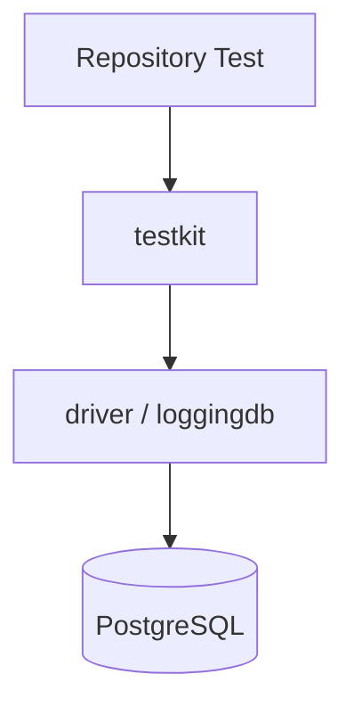
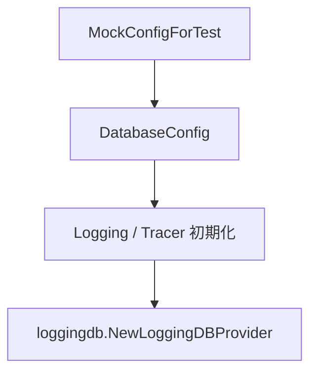
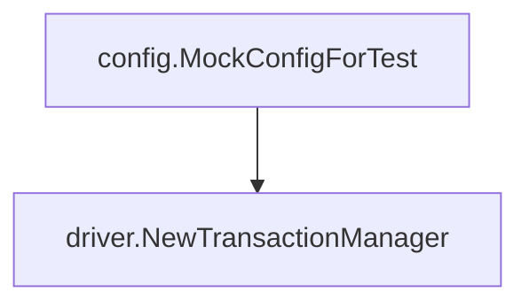
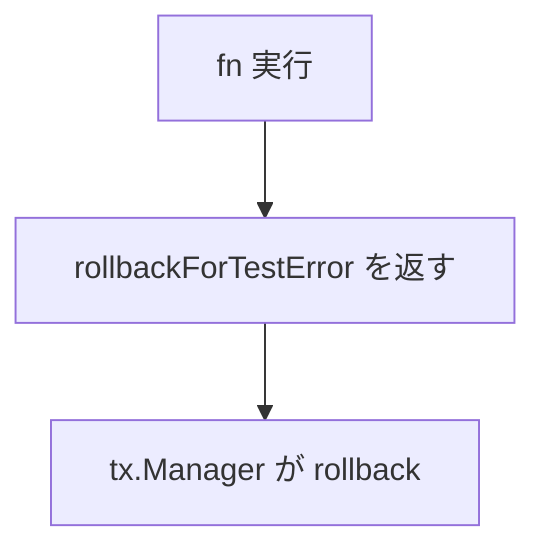
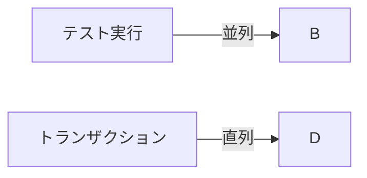
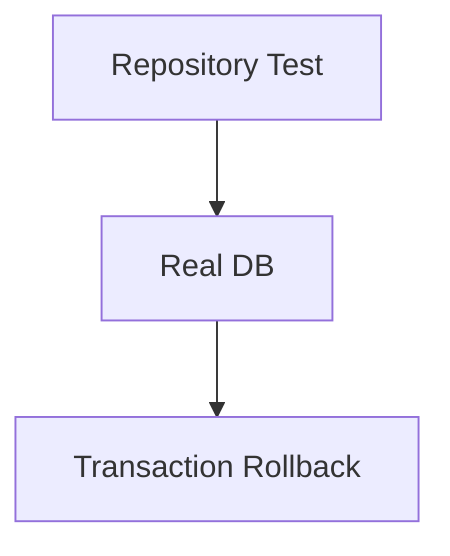
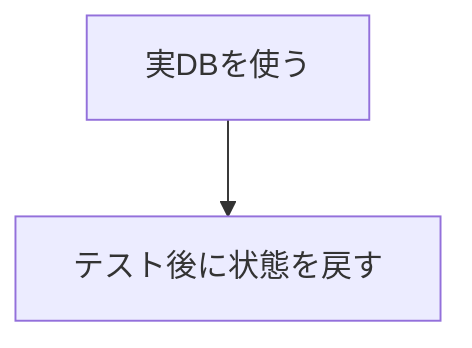

## `testkit` パッケージ

[English](README.md) | 日本語

概要: **RDB を利用するテストのためのユーティリティを提供するパッケージです。**

主に次の用途で利用します。

- テスト用の `DatabaseDriver` を簡単に生成する
- LoggingDBProvider を含めた Infrastructure 初期化を行う
- トランザクション内でテストを実行し、必ずロールバックする

このパッケージは **Repository や Infrastructure のテストを簡単に書くための補助ツール**です。

## 目的

RDB を利用するテストでは次の問題が発生します。

- DB 初期化コードが毎回長くなる
- トランザクション管理が煩雑になる
- テスト後のデータクリーンアップが必要

`testkit` はこれらを解決するために次の機能を提供します。

- テスト用 DB 初期化
- LoggingDBProvider の生成
- 自動ロールバックトランザクション

## アーキテクチャ上の位置



`testkit` は **テスト専用の Infrastructure ヘルパー層**です。

## 提供 API

### NewTestDB

```go
func NewTestDB(t *testing.T) driver.DatabaseDriver
```

テスト用の `DatabaseDriver` を生成します。

### NewTestLoggingProvider

```go
func NewTestLoggingProvider(t *testing.T) loggingdb.DBProvider
```

LoggingDBProvider を生成します。

主な用途:

- Repository テスト
- QueryService テスト

内部では次の処理を行います。



### NewTestTransactionManager

```go
func NewTestTransactionManager(t *testing.T) TransactionRunner
```

テスト用トランザクションマネージャーを生成します。

内部では



を利用します。

## トランザクション実行

### TransactionRunner

```go
type TransactionRunner interface {
    WithinTx(fn func(ctx context.Context))
}
```

### WithinTx

```go
func (t *testTxManager) WithinTx(fn func(ctx context.Context))
```

指定された関数を **トランザクション内で実行**します。

処理の流れ

```mermaid
flowchart TD
    A[Transaction Begin]
    B[fn(ctx) 実行]
    C[rollbackForTestError を返す]
    D[Rollback]

    A --> B --> C --> D
```

内部では `tx.Manager.Do` を利用しています。

```mermaid
flowchart TD
    A[Do(fn)]
    B[error を返すことで rollback]

    A --> B
```

## ロールバックの仕組み

`WithinTx` は次の仕組みでロールバックを実現しています。



この特殊エラーは

```go
var rollbackForTestError = xerrors.New("rollback for test")
```

として定義されています。

このエラーは **テストでは成功扱い**として扱われます。

## 並列実行

Repository テストは `t.Parallel()` を使用して並列実行できます。

ただし、トランザクションは内部で直列化されます。



これは次の実装によって保証されています。

```go
txLock sync.Mutex
```

```go
txLock.Lock()
defer txLock.Unlock()
```

これにより

- DB状態の競合を防止
- テスト間の干渉を防止

が保証されます。

## DB インスタンス

テスト用 DB はシングルトンで管理されます。

```go
var (
    testDB driver.DatabaseDriver
    dbOnce sync.Once
)
```

**プロセス内で1つのDBインスタンスを共有** することで

- 接続コスト削減
- テスト高速化

が実現されています。

## 使用例

### トランザクションを利用したテスト

```go
txm := testkit.NewTestTransactionManager(t)

txm.WithinTx(func(ctx context.Context) {
    repo.Create(ctx, ...)
})
```

### Repository テスト

```go
provider := testkit.NewTestLoggingProvider(t)

repo := repository.NewRepository(provider)
```

## テスト設計ポリシー

`testkit` を使うことで次の設計が可能になります。



つまり



という **安全な Integration Test** を実現できます。

## 注意点

### 実際の DB に接続する

このパッケージは **実際の PostgreSQL に接続します。**

そのため

- テスト用 DB
- CI 用 DB

の設定が必要です。

### WithinTx の設計

`WithinTx` は fn の戻り値を受け取りません。

```go
fn(ctx)
return rollbackForTestError
```

そのためテスト内の検証は

```go
require / assert
```

を使用してください。

### トランザクションは必ずロールバックされる

`WithinTx` を使用した場合、トランザクションは **必ず rollback されます。**

そのため `永続データを残すテスト` には使用できません。
