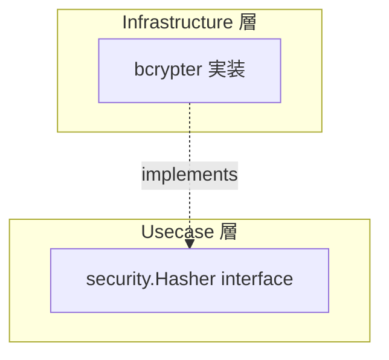

# security

[English](README.md) | 日本語

`internal/infrastructure/security` は、パスワードハッシュ化などの **セキュリティ関連インフラ実装**を提供するパッケージです。

## アーキテクチャ上の位置づけ



Usecase 層の `security.Hasher` インターフェース（`internal/usecase/boundary/security`）を Infrastructure 層で実装します。Usecase / Domain は bcrypt の実装詳細に依存しません。

## 公開 API

|関数 / メソッド|説明|
|---|---|
|`NewBcryptHasher(secCfg)`|`config.SecurityConfig` の `BcryptCost` を使用して `security.Hasher` を生成|
|`Hash(password)`|パスワードを bcrypt でハッシュ化|
|`Compare(hash, password)`|ハッシュと平文パスワードを比較（不一致は `false, nil` を返す）|

## 設計方針

- bcrypt コストは `config.SecurityConfig.BcryptCost()` で外部化
- パスワード不一致は `bcrypt.ErrMismatchedHashAndPassword` を吸収し `false, nil` を返す（エラーとして扱わない）
- それ以外のエラー（コスト不正等）は `apperror.ErrInternal` に変換して返却（外部エラーをアプリ全体のエラーへ変換するという Infrastructure 層の規則に従う）

## DI 登録

`internal/di/module/infrastructure.go` の `security` モジュールに登録します。

```go
fx.Provide(security.NewBcryptHasher)
```
