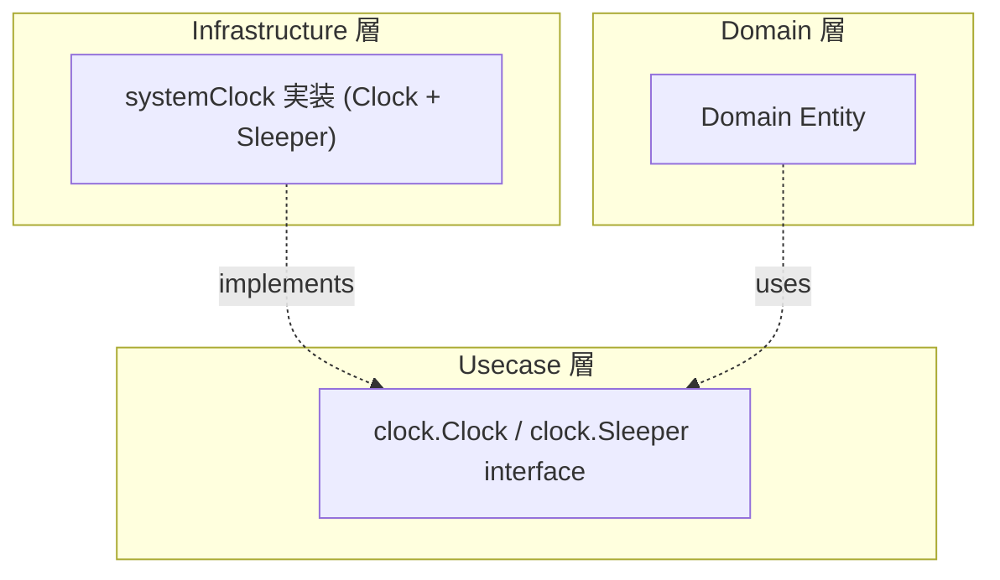

# system

[English](README.md) | 日本語

`internal/infrastructure/system` は、時刻取得やコンテキスト対応の待機などの **システム依存処理の Infrastructure 実装**を提供するパッケージです。

`internal/usecase/boundary/clock` の 2 つのインターフェースを実装します。

- `clock.Clock`（`NewClock`）— `Now()` は現在時刻を返す
- `clock.Sleeper`（`NewSleeper`）— `Sleep(ctx, d)` は `d` 経過まで待機し、先に context がキャンセルされた場合は `ctx.Err()` を返す（`d` が非正の場合は即座に `ctx.Err()` を返す）

いずれも同一の非公開型 `systemClock` が実体です。

## アーキテクチャ上の位置づけ



Domain / Usecase が `time.Now()` を直接呼ぶと、テストで時刻を制御できなくなります。`clock.Clock` インターフェース（`internal/usecase/boundary/clock`）を介することで、テスト時にモック差し替えが可能になります。

## なぜ抽象化するのか

- Domain / Usecase の **決定論性（determinism）** を守る — テストで時刻を固定できる
- オニオンアーキテクチャの原則に従い、**システム依存を外側に押し出す**
- `time.Now()` への直接依存は Domain 層で禁止されている

## DI 登録

`internal/di/module/clock.go` の `clockModule()` で登録します（`InfrastructureModule()` に集約）。`Clock` と `Sleeper` の両実装をここで提供します。

```go
fx.Provide(
    system.NewClock,
    system.NewSleeper,
)
```

## 拡張する場合

時刻以外のシステム依存処理（乱数生成、ホスト名取得等）を追加する場合：

1. `internal/usecase/boundary/` に interface を定義
2. このパッケージに実装を配置
3. `internal/di/module/infrastructure.go` に DI 登録を追加
