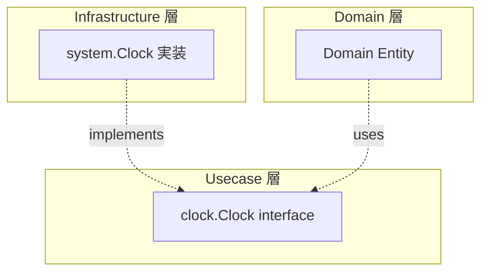

# system

[English](README.md) | 日本語

`internal/infrastructure/system` は、時刻取得などの **システム依存処理の Infrastructure 実装**を提供するパッケージです。

## アーキテクチャ上の位置づけ



Domain / Usecase が `time.Now()` を直接呼ぶと、テストで時刻を制御できなくなります。`clock.Clock` インターフェース（`internal/usecase/boundary/clock`）を介することで、テスト時にモック差し替えが可能になります。

## 公開 API

|関数 / メソッド|説明|
|---|---|
|`NewClock()`|`clock.Clock` を実装した実体を生成（内部で `time.Now()` を呼ぶ）|
|`Now()`|現在の時刻を返す|

## なぜ抽象化するのか

- Domain / Usecase の **決定論性（determinism）** を守る — テストで時刻を固定できる
- オニオンアーキテクチャの原則に従い、**システム依存を外側に押し出す**
- `time.Now()` への直接依存は Domain 層で禁止されている

## DI 登録

`internal/di/module/infrastructure.go` の `system` モジュールに登録します。

```go
fx.Provide(system.NewClock)
```

## 拡張する場合

時刻以外のシステム依存処理（乱数生成、ホスト名取得等）を追加する場合：

1. `internal/usecase/boundary/` に interface を定義
2. このパッケージに実装を配置
3. `internal/di/module/infrastructure.go` に DI 登録を追加
