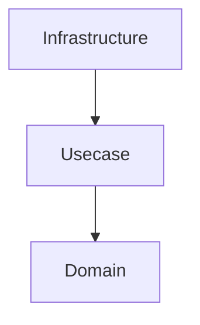
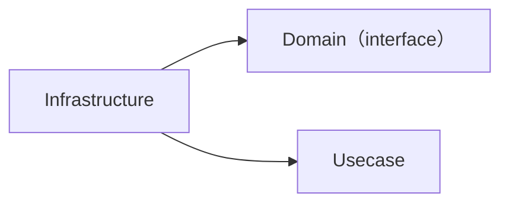
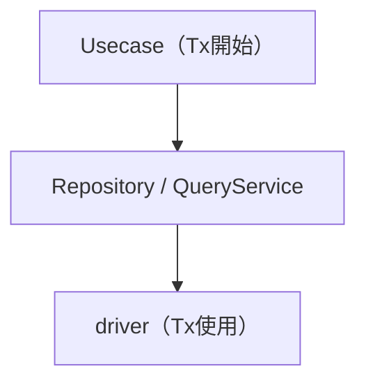
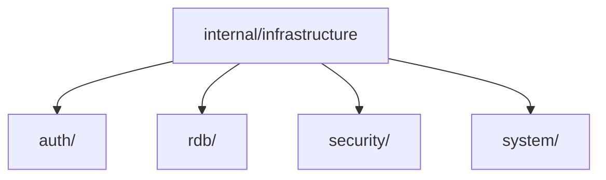
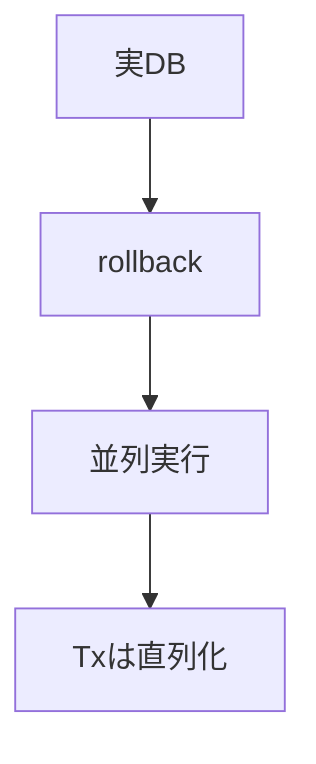

# インフラ層（`internal/infrastructure`）ガイド

[English](README.md) | 日本語

## 役割

Infrastructure 層は、**外部技術（DB・外部API・認証・セキュリティ等）へのアクセス実装**を担う層です。

この層は以下の責務を持ちます。

- 外部I/Oの実装（RDB / API / 認証 / システム）
- Domain が定義した interface の実装
- 技術的詳細（接続・リトライ・ドライバ・ログ等）のカプセル化
- エラーの正規化
- Observability（ログ / トレース）の付与

上位層（Domain / Usecase）は、**Infrastructure の実装詳細を一切意識しません。**

## オニオンアーキテクチャでの位置

- Domain / Usecase は抽象のみ
- Infrastructure は具体実装

## 依存関係

- Infrastructure は Domain に依存する
- Domain / Usecase は Infrastructure に依存してはならない

## Usecaseとの関係

- トランザクション境界は Usecase 層が管理
- Infrastructure はトランザクションを開始しない
- トランザクションは context.Context により伝搬される

## エラーハンドリング

Infrastructure 層は外部技術のエラーをそのまま返さず、  
**アプリケーション共通エラーへ変換**します。

例：

- PostgreSQL エラー → pgerror.NormalizeError
- 外部APIエラー → apperror に変換

## Observability

Infrastructure 層では以下の可観測性を提供します。

- SQL / 外部I/Oのログ出力
- OpenTelemetry によるトレース
- 実行時間計測（slow query）

主に loggingdb などの wrapper で実現します。

## 禁止事項

Infrastructure 層では以下を行ってはいけません。

- ビジネスロジックの実装
- Domain ルールの分岐
- Usecase の意思決定
- HTTP / Framework 依存コードの持ち込み
- トランザクションの開始

## 実装ルール

- SQL 実行は sqlc を使用する
- Repository に検索ロジックを書かない（QueryServiceへ）
- driver を直接使わず loggingdb 経由で利用する
- context を必ず伝搬する
- 外部エラーは必ず正規化する

## ディレクトリ構成

## サブディレクトリ

|ディレクトリ|説明|interface 配置|詳細|
|---|---|---|---|
|`auth/`|認証基盤（環境別 Authenticator 実装）|Usecase boundary|[README](auth/README.ja.md)|
|`rdb/`|RDB サブシステム（Repository / QueryService / driver / sqlc 等）|Domain / Usecase|[README](rdb/README.ja.md)|
|`security/`|パスワードハッシュ化（bcrypt）|Usecase boundary|[README](security/README.ja.md)|
|`system/`|システム依存処理（時刻取得等）|Usecase boundary|[README](system/README.ja.md)|

## テスト戦略

- 実DBを用いた Integration Test
- トランザクション rollback による状態隔離
- testkit を利用

## 設計原則まとめ

### 1. 技術詳細のカプセル化

DB / API / 認証 / セキュリティ  
→ Infrastructure に閉じ込める

### 2. 依存関係の逆転

Domain が interface を定義  
Infrastructure が実装する

### 3. 責務分離

永続化 → Repository  
検索   → QueryService

### 4. トランザクション管理

Usecase が管理  
Infrastructure は関与しない

### 5. エラー統一

外部エラー → アプリケーションエラー

### 6. 可観測性

logging / tracing / metrics
