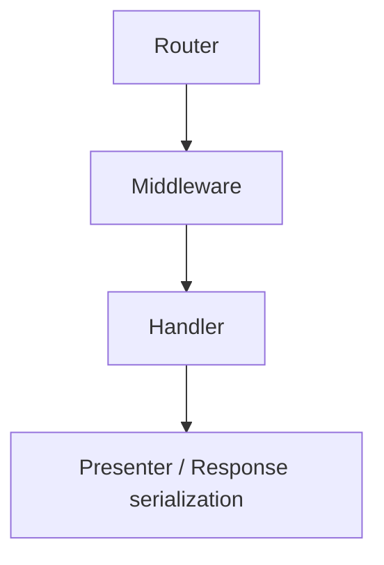
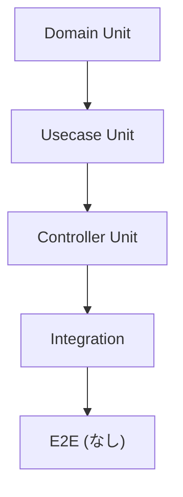
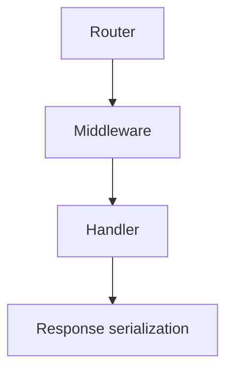
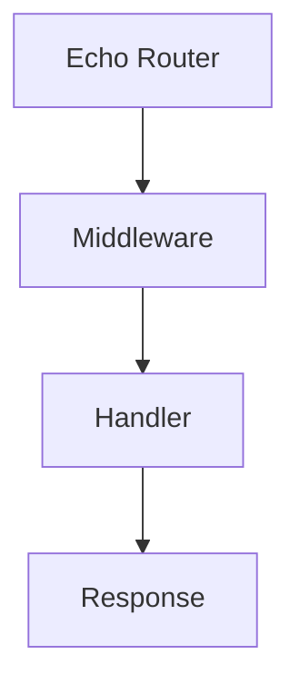
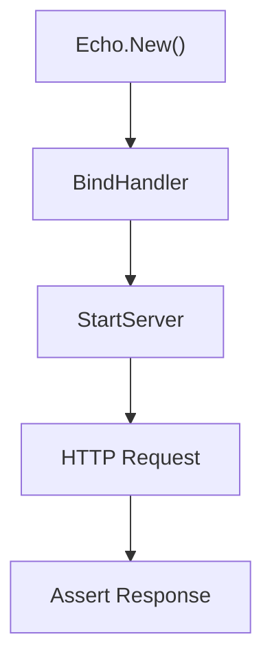
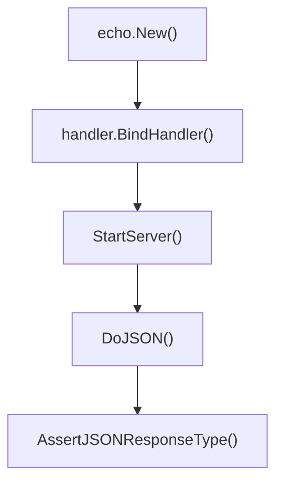

## integration ディレクトリ

[English](README.md) | 日本語

このディレクトリは **結合テスト (integration test)** をまとめるための場所です。  

ユニットテストでは拾いきれない、Echo サーバを立ち上げて **実際の HTTP 通信経路** を通した検証を行います。

このテストは **DB や Infrastructure を含む統合テストではなく、HTTP 境界の検証を目的とした結合テスト**です。

## テスト戦略

本プロジェクトでは以下のテスト戦略を採用しています。

- `Domain` → Unit Test
- `Usecase` → Unit Test
- `Controller` → Unit Test
- `Integration` → HTTP boundary test

integration テストでは **HTTP 経路全体の動作確認**のみを行います。

つまり次の範囲を検証します。



以下は **integration テストでは扱いません**

- Domain ロジック
- Usecase 内部ロジック
- Repository 実装
- DB 接続
- SQL 実行

## テストレベルの定義(Test Pyramid)

本プロジェクトでは **Test Pyramid** を前提としたテスト戦略を採用しています。



方針：

- **Domain / Usecase の Unit Test を中心にテストを書く**
- Integration Test は **HTTP 境界の検証のみ**
- E2E テストはこのプロジェクトでは扱いません

この方針により次のメリットを得ます。

- テスト実行速度の高速化
- テストの保守性向上
- 失敗時の原因特定の容易さ

## なぜ Usecase を mock するのか

integration テストでは **Usecase を mock 化**します。

理由は **レイヤ境界を守るため**です。

integration テストの目的は **HTTP Layer の検証**であり、  
以下の範囲のみを対象とします。



Usecase / Domain / Repository のロジックは  
それぞれ **Unit Test の責務**です。

もし Usecase を実装のまま利用すると

- DB
- Repository
- Domain

までテスト範囲が拡大してしまい、  
**HTTP boundary test の目的が崩れてしまいます。**

## Integration Test の配置ポリシー

integration テストは **公開 API の動作確認**として配置します。

対象となるエンドポイント例：

- `/health`
- `/healthz`
- `/ready`
- `/version`
- `/v1/...`

つまり、**公開される HTTP API** のみを integration テストの対象とします。

内部関数や handler の細かなロジックは  
**Controller Unit Test で検証します。**

## integration ディレクトリがある理由

### 層の分離

ユニットテストは個々の関数やハンドラを対象としますが、  
結合テストは **ルータ〜ミドルウェア〜ハンドラ〜レスポンス整形までの一連の流れ** を確認します。

このディレクトリを分けることで、**テストの目的と粒度を明確にしています。**

- `internal/controller/handler/...` → Handler Unit Test
- `internal/integration` → HTTP Integration Test

### 実運用に近い検証

integration テストでは **実際に HTTP リクエストを送信**して検証します。

これにより以下を確認できます。

- Router のバインド
- Middleware の適用
- Request → DTO 変換
- Response serialization
- HTTP ステータスコード

CI/CD やスモークテストとしても利用できます。

## 統合テストの範囲

integration テストで扱う範囲は次の通りです。



Usecase は **mock を利用します。**

理由：

integration テストの目的は **HTTP boundary の検証**であり  
アプリケーションロジックの検証ではないためです。

例

- `mock_<feature>.NewMockUsecase`
- `mock_healthcheck.NewMockUsecase`

## テストの流れ

integration テストは次の手順で実行されます。



具体例



## helper_test.go で定義されている関数

各ハンドラの `BindHandler` は tracer factory を受け取ります。これらのテストでは
`observability.NewNoopTracerFactory(t)` から得た no-op のものを渡します。feature
ハンドラは加えて **mock 化した usecase** を受け取ります（「なぜ Usecase を mock するのか」参照）。

### `StartServer(t *testing.T, e *echo.Echo) *Server`

Echo を `httptest.NewServer` で立ち上げ、結合テスト用の簡易サーバを返します。

特徴

- `t.Cleanup` によりサーバは自動停止
- HTTP クライアントを内部で保持
- テストヘルパー関数 `Do` / `DoJSON` を提供

使用例

```go
e := echo.New()
tf := observability.NewNoopTracerFactory(t)
<feature>.BindHandler(e, tf, mockUsecase)

srv := StartServer(t, e)
```

### `StopServer()`

明示的にサーバを停止します。

通常は `StartServer` 内の `t.Cleanup` により自動停止されるため、  
特別なケース以外では使用しません。

### `Do(method, path string, reqBody io.Reader, contentType string, headers http.Header)`

任意の HTTP リクエストを送信します。

機能

- HTTP method 指定
- request body 指定
- header 指定
- content-type 指定

内部では `http.NewRequestWithContext` を使用しています。

### `DoJSON(method, path string, reqBody any, headers http.Header)`

JSON 用のショートカット関数です。

特徴

- `reqBody` を JSON encode
- `Content-Type: application/json` を自動設定
- 内部的に `Do` を呼び出す

例

```go
actual := srv.DoJSON(http.MethodGet, "/health", nil, nil)
```

### `AssertJSONResponseType[T any]`

HTTP 境界の到達確認アサーションです。レスポンスが HTTP 経路を通り、期待した型へ
シリアライズされることを検証します。**個々のフィールド値の正しさは検証しません。**

検証内容

- HTTP Status Code = 200
- Content-Type = application/json
- レスポンスボディが型 `T` に Unmarshal 可能
- `T` に Go スライスとして宣言されたフィールド（ネストした struct / スライス要素を含む）は
  JSON 配列としてシリアライズされ、`null` にならない。キーが存在して値が `null` の場合のみ
  違反で、キー自体が無い（`omitempty` で absent）場合は違反ではない

このヘルパーは意図的に値比較を行いません。上記のテストピラミッドのとおり、レスポンス値の
正しさ（Presenter のフィールドマッピング）は **Controller Unit Test** が独立したオラクルで
検証する責務です。ここで値比較を重複させると integration テストが Presenter の詳細に結合し
壊れやすくなります。build info や `RegisteredAt` などの動的な値を含むレスポンスでは、
そもそも型のみが検証可能です。

配列が `null` でないことの検査は値のアサーションではなく**シリアライズの形**の検査です。
空のコレクションがクライアントへ `[]` として届くか `null` として届くかは HTTP 境界で
決まるため、この担保は integration 層が担います。

使用例

```go
AssertJSONResponseType[gen.HealthResponse](t, actual)
```

### `UseAppErrorHandler(t, e, extra ...extension.UseMiddleware)`

本番相当の `HTTPErrorHandler` を Echo に登録します。素の `echo.New()` は Echo 標準の
エラーハンドラしか持たないため、`apperror` → HTTP ステータスの実マッピングを観測する異常系
テストでは、先に本番ハンドラを配線する必要があります。

あわせて本番の `requestid` ミドルウェアも配線します。ハンドラはボディの `requestId` を、
ミドルウェアがレスポンスへ書いた `X-Request-Id` を**読み戻して**埋めるため、ハンドラだけを
配線するとすべてのエラーボディの `requestId` が空になり、契約が成立しないからです。両者で
1 つの契約なので、各テストの記憶に委ねずここで一体に配線します。

`extra` には、このスタックへ追加したい本番ミドルウェアを渡します。各ミドルウェアは自身の
DI provider から取得し、順序は `extension.ApplyUseMiddlewares` に決めさせてください（後述の
「ミドルウェア順序の契約は手書きせず DI provider から配線する」を参照）。呼び出し側は順序を
書きません。

### `AssertErrorResponse(t, actual, wantStatus)`

異常系レスポンスが `wantStatus` を返し、ボディが JSON のエラー形式（`ErrorResponse`）へ
デシリアライズ可能であることを検証します。`AssertJSONResponseType` と同様に、検証するのは
境界の関心事（`apperror` → ステータスのマッピングとエラーボディの形）のみで、`code` /
`message` の値の正しさはユニットテストの責務のままです。

加えて、ボディの `requestId` が非空であること、かつ**ワイヤ上の `X-Request-Id` ヘッダーと
一致すること**を検証します。これは値の検証ではなく境界の関心事です。ヘッダーとボディは
別々のコンポーネント（ミドルウェアとエラーハンドラ）が生成し、HTTP 境界でしか出会わないため、
両者の食い違いはこの層より下では検出できません。すべての異常系テストがこのヘルパーを通るので、
専用テスト 1 本ではなくスイート全体でこの保証が成立します。

使用例

```go
e := echo.New()
UseAppErrorHandler(t, e)
// ... usecase モックが apperror.ErrNotFound を返すよう設定し、handler を bind ...
actual := StartServer(t, e).DoJSON(http.MethodGet, path, nil, headers)
AssertErrorResponse(t, actual, http.StatusNotFound)
```

## Auth テストヘルパー

### `MakeAvailableUserID`

integration テストで **認証済みユーザーを模擬するヘルパー**です。

内部では `auth.New` で認証済みプリンシパルを生成し、それを `ctxhelper.WithAuthn` /
`ctxhelper.SetAuthn` でリクエストコンテキストに注入する Echo Middleware を追加したうえで、
リクエストに付与する `Authorization: Bearer debug:<id>` ヘッダーを返します。

使用例

```go
headers := MakeAvailableUserID(t, e, userID)
srv.DoJSON(http.MethodPost, "/v1/<resource>", body, headers)
```

## テスト設計ポリシー

integration テストでは以下の原則を守ります。

### 1 Infrastructure を使用しない

integration テストでは

- DB
- SQL
- Repository

を使用しません。

### 2 Usecase は mock する

integration テストでは **Usecase を mock 化**します。

理由: `integration = HTTP boundary test` であるためです。

### 3 HTTP を実際に叩く

handler を直接呼ぶのではなく `httptest.Server` を利用します。

### 4 レスポンス型で検証

レスポンスは **OpenAPI 型**で検証します。

- `gen.HealthResponse`
- `gen.VersionResponse`
- feature ハンドラの `gen` パッケージが公開するレスポンス型 — `gen.<Xxx>Response`（1 テストファイルで複数 handler の `gen` を import する場合は `detailgen.<Xxx>Response` のようにエイリアス）

### 5 ミドルウェア順序の契約は手書きせず DI provider から配線する

ここでのテストの多くは、エンドポイントに必要なミドルウェアだけをテストが書いた順序で登録します。
アサーション対象が 1 つのミドルウェアに閉じている限りはそれで十分ですが、「ミドルウェア A が B の
外側で動く」ことによってのみ成立する契約は、手書きの順序では検証できません。実際の優先度が背後で
変わってもテストは通り続けてしまいます。

そうしたテストでは、ミドルウェアを各 DI provider（`instrumentation.RequestIDMiddleware()`、
`security.CookieMiddleware(...)` など）から取得し、本番と同じ `Priority` ソートを行う
`extension.ApplyUseMiddlewares` で適用します。順序が実サーバーと同一の出所から決まるため、
スタックの並べ替えは、それに依存するテストを壊します。

統合テストが `internal/di` に触れてよいのはこのケースだけです。DI コンテナで usecase や
infrastructure を組み立ててよいという意味ではなく、それらは上記のポリシーどおり mock のままです。
