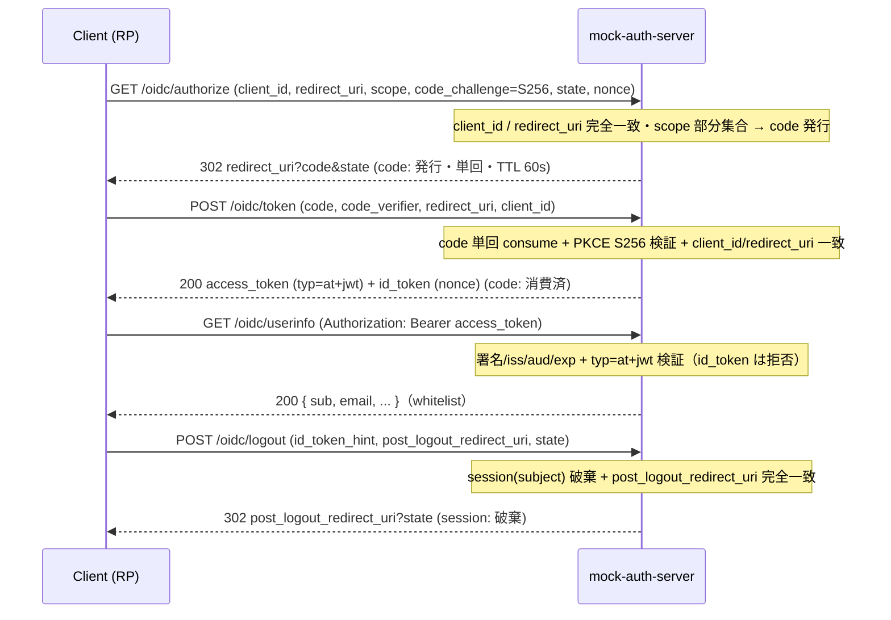

# mock-auth-server（JWT Test Provider）

[English](README.md) | 日本語

> このファイルは canonical な [README.md](README.md) の日本語訳です。内容の更新は canonical 側で行い、本ファイルへ同期してください。

ローカル開発用の**疑似 OIDC 認証サーバー**。実 IdP なしに、Go API（Resource Server）が **JWT の署名・Claim 検証と Authorization Code Flow（+ PKCE S256）**を E2E で検証できるようにする。Login UI / consent / refresh token / Role は対象外。

Token 発行側と検証側が同一ライブラリ由来の誤りを共有しないよう、**Go API とは異なるランタイム（Node.js 上の TypeScript）**で実装している。`.ts` は Node 24 のネイティブ型ストリッピングで直接実行するため `tsc` ビルドは不要で、HTTP 層は [Hono](https://hono.dev/)。`typescript` は `pnpm run typecheck` と 1:1 テスト対応ゲート用の dev 依存で、ユニットは `vitest`、統合は
`node --test` で実行する。

## エンドポイント

| Method | Path | 説明 |
| --- | --- | --- |
| GET | `/health` | 死活確認 — `{"status":"ok"}` |
| GET | `/.well-known/openid-configuration` | OIDC Discovery ドキュメント |
| GET | `/.well-known/jwks.json` | JWKS（公開鍵のみ: `kty=RSA` `alg=RS256` `use=sig`。公開集合は鍵ローテーションで変化する） |
| GET | `/oidc/authorize` | 認可エンドポイント（Code Flow + PKCE S256）— `302` で `code`、または error `redirect` / `400` |
| POST | `/oidc/token` | トークンエンドポイント（`authorization_code` + PKCE）— `access_token` + `id_token` を発行 |
| GET | `/oidc/userinfo` | UserInfo（Bearer access token・whitelist claim）。ID Token は `401` で拒否 |
| POST | `/oidc/logout` | RP-Initiated Logout — `post_logout_redirect_uri` を検証し `state` を反映 |
| POST | `/bypass/token` | 固定 Profile でトークン発行 — `{subject, profile}` → `{access_token, ...}` |
| POST | `/bypass/session` | session を直接作成 — `{subject}` → `{session_id, subject}` |
| GET | `/admin/users` | 固定 User Fixture の一覧 |
| POST | `/admin/reset` | 揮発ストア（code / session）と鍵ストア（Phase 1 へ戻す）の初期化 |
| POST | `/admin/keys/rotate` | 鍵ローテーション — 宣言的 `{action, kid}` → 遷移後の鍵状態 |

`/bypass/*` ・ `/admin/*` は**dev 専用**: `MOCK_AUTH_DEV_ENDPOINTS=disabled` で `404` を返す。さらに **`NODE_ENV=production` では server が即時終了する**（本番で動かしてはならない）。登録クライアント（`fixtures/clients.json`）は public + PKCE 必須で、`redirect_uri` / `post_logout_redirect_uri` は完全一致で照合する。

## フロー

### Authorization Code Flow + PKCE（標準的なログイン利用ケース）



### テスト / bypass 利用ケース（dev-gate 限定）

- **フローを経ずにトークン発行**: `POST /bypass/token {subject, profile}` → access token（異常系 Profile で否定テスト用トークンも）。Go API や `/oidc/userinfo` に直接投入できる。
- **UI を経ずに session 作成**: `POST /bypass/session {subject}` → `{session_id}`（session: 作成）。後で `/oidc/logout`（`id_token_hint` の subject 一致）や `/admin/reset` で破棄する。

### 状態ライフサイクル

| 状態 | 作成 | 消費 / 破棄 | TTL |
| --- | --- | --- | --- |
| 認可コード | `/oidc/authorize` | `/oidc/token`（単回）または期限切れ | 60s |
| session | `/oidc/authorize`（ログイン）・`/bypass/session` | `/oidc/logout`（subject 単位）・`/admin/reset` | 1h |
| access / id token | `/oidc/token`・`/bypass/token` | 期限切れ（stateless・非保存） | 3600s |

`/admin/reset` は揮発ストア（code / session）を初期化し、鍵ストアを Phase 1 へ戻す（[鍵ローテーション](#鍵ローテーション)を参照）。鍵素材そのもの（固定 PEM）と fixture はプロセス再起動でのみ初期化される。

## トークン Profile（`/bypass/token`）

再現性のため、異常系は **固定 Profile**（任意 Claim 注入 API ではない）として提供する。Go API は `valid` を受理し、すべての異常系を `401` で拒否することを期待する。

| Profile | 内容 | Go API |
| --- | --- | --- |
| `valid` | 標準 access token（`typ=at+jwt`、正しい `iss`/`aud`/`exp`/`nbf`/`sub`） | 受理 |
| `expired` | `exp` が過去 | 401 |
| `not-yet-valid` | `nbf` が未来 | 401 |
| `wrong-issuer` | `iss` 不一致 | 401 |
| `wrong-audience` | `aud` 不一致 | 401 |
| `missing-subject` | `sub` なし | 401 |
| `invalid-signature` | JWKS に無い鍵で署名（`kid` は同一） | 401 |
| `unsupported-algorithm` | `HS256`（対称鍵・RS256 allowlist 外） | 401 |
| `unknown-kid` | 有効な署名だが JWKS に無い `kid` | 401 |
| `old-key` | 退役鍵で署名（`kid` は JWKS に一度も載らない） | 401 |
| `id-token` | `token_use=id`、`aud=<client_id>`、`typ` が `at+jwt` でない | 401 |

`valid` の access token の Claim はデファクト標準 Profile に従う: `iss` / `sub` / `aud` / `exp` / `iat` / `nbf` / `jti` / `client_id` / `token_use=access` / `scope`。access token は `typ=at+jwt` ヘッダ（RFC 9068）を持ち、Go 検証側はこれで ID Token の誤用を拒否する。

## 鍵 & Fixture

- `keys/*.pem` — **固定 RSA 秘密鍵**（再起動しても不変。発行トークンが再現可能）。`mock-key-1`（初期署名鍵）と `mock-key-2` が回転プールを構成し、`mock-key-retired` は `old-key` profile 用で JWKS には一度も載らない。鍵ストアは起動時にこれらをロードし、揮発するのは状態（どの鍵を公開 / 署名するか）のみ。
- `fixtures/jwks/phase{1,2,3}.json` — 各ローテーション Phase で鍵ストアが公開する **golden JWKS**。Go 側のローテーション統合テストと共有し、双方が同一バイトをパースする。`pnpm run gen:jwks` で再生成する。
- `fixtures/users.json` — サンプルユーザー（Subject / Email / 名前。`status` は未使用）。ファイルが無くても mock は動作する（`/bypass/token` は任意の `subject` を受理）。`fixtures/README.md` を参照。
- `fixtures/clients.json` — 登録済み OAuth クライアント（public client・PKCE 必須・許可する `redirect_uris` / `post_logout_redirect_uris`）。

## 鍵ローテーション

鍵ストアは **公開集合**（JWKS で公開する鍵）と **単一の署名鍵** を分離管理し、Go API をローテーションする IdP に対して検証できるようにする。`POST /admin/keys/rotate` は宣言的な `{action, kid}` を受け取り、遷移後の `{signing_kid, published_kids}` を返す:

| `action` | 効果 |
| --- | --- |
| `add-key` | `kid` を公開集合へ追加（署名鍵は不変）。プール内の鍵のみ回転可能 |
| `promote` | `kid` を署名鍵に切替（公開済みが前提） |
| `retire` | `kid` を公開集合から退役（現署名鍵は退役不可） |

これらを連ねると 3 つの Phase を再現できる（`POST /admin/reset` で Phase 1 へ戻る）:

```text
Phase 1  JWKS: [mock-key-1]              署名: mock-key-1   （初期）
Phase 2  JWKS: [mock-key-1, mock-key-2]  署名: mock-key-2   （add-key + promote mock-key-2）
Phase 3  JWKS: [mock-key-2]              署名: mock-key-2   （retire mock-key-1）
```

これは実 IdP の一方通行の鍵ライフサイクルではなく、**固定鍵プール上の可逆な状態制御面**である: 退役したプール鍵は再追加でき、2 鍵を無限にループできる（任意回数のローテーションを固定 PEM から駆動できる）。到達可能な状態はすべて正当な JWKS（公開集合は空にならず常に署名鍵を含む）であり、Go 側は経路ではなく結果の `(公開集合, 署名鍵)` のみを観測する。「退役鍵が拒否される」ケースはローテーションが一方通行であることに依存**しない** — JWKS に一度も載らない専用鍵 `mock-key-retired` で署名する `old-key` profile が独立に担保する。

## 使い方

```sh
docker compose --profile development up mock_auth_server
curl -s http://localhost:4000/.well-known/openid-configuration
curl -s -X POST http://localhost:4000/bypass/token \
  -H 'Content-Type: application/json' \
  -d '{"subject":"user-john-doe","profile":"valid"}'
```

Go API は `AUTH_ISSUER` をホスト URL（`http://localhost:4000`）に、`AUTH_JWKS_URL` を内部サービス URL（`http://mock_auth_server:4000/.well-known/jwks.json`）に向ける — **issuer と JWKS 取得 URL を分離**し、`iss` はブラウザ/ホストから解決可能なまま、鍵取得はコンテナ名を使う。`env/README.md`（Auth セクション）を参照。

## テスト

| コマンド | 対象 |
| --- | --- |
| `pnpm test` | ユニット（`src/**/*.test.ts`）。`app.fetch` をプロセス内で叩く。**行 / 分岐 / 関数すべて 100% をゲートにしている** |
| `pnpm run test:integration` | 統合（`integration/**/*.test.ts`）。実 HTTP と、エントリポイントの子プロセス起動 |

カバレッジゲートは `vitest` 自身のしきい値（`vitest.config.ts`）。統合テストだけは `node --test` のままで、
import ではなく実プロセスを起動するため。カバレッジの対象外は 2 つ:
`src/generated/**`（orval の生成物で手書きではない）と `src/server.ts`（import した時点でポートを掴むため
プロセス内で読み込めないエントリポイント）。エントリの除外は穴ではなく、
`integration/server-entry.integration.test.ts` が実プロセスとして起動し、`NODE_ENV=production` で起動を拒否すること
と、通常起動で `/health` に応答することの両方を固定している。

### 1:1 テスト対応

`scripts/one-to-one.gate.test.ts` は、Go 側が `internal/architest` から受けているのと同じ 1:1 の規則を強制する。
呼べる export はそれぞれ `describe("<export 名>")` を 1 つ持ち、その直下に 正常系 / 異常系 のグループが
並び、ケースはその中に置く。検査は両方向で、describe を持たない export と、どの export にも対応しない
describe の双方を挙げる。テストの改名も、テストの無い export の追加も、黙って通ることはない。
ゲートの実体がここではなく `scripts/` に在るのは、「呼べる export か」を型検査器で決めるため
`typescript` を要し、Node はそれを import 元のファイル位置から解決するから。自分の依存しか入れない
パッケージでは満たせない。除外はカバレッジゲートと同じ 2 つ。

呼べない export（定数・ルートオブジェクト）に対する describe は、要求はされないが許される。
production のシンボルに対応しない契約テストは違反ではない。

## 環境変数

| 変数 | 既定 | 説明 |
| --- | --- | --- |
| `OIDC_PORT` | `4000` | Listen ポート |
| `OIDC_ISSUER` | `http://localhost:4000` | `iss` Claim / OIDC issuer（ホスト解決可能な URL） |
| `OIDC_AUDIENCE` | `go-boilerplate-api` | access token の `aud` Claim |
| `OIDC_CLIENT_ID` | `go-boilerplate-client` | `client_id` Claim / ID Token の audience |
| `MOCK_AUTH_DEV_ENDPOINTS` | `enabled` | `disabled` で `/bypass/*` ・ `/admin/*` を `404` にする |
| `NODE_ENV` | (未設定) | `production` の場合 server を即時終了させる（本番で動かさない） |

## OpenAPI & コード生成

HTTP 表面は `openapi/` で OpenAPI-first に定義し（`openapi/openapi.gen.yaml` にバンドル）、`src/generated/schemas.ts` に [orval](https://orval.dev/) 生成の zod スキーマを持つ。両者は `make gen-mock-auth-oapi` で再生成し、commit・CI で drift 検知する。

golden JWKS（`fixtures/jwks/phase{1,2,3}.json` と `internal/integration/testdata/jwks/` 配下のコピー）は `pnpm run gen:jwks` で別途再生成する（鍵ストアを import するため `node_modules` を要し、コンテナで走る `gen` ステップからは外している）。PEM が固定のためほとんど変化せず、正しさは drift 検知ではなくテストで担保する — provider の `keys.test.ts` が各 Phase を `keyStore.jwks()` と一致検証し、Go のローテーション統合テストが埋め込みコピーを共有 PEM で署名検証する。

## 未実装

Role / `user_identities` / deleted・unknown user の扱い。
