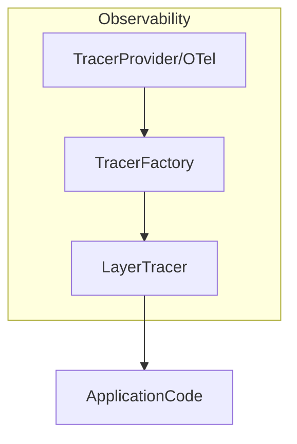

# internal/observability

[English](README.md) | 日本語

`internal/observability` は、本プロジェクトの **トレーシング（Tracing）および観測ログ連携**を提供するパッケージです。

このパッケージは **OpenTelemetry をベースとしたトレーシング機構**と、  
`internal/logging` パッケージと連携した **レイヤー単位の可観測性ログ**を提供します。

主な目的：

- OpenTelemetry の初期化と管理（トレーシング / メトリクス / ログ）
- レイヤー単位の span 生成
- trace / span 情報のログ出力
- `zap` ログを橋渡し（otelzap）した OTLP ログ送出
- Domain / Usecase / Controller の観測統一
- テスト時の軽量トレーサ提供

## 設定境界（typed config・ベンダー非依存 OTLP）

このパッケージが配線するのは **ベンダー非依存な OTLP の土台のみ**です。シグナルの有効化と
送出先は typed な `config.ObservabilityConfig` にモデル化され、`OBS_` 接頭辞の環境変数から
読み込まれます。

| Env | 用途 |
| --- | --- |
| `OBS_TRACES_EXPORTER` | trace 送出の有効化（`otlp` で有効／空・`none` で無効） |
| `OBS_METRICS_EXPORTER` | metric 送出の有効化（同上） |
| `OBS_LOGS_EXPORTER` | otelzap 経由の log 送出の有効化（同上） |
| `OBS_OTLP_ENDPOINT` | OTLP エンドポイント URL（Collector / Agent サイドカー）。シグナル有効時のみ使用 |
| `OBS_OTLP_PROTOCOL` | `http/protobuf`（既定）または `grpc` |

各シグナルは **独立にゲート**されます。`TracesEnabled()` / `MetricsEnabled()` /
`LogsEnabled()` は、対応する exporter 値が空でも `none` でもないとき（`isActiveExporter`）
のみ真になります。無効なシグナルは **no-op フォールバック**となり、送出も接続試行も
常駐 goroutine（batch processor / periodic reader / ランタイムメトリクス収集）も発生しません。
そのためローカル開発では設定も DI 差し替えも不要です。

> **重要:** 送出トランスポートは **OTLP のみ**です（console exporter はありません）。単一の
> `OBS_OTLP_ENDPOINT` を 3 シグナルで共用し、HTTP ではシグナル別パス（`/v1/traces` /
> `/v1/metrics` / `/v1/logs`）を URL に path が無いとき自動補完します。エンドポイント
> **だけでは送出は有効になりません** — staging / prod では対応する `OBS_*_EXPORTER=otlp`
> の設定も必須です。

ベンダー固有（Grafana / Datadog / New Relic）はその Collector 側に置き、ここには持ち込みません。

サービス識別情報（`service.name` / `deployment.environment` / `service.version` /
`service.revision` / `service.build_date`）は既存のアプリ設定とビルド時注入（ldflags）の
`internal/system` に由来し（`NewResource`）、OTLP 固有のキーは typed config に漏れません。

## アーキテクチャ

observability パッケージは次の構成で設計されています。



各コンポーネントの役割：

|コンポーネント|役割|
|---|---|
|`NewResource`|アプリ設定 + ビルド情報から OTel リソース（サービス識別情報）を構築|
|`NewTracerProvider`|OpenTelemetry のトレーサープロバイダ + コンテキスト伝播器|
|`NewMeterProvider`|OpenTelemetry のメータープロバイダ + Go ランタイムメトリクス|
|`NewLoggerProvider` / `NewLogCore`|OTLP ログプロバイダ + `zap` ログを橋渡しする otelzap core（`log_provider.go` 内）|
|`shutdown.go`|`ProviderShutdowner`（otel 非依存の後始末ハンドル）+ `NewProviderShutdowner`。di の shutdown hook が利用|
|`ProvideTracerProvider` / `ProvideMeterProvider`|具象プロバイダを `trace.TracerProvider` / `metric.MeterProvider` IF として公開するアダプタ（`provider.go` 内）|
|`NewPgxTracer`|接続情報を抑止した `otelpgx` トレーサ（DB span + metric、`pgx_tracer.go` 内）|
|`NewHTTPClientTransport` / `NewHTTPClientMetrics`|SSRF ガード付き・計装済み外向き HTTP トランスポート + その RED メトリクス（`http_client_transport.go` / `http_client_metrics.go` 内）|
|`propagation.go`|サービス跨ぎ / キャリア跨ぎのトレース伝播（`ExtractFromCarrier` / `InjectTraceContextToCarrier`）+ `NewTextMapPropagator`|
|`TracerFactory`|レイヤー別トレーサ生成|
|`LayerTracer`|レイヤー別 span 生成（span のみ。ログ行自体は出力しない）|
|`helper.go`|span / trace helper, ShouldLogWithSpan, BuildSpanName|
|`caller.go`|呼び出し元関数名取得|
|`test_kit.go`|テスト用 tracer|

## 提供機能

### 1. NewTracerProvider

OpenTelemetry のトレーサープロバイダを初期化します。

```go
func NewTracerProvider(obsCfg *config.ObservabilityConfig, res *resource.Resource) (*sdktrace.TracerProvider, error)
```

特徴

- 与えられたリソースで OpenTelemetry TracerProvider を生成
- `otel.SetTracerProvider` に登録
- W3C `TraceContext` + `Baggage` 伝播器を `otel.SetTextMapPropagator` で登録
  （サービス跨ぎのトレース継続に必須）
- OTLP `SpanExporter`（batch processor）は `TracesEnabled()` のときのみ構築（無効時は no-op となり BatchSpanProcessor を配線しない＝goroutine 無し）
- サンプラは SDK 既定（`ParentBased(AlwaysSample)`）。サンプリングは現状 env で設定不可
- ライフサイクル非依存：`Shutdown` を公開する具象 `*sdktrace.TracerProvider` を返し、
  シャットダウン登録は di 層（`hook.RegisterObservabilityShutdownHooks`）が担う。これにより
  `observability` パッケージは `di/lifecycle` への依存を持たない。

アプリケーションの DI 初期化で利用されます。

### 1.1 NewResource / NewMeterProvider

```go
func NewResource(appCfg *config.ApplicationConfig, bi system.BuildInfo) (*resource.Resource, error)
func NewMeterProvider(obsCfg *config.ObservabilityConfig, res *resource.Resource) (*sdkmetric.MeterProvider, error)
```

- `NewResource` は `service.name` / `deployment.environment` / `service.version` /
  `service.revision` / `service.build_date` をアプリ設定 + ビルド情報から付与した共有 OTel
  リソースを構築します。
- `NewMeterProvider` は `NewTracerProvider` と対称で、`otel.SetMeterProvider` への登録・
  periodic な `MetricReader` 構築を `MetricsEnabled()` のときのみ行います。Go **ランタイム
  メトリクス**計装もそのときのみ開始します（no-op フォールバック時はスキップ）。これも
  ライフサイクル非依存で、具象 `*sdkmetric.MeterProvider` を返し `Shutdown` 登録は di の hook が担う。
  シャットダウン hook が具象プロバイダに依存するため、DI モジュール側に別途の force-start invoke は
  不要で、hook を構築することでプロバイダが構築される。

### 1.2 NewLoggerProvider / NewLogCore（OTLP ログ）

```go
func NewLoggerProvider(obsCfg *config.ObservabilityConfig, res *resource.Resource) (*sdklog.LoggerProvider, error)
func NewLogCore(obsCfg *config.ObservabilityConfig, appCfg *config.ApplicationConfig, lp *sdklog.LoggerProvider) logging.LogCore
```

- `NewLoggerProvider` は OTLP ログエクスポータ（batch processor）を `LogsEnabled()` のとき
  のみ構築します（無効時は processor 無しのリソースのみプロバイダ＝goroutine 無し）。
- `NewLogCore` は、アプリの `zap` ログを LoggerProvider へ橋渡しして OTLP 送出する `otelzap`
  core を返します。`LogsEnabled()` が偽なら `nil` を返し、`zap` は stdout 出力のみを続けます。
  これは trace / metric に並ぶ第 3 のシグナルで、アプリケーションコードは変わらず exporter の
  トグルだけが変わります。

### 2. TracerFactory

各レイヤー用の `LayerTracer` を生成するファクトリです。

```go
type TracerFactory interface {
    Controller() LayerTracer
    Usecase() LayerTracer
    Infra() LayerTracer
}
```

この設計により

- Controller
- Usecase
- Infrastructure

ごとに **span namespace を分離**できます。

生成例

```go
tf := observability.NewTracerFactory(tp)

controllerTracer := tf.Controller()
usecaseTracer := tf.Usecase()
infraTracer := tf.Infra()
```

### 3. LayerTracer

`LayerTracer` は **レイヤー単位の span 管理**を行うコンポーネントです。

主な機能

- span生成
- traceID / spanID を span context 経由で公開（`TraceContext` 参照）
- span名の自動生成

#### Start

```go
ctx, end := tracer.Start(ctx)
defer end()
```

span名は `layer.package.function` のルールで自動生成されます。

例

- `usecase.user.CreateUser`
- `controller.user.GetUsers`
- `infrastructure.user.FindByID`

#### StartWithSuffix

span名に追加の接尾辞を付与して span を開始します。

```go
ctx, end := tracer.StartWithSuffix(ctx, "detail")
defer end()
```

生成される span名: `usecase.user.CreateUser.detail`

同一関数内で複数の span を区別したい場合に使用します。

### 4. Span Helper (RunWithSpan)

任意の処理は `RunWithSpan` で簡単に span 計測できます。

この関数はレイヤに依存せず、任意の処理を span + observability logging とともに実行するためのユーティリティです。

```go
ctx, result, err := observability.RunWithSpan(
    ctx,
    tracer,
    observability.Usecase,
    "user",
    "FullName",
    func(ctx context.Context) (string, error) {
        return user.FullName(), nil
    },
)
```

この関数を使うことで、以下を自動で処理します。

- span開始
- span終了（`defer` による）

### 5. ShouldLogWithSpan

o11yモードが有効かつ、現在の Context に有効な Span が存在するかを判定します。

```go
if observability.ShouldLogWithSpan(ctx, obsCfg) {
    // span 前提のログ出力
}
```

`config.ObservabilityConfig` の `Enabled()` と、Context 内の Span の有効性を組み合わせて判定します。

### 6. BuildSpanName

レイヤー名・パッケージ名・関数名からスパン名を構築するヘルパーです。

```go
name := observability.BuildSpanName("usecase", "user", "CreateUser")
// => "usecase.user.CreateUser"
```

## Span / ログ相関

`LayerTracer` は **span のみを生成**し、ログ行自体は出力しません。各 span は
`trace_id` / `span_id` / `parent_span_id`（`TraceContext` から取得可能）を保持し、span 名は
`layer.package.function` を表します。

ログ ↔ トレース相関は `otelzap` の `LogCore`（§1.2）が担います。`LogsEnabled()` のとき、
アプリの `zap` ログはアクティブな trace context を付与して OTLP 送出されるため、バックエンド
では同一 `trace_id` でログと span が揃います。

## TraceContext

TraceContext は span の識別情報を保持します。

```go
type TraceContext struct {
    traceID
    spanID
    parentSpanID
}
```

取得

```go
tc := observability.ExtractTraceContext(ctx)
```

利用例

```go
tc.TraceID()
tc.SpanID()
tc.ParentSpanID()
```

## Span Helper

### StartSpanWithParent

親 span を引き継いだ子 span を生成します。

```go
tc, ctx, end := observability.StartSpanWithParent(
    ctx,
    tracer,
    "usecase.user.CreateUser",
)
defer end()
```

返却値

|値|説明|
|---|---|
|TraceContext|trace/span 情報|
|context|child context|
|func()|span終了|

## Caller Helper

`caller.go` は **呼び出し元関数名を取得**します。

```go
getCallerFullName()
```

この情報は

- span名生成
- observabilityログ

で使用されます。

## テストサポート

テストでは **Noop tracer** を利用します。

### TracerFactory

```go
tf := observability.NewNoopTracerFactory(t)
```

### LayerTracer

```go
lt := observability.NewMockUsecaseLayerTracer(t)
```

利用可能なテストトレーサ

|関数|説明|
|---|---|
|`NewMockControllerLayerTracer`|Controller用|
|`NewMockUsecaseLayerTracer`|Usecase用|
|`NewMockInfraLayerTracer`|Infra用|
|`NewNoopLayerTracer`|汎用|
|`NewStubSpanContext`|有効な Span を持つ Context 生成|

### StubSpanContext

テストで有効な `trace.Span` を含む Context が必要な場合に使用します。

```go
ctx, cleanup := observability.NewStubSpanContext(t)
defer cleanup()
```

実際の `sdktrace.TracerProvider` を使用して有効な span を生成するため、`ShouldLogWithSpan` のテスト等で利用できます。

### メトリクス / トランスポートのテストヘルパ

メトリクスセットや HTTP トランスポートに依存するコード向けに、no-op の `MeterProvider` /
`TracerProvider` を用いた no-op 構築を提供します。

|関数|説明|
|---|---|
|`NewNoopWorkerMetrics`|no-op meter 上の `WorkerMetrics`|
|`NewNoopHTTPClientMetrics`|no-op meter 上の `HTTPClientMetrics`|
|`NewNoopOutboxMetrics`|no-op meter 上の `OutboxMetrics`|
|`NewNoopHTTPClientTransport`|SSRF ガードを無効化した `HTTPClientTransport`（loopback / httptest 宛てを許可）|

## 設計ポリシー

このパッケージは次の設計ポリシーに基づいています。

### 1 Layer単位のトレーシング

span名は必ず `layer.package.function` 形式になります。

理由

- trace可読性向上
- service map 分析容易

### 2 logging と統合

ログ ↔ トレース相関は `otelzap` の `LogCore`（§1.2）が担います。アプリのログはアクティブな
trace context を付与して OTLP 送出されるため、バックエンドではログと span が同一の識別子を
共有します。span context が公開するのは以下です。

- `trace_id`
- `span_id`
- `parent_span_id`

### 3 アプリケーションコードはOTelに依存しない

アプリケーションコードは `LayerTracer` のみ利用します。

OpenTelemetry SDK は **observability パッケージ内に閉じ込めます。**

### 4 フェールセーフ

observability 機能が失敗しても

- アプリケーション処理
- ビジネスロジック

に影響を与えません。

### 5 レイヤーごとの span の価値（なぜ controller 層の span が最も冗長か）

layer span は controller / usecase / infra の全層で `LayerTracer.Start` により生成されますが、
その **診断上の価値は異なります**。これは計装をどこから削るかを判断する際に重要になります。

- **controller 層の span — 最も冗長。** `echootel` ミドルウェアが **リクエスト単位のルート span を既に生成**
  しているため、controller(handler) 層で追加する span は **そのリクエスト span とほぼ同じ境界・同程度の区間を重複**
  します。ルート span とほぼ重なります。
- **usecase / infra 層の span — 残す価値がある。** これらは **リクエスト内の内訳**
  ——「どの usecase フローか」「どの repository / SQL か」——を表します。この内訳は **ルート span だけでは見えず**、
  実際の診断価値があります。

設計判断: 計装を削るなら **controller 層の span が第一候補**であり、**usecase / infra の span は残す価値がある**、
という整理です。

> **注意:** 現状のコードは層の一貫性のため **controller 層の span も意図的に残しています**
> （各層で `LayerTracer.Start` を呼ぶ）。ここでの記述は **相対的な価値・設計判断の根拠**についてであり、
> 「controller の span を削除した」という意味ではありません。

## トレースコンテキスト伝播

`propagation.go` は W3C トレースコンテキストをサービス跨ぎ・キャリア跨ぎで運び、
producer → relay → consumer の連鎖を 1 つの trace にまとめます。

- `NewTextMapPropagator` — `NewTracerProvider` が `otel.SetTextMapPropagator` でグローバル
  登録する、W3C `TraceContext` + `Baggage` の複合 propagator。
- `ExtractFromCarrier(ctx, attrs)` — `map[string]string` キャリア（メッセージ属性 / ヘッダ等）
  から **グローバル** propagator で trace を継続します。キャリアが空なら `ctx` をそのまま返します。
- `InjectTraceContextToCarrier(ctx, attrs)` — 現在の ctx の **`traceparent` / `tracestate`**
  のみをキャリアへ書き込みます（グローバルではなく `TraceContext` 限定 propagator）。outbox 行の
  emit 時に用い、relay → 受信側を起点 trace に繋ぎつつ、インバウンド由来の任意 baggage を外部
  エンドポイントへ **転送しない**ようにします。

## 外向き HTTP client トランスポート

`http_client_transport.go` は、外向き HTTP client substrate が使う計装済み・SSRF ガード付き
トランスポートを提供します。

- `NewHTTPClientTransport(tp, propagator)` — base `http.Transport` を `otelhttp`（自動 client
  span）と dial 時の SSRF ガードで包みます。`RoundTripper()` が内側の `http.RoundTripper` を
  公開します。
- **SSRF ガード** — dial 時に *名前解決後の* 宛先 IP を検査します（DNS rebinding も捕捉）。
  link-local / メタデータ、unspecified、reserved / bogon 帯は **常時ブロック**。loopback /
  private / CGNAT（`100.64.0.0/10`）は明示的に許可されない限りブロックします。
- `ContextWithTracePropagation(ctx, enabled)` — この呼び出しで `traceparent` / `baggage` を
  outgoing リクエストへ注入するかの呼び出し単位トグル（`false` で信頼できない downstream への
  伝搬を抑止）。
- `ContextWithAllowPrivateNetwork(ctx, allowed)` — private / loopback 宛てを許可する呼び出し
  単位トグル（既定は拒否）。

## メトリクス

トレーシングに加えて、本パッケージは **OTel meter instruments**（`MetricsEnabled()` のとき
OTLP 送出）と **Prometheus collector**（プロセスから scrape）の双方を公開します。

### OTel meter instruments

各サブシステムが meter と instrument を所有し、注入された `MeterProvider` から構築します。
ラベルは低カーディナリティで、秘匿値 / PII を載せません。

|Meter (`go-boilerplate/...`)|Instruments|所有|
|---|---|---|
|`/outbox`|`outbox.lag_seconds`（gauge）, `outbox.dead`（counter）|outbox relay|
|`/worker`|`received` / `processed` / `failed` / `retried` / `dlq` / poll・extend errors（counter）, latency（histogram）, in-flight（up-down）|worker engine（broker 非依存）|
|`/idempotency`|`requests` / `failures` / `expiredCleanup`（counter）。ラベルは `operation_id` / `result` / `phase` / `job` に限定|冪等性サブシステム|
|`/httpclient`|RED（`requests` / `errors`, latency histogram）+ `retries`, in-flight, `breakerState` gauge|外向き HTTP client substrate|

DB span / metric は `NewPgxTracer`（`otelpgx`）が追加で送出し、Go **ランタイムメトリクス**は
`MetricsEnabled()` のとき収集されます。

### Prometheus collector

|Collector|メトリクス|source|
|---|---|---|
|`metrics/buildinfo`|`app_build_info` info gauge（値は常に `1`）|`system.BuildInfo`（`/version` と同一 source）。ラベルは DI 結線時に一度だけ解決|
|`metrics/queue`|`worker_queue_depth` gauge（state 別・DLQ 含む）+ `worker_queue_stats_collection_failures_total`|broker adapter の `worker.QueueStatsProvider` から scrape 毎に pull（SQS では approximate）|

詳細は `internal/observability/metrics/buildinfo/README.ja.md` を参照してください。

## テストカバレッジ例外（超法規的措置）

本パッケージは **write-once なインフラ**で、一度実装するとほぼ触りません。**超法規的措置**
として、以下の防御的 / 構造上到達不能な分岐は「ほぼ 100%」のユニット被覆期待から除外します。
下記の方針どおり、**これらを塗るための追加実装や contrived テストは行いません**。あくまで
現状のまま到達可能な分岐のみをテスト対象とし、以下はいずれも到達不能です。

|ファイル|関数|未被覆分岐|除外理由|
|---|---|---|---|
|`caller.go`|`getCallerFullName`|`runtime.Caller` `!ok` / `runtime.FuncForPC` `nil` ガード|runtime スタックを操作しない限り決定的に発火させられない|
|`provider.go`|`NewResource`|`resource.Merge` エラー|入力が固定（default + schemaless）でスキーマ衝突が起こり得ない|
|`provider.go`|`NewMeterProvider`|`runtime.Start` エラー|instrument 登録失敗時のみ。壊れた provider 無しには到達不能|
|`test_kit.go`|`NewNoop{Worker,HTTPClient,Outbox}Metrics`|`t.Fatalf` ガード|テスト補助 helper。no-op provider は失敗せず、`*testing.T` は署名変更なしに fake 化できない|

> **ガバナンス:** カバレッジ例外は**任意に追加しない**。新規エントリはアーキテクト等の
> **適切な承認者の承認を得た場合に限り**本節へ記録する。「行を塗るためだけの contrived
> テスト / 追加実装はしない」原則は維持し、本節はそのトレードオフが明示的に承認された
> 数少ない分岐の、監査可能な一覧である。

## セキュリティ注意点

トレース情報には次を含めないでください。

- パスワード
- トークン
- 個人情報
- 秘密鍵

必要な場合は **マスキング処理**を行います。

## テスト戦略

テレメトリにはユーザから見える振る舞いが無いため、「クラッシュしなかった」は結果ではない。テストは exporter や collector ではなく OTel SDK のインメモリ機構を使い、送出されるシグナルそのものを検証する。

- **メトリクスは manual reader 経由** — `sdkmetric.NewManualReader` を持つ `sdkmetric.NewMeterProvider` を組み、対象を駆動してから collect し、`metricdata` に対して instrument 名・データポイントの値・属性集合を検証する。記録がエラーにならなかったことしか見ないと、instrument 名やラベルの誤りが検知されない。それこそがダッシュボードを壊す失敗である。
- **スパンは syncer 付き tracer provider 経由** — インメモリのレコーダに対し `sdktrace.WithSyncer` を付けた `sdktrace.NewTracerProvider` を組み、得られた `sdktrace.ReadOnlySpan` のスパン名・属性・親子関係を検証する。
- **属性のカーディナリティは契約の一部** — 設計上ラベル集合を有界にしている箇所では、非有界な入力（生のパス、ID）が属性へ到達しないことを検証する。カーディナリティの退行はローカルでは不可視で、本番では高くつく。
- **秘匿化と伝播** — 外向き HTTP トランスポートはスパンから秘匿情報を落としつつ、実リクエストは変更しない。同一テストで **両方** を検証すること。秘匿化だけを見てもリクエストを壊した場合と区別できない。
- **条件付き propagator** — 2 方向は対称ではなく、その非対称性こそが契約である。`Inject` はフラグで分岐し（明示的に false のときだけ抑止）両側の検証が要る。抑止される分岐がトレースの連続性を黙って落とす経路だからである。`Extract` は無条件に委譲するため、存在しない 2 つ目の分岐を作らず委譲そのものを検証する。

残りは隣接する 2 節が管轄しており、ここへ再掲しないこと。他層へ提供する補助は [テストサポート](#テストサポート)、承認済みの未カバー分岐と追加時の承認ルールは [テストカバレッジ例外（超法規的措置）](#テストカバレッジ例外超法規的措置) にある。
