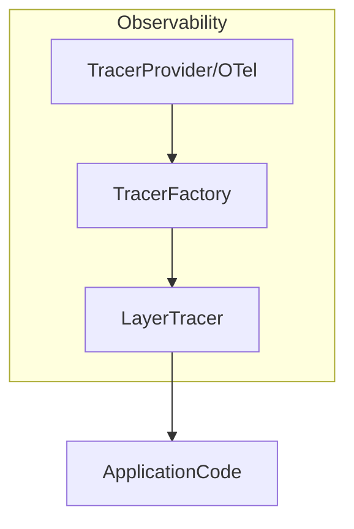

# internal/observability

[English](README.md) | 日本語

`internal/observability` は、本プロジェクトの **トレーシング（Tracing）および観測ログ連携**を提供するパッケージです。

このパッケージは **OpenTelemetry をベースとしたトレーシング機構**と、  
`internal/logging` パッケージと連携した **レイヤー単位の可観測性ログ**を提供します。

主な目的：

- OpenTelemetry の初期化と管理
- レイヤー単位の span 生成
- trace / span 情報のログ出力
- Domain / Usecase / Controller の観測統一
- テスト時の軽量トレーサ提供

## アーキテクチャ

observability パッケージは次の構成で設計されています。



各コンポーネントの役割：

|コンポーネント|役割|
|---|---|
|`TracerProvider`|OpenTelemetry のトレーサープロバイダ|
|`TracerFactory`|レイヤー別トレーサ生成|
|`LayerTracer`|span生成 + observabilityログ|
|`helper.go`|span / trace helper|
|`caller.go`|呼び出し元関数名取得|
|`test_kit.go`|テスト用 tracer|

## 提供機能

### 1. TracerProvider

OpenTelemetry のトレーサープロバイダを初期化します。

```go
func TracerProvider(reg lifecycle.Registrar) trace.TracerProvider
```

特徴

- OpenTelemetry TracerProvider を生成
- `otel.SetTracerProvider` に登録
- アプリ終了時に `Shutdown()` を実行

アプリケーションの DI 初期化で利用されます。

### 2. TracerFactory

各レイヤー用の `LayerTracer` を生成するファクトリです。

```go
type TracerFactory interface {
    Controller() LayerTracer
    Usecase() LayerTracer
    Infra() LayerTracer
}
```

この設計により

- Controller
- Usecase
- Infrastructure

ごとに **span namespace を分離**できます。

生成例

```go
tf := observability.NewTracerFactory(tp, logger, logFieldBuilder)

controllerTracer := tf.Controller()
usecaseTracer := tf.Usecase()
infraTracer := tf.Infra()
```

### 3. LayerTracer

`LayerTracer` は **レイヤー単位の span 管理**を行うコンポーネントです。

主な機能

- span生成
- span開始 / 終了ログ
- traceID / spanID ログ出力
- span名の自動生成

#### span生成

```go
ctx, end := tracer.Start(ctx)
defer end()
```

span名は `layer.package.function` のルールで生成されます。

例

- `usecase.user.CreateUser`
- `controller.user.GetUsers`
- `infrastructure.user.FindByID`

### 4. Span Helper (RunWithSpan)

任意の処理は `RunWithSpan` で簡単に span 計測できます。

この関数はレイヤに依存せず、任意の処理を span + observability logging とともに実行するためのユーティリティです。

```go
ctx, result, err := observability.RunWithSpan(
    ctx,
    tracer,
    observability.Usecase,
    "user",
    "FullName",
    func(ctx context.Context) (string, error) {
        return user.FullName(), nil
    },
)
```

この関数を使うことで、以下を自動で処理します。

- span開始
- span終了
- observabilityログ出力

## Span Logging

span開始 / 終了時には **structured logging** が出力されます。

Start

- `event_type=start`
- `span_name=usecase.user.CreateUser`
- `trace_id=...`
- `span_id=...`

End

- `event_type=end`
- `latency=12ms`
- `trace_id=...`
- `span_id=...`

ログ出力は `internal/logging` の `LogFieldBuilder` を使用します。

## TraceContext

TraceContext は span の識別情報を保持します。

```go
type TraceContext struct {
    traceID
    spanID
    parentSpanID
}
```

取得

```go
tc := observability.ExtractTraceContext(ctx)
```

利用例

```go
tc.TraceID()
tc.SpanID()
tc.ParentSpanID()
```

## Span Helper

### StartSpanWithParent

親 span を引き継いだ子 span を生成します。

```go
tc, ctx, end := observability.StartSpanWithParent(
    ctx,
    tracer,
    "usecase.user.CreateUser",
)
defer end()
```

返却値

|値|説明|
|---|---|
|TraceContext|trace/span 情報|
|context|child context|
|func()|span終了|

## Caller Helper

`caller.go` は **呼び出し元関数名を取得**します。

```go
getCallerFullName()
```

この情報は

- span名生成
- observabilityログ

で使用されます。

## テストサポート

テストでは **Noop tracer** を利用します。

### TracerFactory

```go
tf := observability.NewNoopTracerFactory(t)
```

### LayerTracer

```go
lt := observability.NewMockUsecaseLayerTracer(t)
```

利用可能なテストトレーサ

|関数|説明|
|---|---|
|`NewMockControllerLayerTracer`|Controller用|
|`NewMockUsecaseLayerTracer`|Usecase用|
|`NewMockInfraLayerTracer`|Infra用|
|`NewNoopLayerTracer`|汎用|

## 設計ポリシー

このパッケージは次の設計ポリシーに基づいています。

### 1 Layer単位のトレーシング

span名は必ず `layer.package.function` 形式になります。

理由

- trace可読性向上
- service map 分析容易

### 2 logging と統合

spanイベントは logging パッケージを通じて出力します。

- `trace_id`
- `span_id`
- `parent_span_id`
- `layer`
- `pkg`
- `function`

### 3 アプリケーションコードはOTelに依存しない

アプリケーションコードは `LayerTracer` のみ利用します。

OpenTelemetry SDK は **observability パッケージ内に閉じ込めます。**

### 4 フェールセーフ

observability 機能が失敗しても

- アプリケーション処理
- ビジネスロジック

に影響を与えません。

## セキュリティ注意点

トレース情報には次を含めないでください。

- パスワード
- トークン
- 個人情報
- 秘密鍵

必要な場合は **マスキング処理**を行います。
