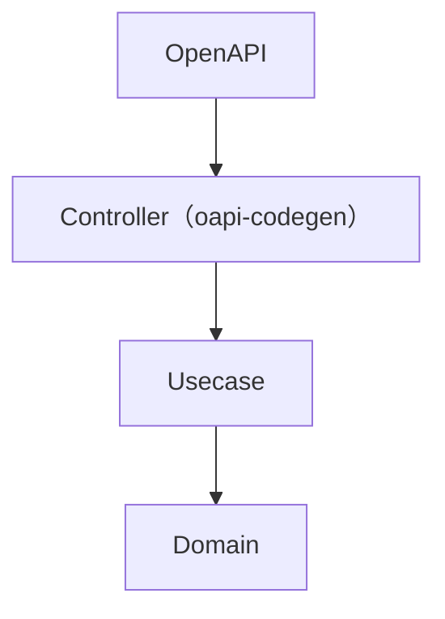
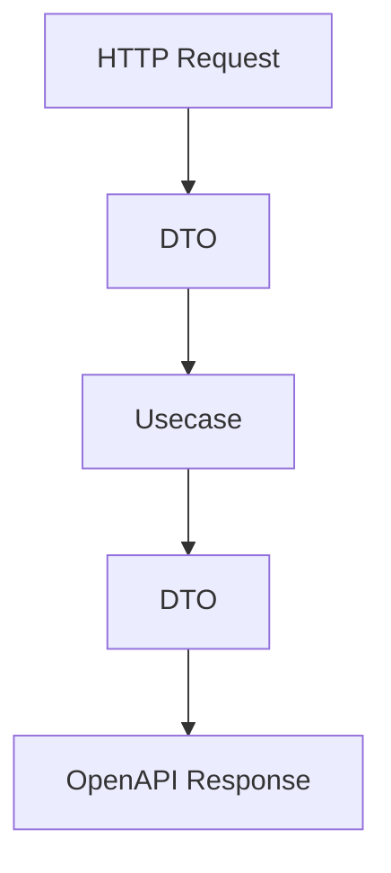
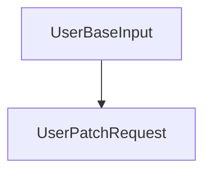

# OpenAPI ガイド（`openapi/`）

このディレクトリには、本プロジェクトで使用する **OpenAPI定義** が格納されています。

本プロジェクトでは以下を前提としています。

- redocly による分割構成
- oapi-codegen による Go コード生成
- Onion Architecture に準拠した境界設計

## 目的

この構成の目的は以下です。

- API仕様の明確化（Single Source of Truth）
- 型安全なコード生成
- レイヤー分離の強制（Controller境界の固定）
- チーム開発での変更影響範囲の最小化

## ディレクトリ構成

```txt
    openapi/
    ├── openapi.yaml          # エントリーポイント（分割参照）
    ├── openapi.gen.yaml      # bundle後ファイル（生成用）
    ├── paths/                # エンドポイント定義
    ├── components/
    │   ├── schemas/          # データ構造
    │   ├── requests/         # リクエスト意味付け
    │   ├── responses/        # レスポンス意味付け
    │   └── parameters/       # パラメータ
    └── README.md
```

## ファイルの役割

### openapi.yaml

- 分割されたOpenAPI定義のエントリーポイント
- `$ref` により各ファイルを参照

### openapi.gen.yaml

- redocly 等で bundle された単一ファイル
- **oapi-codegen の入力として使用**

## 設計方針

### 1. 分割構成（redocly前提）

- エンドポイントは `paths/`
- データ構造は `components/schemas/`
- リクエスト/レスポンスは分離

### 2. スキーマと意味の分離

|種別|役割|
|------|------|
|schemas|データ構造|
|requests|入力の意味|
|responses|出力の意味|

例：

- `UserBaseInput` → 構造
- `UsersPostRequest` → 「作成」の意味

### 3. `$ref` は相対パスで統一

禁止：`#/components/...`

推奨：`../../components/schemas/User.yaml`

理由：

- redocly / swagger-cli 互換性
- 分割構造との整合性

### 4. 1ファイル1責務

- schema → 1ファイル1構造体
- parameter → 1ファイル1定義
- path → 1エンドポイント単位

## API設計ポリシー

### REST設計（Google API Design Guide準拠）

- リソースは複数形

例：`/users`

- CRUDはHTTPメソッドで表現

- `GET /users`
- `POST /users`
- `PATCH /users/{id}`

- 非CRUDは action サフィックス

例：`POST /users/{id}:deactivate`

### バージョニング

- URLで管理

例：`/v1/users`

- 破壊的変更時

破壊的変更時は ` /v2/... ` を新設

## セキュリティポリシー

### 認証

- JWT（BearerAuth）を使用
- 書き込み系APIは必須

### 認可

- `sub` を元にリソース所有者を判定
- Usecase または Middleware で検証

### ID設計

- UUID を使用
- IDOR対策必須

## コード生成

Goコード生成：

`make go-gen`

生成内容：

- Handler interface
- Request/Response 型
- Router binding

## アーキテクチャ上の位置



OpenAPI は **Controller境界の契約**です。

## Controllerとの関係

OpenAPIは以下を定義します。

- 入力形式（Request）
- 出力形式（Response）
- HTTP仕様（status / header）

Controllerの責務：



## 禁止事項

- OpenAPIにビジネスロジックを持たせない
- schemaを直接inlineで書かない
- 同じ構造を重複定義しない
- DB構造を露出しない

## 実装との整合ルール

### Usecaseとの関係

- OpenAPI型はUsecaseに渡さない
- DTOに変換する

### Domainとの関係

- DomainはOpenAPIを知らない
- VO / Entity に変換する

## PATCH設計

- optional field を許容
- 共通schemaを利用

例：



## Debug APIについて

以下は開発用です：

- `/debug/cookie`
- `/debug/cookie/*`

本番では削除してください。
