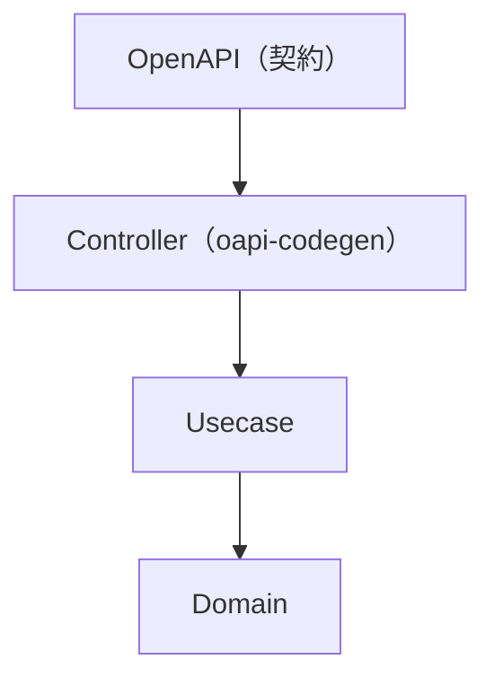

# OpenAPI ガイド（`openapi/`）

[English](README.md) | 日本語

このディレクトリには、本プロジェクトで使用する **OpenAPI 定義**が格納されています。

- Redocly による分割構成
- oapi-codegen による Go コード生成
- オニオンアーキテクチャに準拠した境界設計

## ディレクトリ構成

```text
openapi/
├── openapi.yaml              # エントリーポイント（分割ファイル参照）
├── openapi.gen.yaml          # バンドル済みファイル（生成物、コード生成用）
├── paths/                    # エンドポイント定義
├── components/
│   ├── schemas/              # データ構造（リクエスト / レスポンス / セキュリティ）
│   ├── parameters/           # クエリ・パスパラメータ
│   ├── requests/             # リクエストのセマンティクス（content / required）
│   └── responses/            # レスポンスのセマンティクス（status / description）
├── parameter-guide.md        # パラメータ定義リファレンス
├── secure-uuid.md            # UUID 公開のセキュリティ評価
└── boundary-ownership.md     # min/max/長さ制約のオーナーシップ（ワイヤー契約 vs domain ルール）
```

## ファイルの役割

|ファイル|役割|
|---|---|
|`openapi.yaml`|エントリーポイント — `$ref` で分割ファイルを参照|
|`openapi.gen.yaml`|Redocly でバンドルされた単一ファイル — **oapi-codegen の入力**（編集禁止）|

## コード生成

```bash
make gen-api    # OpenAPI バンドル + Go コード生成
```

生成内容：

- ハンドラインターフェース（`gen/server.gen.go`）
- リクエスト / レスポンス型（`gen/type.gen.go`）
- バリデーション仕様（`gen/validate.gen.go`）

## アーキテクチャ上の位置



OpenAPI は **Controller 境界の契約**を定義します。入出力形式と HTTP セマンティクスを規定し、Controller が OpenAPI 型とアプリケーション DTO の間を変換します。

## 設計方針

### 1. 分割構成（Redocly）

- エンドポイント → `paths/`
- データ構造 → `components/schemas/`
- パラメータ → `components/parameters/`

### 2. `$ref` は相対パスで統一

```yaml
# 推奨
$ref: '../components/schemas/UserResponse.yaml'

# 禁止
$ref: '#/components/schemas/UserResponse'
```

理由: Redocly バンドルとの互換性。

### 3. 1ファイル = 1責務

- schema → 1ファイル1構造体
- parameter → 1ファイル1定義
- path → 1エンドポイント単位

### 4. 実装との分離

|レイヤー|OpenAPI を知るか|
|---|---|
|Controller|はい — OpenAPI 型 ↔ DTO を変換|
|Usecase|いいえ — DTO のみ受け渡し|
|Domain|いいえ — Entity と Value Object を使用|

## API 設計ポリシー

### REST 設計（Google API Design Guide 準拠）

- リソースは複数形: `/users`
- CRUD は HTTP メソッドで表現: `GET`, `POST`, `PATCH`, `DELETE`
- 非 CRUD アクション: `POST /users/{id}:deactivate`

### 命名 / casing

ロケーション別の意図的な規約（`redocly lint` で強制）：

|ロケーション|casing|例|
|---|---|---|
|リクエスト／レスポンスの**ボディフィールド**|`camelCase`|`firstName`, `postalCode`, `nextCursor`, `hasNext`, `requestId`|
|**クエリ／パスパラメータ**|`snake_case`|`per_page`, `user_id`|
|`operationId`|`PascalCase`・動詞始まり|`GetUsers`, `PostUsers`|

ボディフィールドとパラメータは意図的に casing を分けています（ボディ＝JSON/TS クライアントに合わせ camelCase、パラメータ＝URL で一般的な snake_case）。各ロケーション内では統一します。

### バージョニング

URL パスバージョニング: `/v1/users`

破壊的変更 → `/v1/` と並行して `/v2/` を新設

### セキュリティ

- 認証エンドポイントには JWT（BearerAuth）を使用
- リソース所有権は Usecase / Middleware で `sub` クレームにより検証
- UUID を公開識別子として使用 — セキュリティ評価は `secure-uuid.md` を参照
- IDOR 対策必須
- OpenAPI 経由のエンドポイントでは `security:` 宣言が**強制の source of truth**：`oapi` ミドルウェアの `AuthenticationFunc` は宣言のある操作だけ発火する。**例外：** `/metrics` は ops パスとして OpenAPI 検証パイプラインから skip されるため、宣言された `BasicAuth` はドキュメント上のみで、実際の認証はそのルートに付与した別の Echo `BasicAuth` ミドルウェアが担う。

## 禁止事項

- OpenAPI 定義にビジネスロジックを含めない
- パス定義内でスキーマをインライン定義しない
- ファイル間で構造を重複定義しない
- DB カラム構造を API スキーマに露出しない
- OpenAPI 生成型を Usecase に渡さない — DTO に変換する

## ガイド

- [parameter-guide.ja.md](parameter-guide.ja.md) — パラメータ定義のクイックリファレンス
- [secure-uuid.ja.md](secure-uuid.ja.md) — UUID 公開のセキュリティ評価
- [boundary-ownership.ja.md](boundary-ownership.ja.md) — `min` / `max` / 長さ制約のオーナーシップ：OpenAPI の制約は **ワイヤー契約**であり domain の業務ルールではない（両者は正当に食い違える）

## サブディレクトリのドキュメント

- [paths/README.ja.md](paths/README.ja.md) — エンドポイント定義とバージョニング
- [components/schemas/README.ja.md](components/schemas/README.ja.md) — スキーマ設計ポリシー
- [components/parameters/README.ja.md](components/parameters/README.ja.md) — パラメータ規約
- [components/requests/README.ja.md](components/requests/README.ja.md) — リクエストボディのセマンティクス（content / required）
- [components/responses/README.ja.md](components/responses/README.ja.md) — レスポンスのセマンティクス（status / description）
