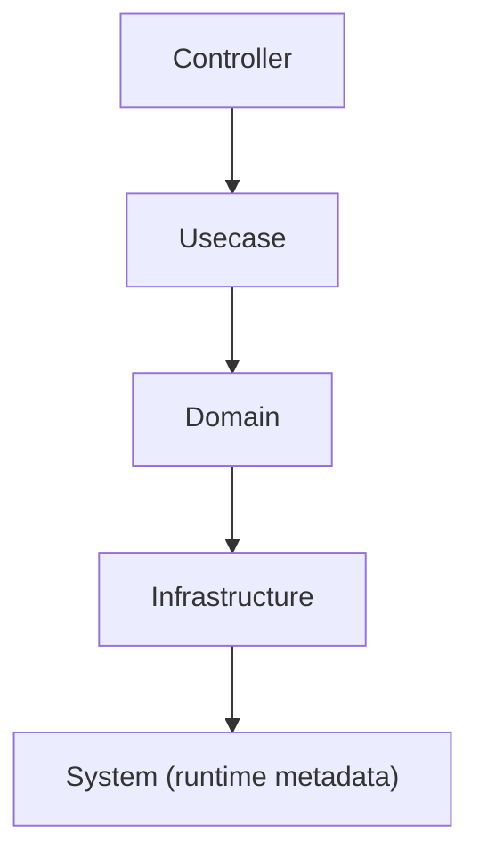

# internal/system

[English](README.md) | 日本語

`internal/system` は **アプリケーションのランタイムメタ情報（ビルド情報）** を提供するパッケージです。

このパッケージはビジネスロジックやインフラとは独立した **プロセス情報 (process metadata)** を扱います。  
主に **バージョン情報・Gitリビジョン・ビルド日時** をアプリケーションから取得できるようにします。

これらの値は通常 **Go build 時の `ldflags` によって注入**されます。

## 役割

このパッケージの責務は次の通りです。

- アプリケーションの **ビルドメタ情報** を保持する
- 実行時に **Version / Revision / BuildDate** を取得できるようにする
- バージョン表示 (`--version`) や診断エンドポイントで利用できる API を提供する
- テスト時に **BuildInfo をモック可能**にする

このパッケージは **ビジネスロジックを持ちません。**

## BuildInfo インターフェース

アプリケーションコードは **BuildInfo interface** を通してビルド情報を取得します。

```go
type BuildInfo interface {
 Version() string
 Revision() string
 BuildDate() string
}
```

実装

```go
func NewBuildInfo() BuildInfo
```

利用例

```go
bi := system.NewBuildInfo()

version := bi.Version()
revision := bi.Revision()
buildDate := bi.BuildDate()
```

この設計により

- テスト時に mock を注入可能
- version 取得処理を抽象化
- DI による依存注入が可能

になります。

## version.go

`version.go` は **ビルド時に書き換えられる変数**を定義します。

```go
var (
 Version   = "dev"
 Revision  = "none"
 BuildDate = "2024-12-31T21:00:00Z"
)
```

デフォルト値は **開発環境用のフォールバック値**です。

実際の値は `go build` 時に上書きされます。

## ビルド時の値注入

CI / Docker / Makefile では通常次のように値を注入します。

例：

```bash
go build \
  -ldflags "-X 'go-boilerplate/internal/system.Version=1.2.3' \
            -X 'go-boilerplate/internal/system.Revision=abcdef1' \
            -X 'go-boilerplate/internal/system.BuildDate=2025-01-01T00:00:00Z'"
```

Dockerfile では次のように利用されます。

```bash
ARG VERSION
ARG REVISION
ARG BUILD_DATE

RUN go build \
  -ldflags "-X 'go-boilerplate/internal/system.Version=$VERSION' \
            -X 'go-boilerplate/internal/system.Revision=$REVISION' \
            -X 'go-boilerplate/internal/system.BuildDate=$BUILD_DATE'"
```

## 利用用途

BuildInfo は次の用途で使用されます。

- `--version` コマンド（`cmd/main.go` の cobra `Version` 経由）
- `/version` API（`internal/controller/handler/version`）
- `app_build_info` Prometheus メトリクス（`internal/observability/metrics/buildinfo` を参照）
- 診断情報

`BuildInfo` プロバイダは `internal/di/module`（`SystemModule`）で DI 配線されます。

例：`service version=1.2.3 revision=abc123 build=2025-01-01`

## レイヤー上の位置

`internal/system` は **アプリケーションのランタイム情報レイヤー**です。



特徴

- ビジネスロジックを持たない
- Infrastructure に依存しない
- アプリケーション全体から参照可能

## テスト戦略

本パッケージが公開する値はリンク時（`-ldflags`）に注入されるため、テストバイナリはそれ **無し** でビルドされる。これが定義的な制約であり、全てのテストが実際に走るのは未注入の状態である。したがって未注入時の値は、事故ではなく文書化された値でなければならない。

- **未注入（テストバイナリ）の値** — `NewBuildInfo` は注入が無い場合に各フィールドの文書化されたプレースホルダを返すこと。空文字が黙って `/version` や build-info メトリクスへ流れないよう、プレースホルダを明示的に検証する。
- **注入された値** — 各 getter は構築時に渡された値を返すこと。アクセサ 1 つにつき `TestXxx` 1 つ（`docs/testing-conventions.md` §1。まとめたアクセサテストにしないこと）。
- **利用側は interface を mock する** — `BuildInfo` は `go:generate mockgen` を持つ interface なので、ビルド情報を読むだけのパッケージはリンク時注入に依存せず生成 mock を使う:

  ```go
  mockBuildInfo := mock_system.NewMockBuildInfo(ctrl)
  mockBuildInfo.EXPECT().Version().Return("1.0.0")
  ```

これを土台にした build-info **メトリクス** は `internal/observability/metrics/buildinfo` にあり、検証もそちらの担当である。

## セキュリティ注意点

ビルド情報には次の情報を **含めないでください**

- 認証トークン
- 環境変数
- 秘密鍵
- 個人情報

含めるべき情報

- Version
- Git Revision
- Build Date
